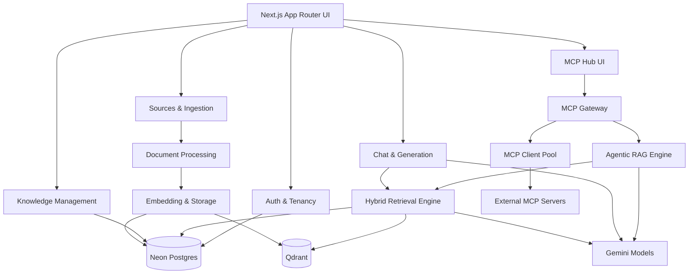
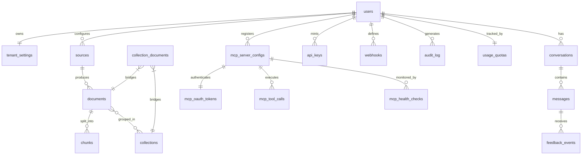

# Components, Data Model, and API Surface

This section decomposes OmniRAG into agent-sized units: domain modules, persistence entities, and the integration contracts that bind them. Every component maps to a verifiable interface; every entity carries `tenant_id` for isolation; every public endpoint is documented with success criteria. Reference the stack rationale in [Section 01](./01-system-overview-and-technology-decisions.md); risks and trade-offs appear in [Section 03](./03-cross-cutting-concerns-adrs-and-risks.md).

---

## 1. Module Map (Domain Boundaries)

OmniRAG is organized into **eight bounded contexts**. Each context owns its data, exposes a typed service surface, and is independently deployable on Vercel.

| # | Module | Responsibility | Primary Tech | Public Surface |
|---|---|---|---|---|
| 1 | **Auth & Tenancy** | Identity, sessions, JWT, tenant provisioning, MFA | NextAuth.js (Auth.js v5), Neon Postgres | `/api/v1/auth/*` |
| 2 | **Sources & Ingestion** | Connectors, fetchers, file upload, scheduled sync | Next.js Route Handlers, Inngest, Vercel Blob | `/api/v1/sources/*`, `/api/v1/documents/upload` |
| 3 | **Document Processing** | OCR, parsing, chunking, language normalization, metadata extraction | Mistral Document AI, Unstructured Transform | Internal pipeline (Inngest jobs) |
| 4 | **Embedding & Storage** | Vector generation, dual storage, sync between Qdrant and Neon | `gemini-embedding-2`, Qdrant, Neon + pgvector | Internal |
| 5 | **Knowledge Management** | Collections, tagging, bulk ops, duplicate detection, relation graph | Neon Postgres, Qdrant | `/api/v1/collections/*`, `/api/v1/documents/*` |
| 6 | **Hybrid Retrieval Engine** | Query parsing, HyDE, parallel search, RRF, re-ranking, MMR | Qdrant, Neon FTS, Gemini Cross-Encoder | `/api/v1/search/*` |
| 7 | **Chat & Generation** | Conversations, streaming, citations, smart model routing, post-processing | Gemini 3.5 Flash-Lite, Gemini 3.6 Flash | `/api/v1/chat/completions` |
| 8 | **MCP Gateway** | Tool registry, OAuth (RFC 8707/9207), audit log, agentic engine | `@modelcontextprotocol/server` v2, `@modelcontextprotocol/client` v2 | `/api/mcp/[...path]` |

### 1.1 Module Dependency Graph



**Architectural rule:** the *Hybrid Retrieval Engine* never reads from raw file storage; it only queries Qdrant + Neon. The *Embedding & Storage* module is the only writer to Qdrant.

---

## 2. Component Inventory (Build Units for Agents)

Each component is sized for a single coding agent. Acceptance criteria are testable.

| Component | Type | Owns | Consumes | Success Criteria |
|---|---|---|---|---|
| `LoginForm` / `RegisterForm` | React RSC + Client island | Form state | `AuthService` | Submit ≤ 400ms p95; rejects weak passwords; emits `tenant_id` on first login |
| `TenantCreation` | Server Action | `users`, `tenant_settings` | Postgres | Creates `tenant_id` UUID; initializes default collection; idempotent |
| `MFASetup` | Client component | TOTP secret (encrypted) | `AuthService` | QR generation; backup codes; verified against RFC 6238 |
| `SourceCard` / `AddSourceModal` | React components | UI state | `/api/v1/sources` | Real-time status via SSE; wizard validates config per source type |
| `FileUploadZone` | Client component | Chunked upload state | Vercel Blob signed URL | Resumable; virus scan pre-OCR; max 500MB/file, 5GB/day/tenant |
| `SyncScheduler` | Inngest cron | Schedule registry | `SourcesService` | Cron expressions stored as `sync_schedule`; supports manual trigger |
| `SourceHealthMonitor` | Inngest recurring job | `source_health` table | All connectors | 5-min ping; status enum `healthy|degraded|down`; alerts after 3 failures |
| `IngestionOrchestrator` | Inngest function | Job state machine | `DocumentProcessing`, `EmbeddingStorage` | Stages: `pending → parsing → chunking → embedding → indexed|failed`; full retry policy |
| `ChunkingService` | Serverless function | `chunks` table rows | Mistral / Unstructured response | Strategy per language; Arabic normalization applied; chunk overlap 0–30% |
| `EmbeddingService` | Serverless function | Qdrant points | `gemini-embedding-2` | Batch ≤ 100 chunks; 3072-dim vectors; task prefixes per role |
| `CollectionManager` | React + Server Actions | `collections`, `collection_documents` | `KnowledgeService` | CRUD; per-collection access policy |
| `ChunkViewer` / `ChunkEditor` | React components | Edit buffer | `/api/v1/documents/:id/chunks` | Preview Markdown; bulk delete/re-embed |
| `SemanticSearchTest` | Client playground | Query form | `/api/v1/search/semantic` | Latency display; raw vector scores shown |
| `DocumentRelationGraph` | Client visualization | Layout cache | `/api/v1/knowledge/relations` | Force-directed graph; max 500 nodes |
| `ChatInterface` | Client + RSC | Stream consumer | `/api/v1/chat/completions` | SSE rendering; RTL/LTR per message; abort controller |
| `StreamingRenderer` | Client hook | Token buffer | SSE event source | First-token latency ≤ 1.2s p95 |
| `ChatModeSelector` | Client component | Mode state | Chat config | 4 modes: `private`, `hybrid`, `general`, `analysis` |
| `ModelSelector` | Client component | Model preference | Smart router | Override allowed per turn |
| `MultimodalInput` | Client component | Upload + text | `/api/v1/chat/completions` | Images, files inline; pre-uploads to Blob |
| `RetrievalEngine` | Serverless function | Result set | Qdrant + Neon FTS + Cross-Encoder | RRF fusion; MMR diversity; returns `chunks[]` + scores |
| `GenerationService` | Serverless function | Stream + citations | Gemini models | Token usage logged; refusal-safe prompts; citation indices |
| `SmartRouter` | Pure function | Model choice | Query heuristics | Low complexity → Flash-Lite; high → 3.6 Flash; override respected |
| `AnalyticsDashboard` | RSC + charts | Aggregated metrics | `/api/v1/analytics/*` | Recall@K, MRR, latency, cost charts |
| `MCPServerCard` / `MCPServerWizard` | React components | Server config state | `/api/v1/mcp/servers` | OAuth flow integration; live tool list |
| `MCPToolExplorer` | Client explorer | Tool schema viewer | `MCPClientPool.listTools` | Shows inputs/outputs/side-effects |
| `MCPConnectionTester` | Client utility | Probe state | Selected server | Latency + sample call |
| `MCPCallLog` | RSC + paginated table | Log viewer | `/api/v1/mcp/calls` | Filters: server, tool, status, date |
| `MCPPermissionManager` | Admin component | Per-tool ACL | `/api/v1/mcp/servers/:id` | Toggles: read-only / read-write / off |
| `MCPHealthMonitor` | Inngest job | `mcp_health_checks` table | All configured servers | 1-min probe; alert on `down` > 5 min |
| `MCPSecretVault` | Server module | Encrypted credentials | AES-256-GCM via KMS | Zero plaintext at rest; rotation support |
| `AgenticEngine` | Serverless function | Step trace | `RetrievalEngine`, `MCPClientPool`, Gemini | Max iterations configurable (1–10); step logging |
| `MCPClientPool` | Server module | Per-tenant client cache | MCP servers | Stateless per 2026-07-28; 60s client cache |
| `MCPOAuthManager` | Server module | OAuth state, tokens | `mcp_oauth_tokens` | PKCE; `iss` validation (RFC 9207); Resource Indicators (RFC 8707) |

---

## 3. Data Model (Neon Postgres)

All entities carry `tenant_id` and enable RLS. Naming uses `snake_case`; primary keys are `UUID v4`; audit columns are mandatory on user-owned tables.

### 3.1 Core Entities

| Table | Purpose | Key Columns | Indexes | RLS |
|---|---|---|---|---|
| `users` | Identity + tenant root | `id`, `tenant_id` (UNIQUE), `email`, `preferred_language`, `settings JSONB` | `email` UNIQUE, `tenant_id` UNIQUE | ✅ |
| `tenant_settings` | Per-tenant config | `tenant_id`, `chunk_size`, `hybrid_weights`, `default_model`, `data_retention_days` | PK on `tenant_id` | ✅ |
| `sources` | Connectors | `id`, `tenant_id`, `type` (`file|url|integration|api`), `config JSONB`, `sync_schedule`, `status` | `(tenant_id, status)` | ✅ |
| `documents` | Indexed files | `id`, `tenant_id`, `source_id`, `title`, `content TEXT`, `content_tsv TSVECTOR`, `language`, `metadata JSONB`, `status` | GIN on `content_tsv`, `(tenant_id, status)` | ✅ |
| `chunks` | Vector-aligned segments | `id`, `tenant_id`, `document_id`, `content`, `chunk_index`, `page_number`, `language`, `embedding_id`, `metadata JSONB` | GIN on `content` (tsvector), `(tenant_id, document_id)` | ✅ |
| `collections` | Curated knowledge sets | `id`, `tenant_id`, `name`, `description`, `embedding_model` | `(tenant_id, name)` | ✅ |
| `collection_documents` | M:N bridge | `collection_id`, `document_id`, `tenant_id` | PK composite | ✅ |
| `conversations` | Chat threads | `id`, `tenant_id`, `title`, `mode`, `model`, `collection_ids UUID[]`, `enabled_mcp_servers UUID[]` | `(tenant_id, updated_at DESC)` | ✅ |
| `messages` | Chat turns | `id`, `tenant_id`, `conversation_id`, `role`, `content`, `citations JSONB`, `model_used`, `tokens_used JSONB`, `feedback` | `(conversation_id, created_at)` | ✅ |
| `feedback_events` | Thumbs / ratings | `id`, `tenant_id`, `message_id`, `kind` (`up|down`), `comment` | `(tenant_id, created_at)` | ✅ |
| `api_keys` | Programmatic access | `id`, `tenant_id`, `name`, `hashed_key`, `scopes TEXT[]`, `last_used_at`, `expires_at` | UNIQUE on `hashed_key` | ✅ |
| `webhooks` | Outbound notifications | `id`, `tenant_id`, `name`, `endpoint_url`, `secret_hash`, `events TEXT[]` | `(tenant_id, is_active)` | ✅ |
| `audit_log` | Compliance trail | `id`, `tenant_id`, `actor_id`, `action`, `resource_type`, `resource_id`, `payload JSONB` | `(tenant_id, created_at DESC)` | ✅ |
| `usage_quotas` | Plan enforcement | `tenant_id`, `tokens_used_month`, `storage_bytes`, `requests_today`, `period_reset_at` | PK on `tenant_id` | ✅ |

### 3.2 MCP-Specific Tables

| Table | Purpose | Key Columns |
|---|---|---|
| `mcp_server_configs` | Registered MCP servers | `id`, `tenant_id`, `server_id`, `endpoint_url`, `transport`, `protocol_version`, `auth_type`, `oauth_resource_uri`, `credentials_encrypted BYTEA`, `enabled_tools[]`, `require_confirmation_tools[]`, `max_calls_per_minute`, `max_calls_per_day`, `health_status` |
| `mcp_oauth_tokens` | Encrypted credentials | `server_config_id`, `access_token_encrypted`, `refresh_token_encrypted`, `scopes[]`, `resource_uri`, `issuer`, `expires_at` |
| `mcp_tool_calls` | Audit trail | `tenant_id`, `conversation_id`, `scoped_tool_name`, `input_params`, `output_result`, `latency_ms`, `status`, `has_side_effect`, `user_confirmed` |
| `mcp_health_checks` | Probe history | `server_config_id`, `status`, `latency_ms`, `available_tools_count`, `error_message` |
| `mcp_approved_webhooks` | Allow-listed side effects | `tenant_id`, `name`, `endpoint_url`, `http_method`, `headers`, `secret_hash` |

### 3.3 Entity Relationship Diagram



### 3.4 Universal RLS Policy

```sql
-- Applied to every tenant-scoped table
ALTER TABLE <table> ENABLE ROW LEVEL SECURITY;

CREATE POLICY <table>_tenant_isolation ON <table>
    USING (tenant_id = current_setting('app.current_tenant', true)::UUID)
    WITH CHECK (tenant_id = current_setting('app.current_tenant', true)::UUID);
```

The session variable `app.current_tenant` is set by the Auth middleware at the start of every request; Postgres connection pooling uses `SET LOCAL` per transaction.

### 3.5 Vector + Lexical Sync Rules

- **Write path:** `EmbeddingService` writes to Qdrant first (point UUID = `chunks.id`); the `embedding_id` column in `chunks` is updated in the same transaction; if Qdrant write fails, the chunk row is rolled back.
- **Read path:** semantic search returns `chunk_ids`; lexical fallback uses `ts_rank` against `documents.content_tsv` and `chunks.content` tsvector (Arabic + English dictionaries configured).
- **Delete path:** hard-delete chunks in both stores within the same transaction; soft-delete is reserved for `conversations` (30-day grace period).

---

## 4. Qdrant Schema

| Aspect | Decision |
|---|---|
| **Collection strategy** | Single collection `omnirag_chunks` with `tenant_id` payload filter (mandatory on every query) |
| **Vector size** | 3072 (matches `gemini-embedding-2`) |
| **Distance** | Cosine |
| **HNSW config** | `m=16`, `ef_construct=128`, indexed on creation |
| **Payload indexes** | `tenant_id` (keyword), `document_id` (keyword), `collection_ids` (keyword array), `language` (keyword) |
| **Quantization** | Scalar quantization (int8) enabled; ≤ 4× memory reduction |
| **Replication** | 2 replicas minimum for `production` tier |
| **Mandatory filter** | Every `search` and `scroll` call MUST include `must: [{ key: "tenant_id", match: { value: <uuid> } }` |

---

## 5. API Surface (v1)

All endpoints under `/api/v1/*` are versioned; require `Authorization: Bearer <jwt>` unless marked public; carry `X-Tenant-Id` derived from the session (never trusted from the client).

### 5.1 Auth & Account

| Method | Path | Purpose | Auth | Success |
|---|---|---|---|---|
| `POST` | `/auth/register` | Create user + tenant | Public | `201` + JWT; emits `user.created` event |
| `POST` | `/auth/login` | Email/password + OAuth | Public | `200` + JWT + refresh token |
| `POST` | `/auth/refresh` | Rotate access token | Refresh JWT | `200` + new JWT |
| `POST` | `/auth/logout` | Invalidate session | JWT | `204` |
| `POST` | `/auth/mfa/enable` | Activate TOTP | JWT | `200` + backup codes |
| `DELETE` | `/auth/account` | GDPR erasure | JWT + confirmation | `202`; async purge job |

### 5.2 Sources & Ingestion

| Method | Path | Purpose | Auth | Success |
|---|---|---|---|---|
| `GET` | `/sources` | List user sources | JWT | `200`; pagination via cursor |
| `POST` | `/sources` | Create connector | JWT | `201`; schedules first sync |
| `GET` | `/sources/:id` | Get config + health | JWT | `200` |
| `PUT` | `/sources/:id` | Update config | JWT | `200` |
| `DELETE` | `/sources/:id` | Remove + purge docs | JWT | `202` |
| `POST` | `/sources/:id/sync` | Trigger manual sync | JWT | `202`; returns `job_id` |
| `POST` | `/documents/upload` | Multipart upload | JWT | `202` + `document_id` |
| `GET` | `/documents` | List documents | JWT | `200`; filters: `source_id`, `status`, `language` |
| `GET` | `/documents/:id` | Metadata + preview | JWT | `200` |
| `DELETE` | `/documents/:id` | Soft-delete + async purge | JWT | `202` |
| `GET` | `/documents/:id/chunks` | List chunks | JWT | `200`; paginated |
| `GET` | `/jobs/:id` | Inngest job status | JWT | `200`; states: `pending|running|completed|failed` |

### 5.3 Knowledge

| Method | Path | Purpose | Auth | Success |
|---|---|---|---|---|
| `GET` | `/collections` | List collections | JWT | `200` |
| `POST` | `/collections` | Create collection | JWT | `201` |
| `PUT` | `/collections/:id` | Update name/description | JWT | `200` |
| `DELETE` | `/collections/:id` | Delete collection | JWT | `204` |
| `POST` | `/collections/:id/documents` | Add documents | JWT | `200`; returns affected count |
| `DELETE` | `/collections/:id/documents/:doc_id` | Remove link | JWT | `204` |
| `POST` | `/chunks/:id/reembed` | Force re-embedding | JWT | `202` |
| `POST` | `/chunks/bulk` | Bulk update/delete | JWT | `200` + result counts |

### 5.4 Search & Retrieval

| Method | Path | Purpose | Auth | Success |
|---|---|---|---|---|
| `POST` | `/search` | Hybrid (semantic + lexical + RRF) | JWT | `200`; returns `{ chunks: [...], scores: [...], latency_ms }` |
| `POST` | `/search/semantic` | Vector-only | JWT | `200` |
| `POST` | `/search/lexical` | FTS-only | JWT | `200` |
| `POST` | `/search/rerank` | Cross-encoder re-rank | JWT | `200` |

**Request body for `/search`:**

```json
{
  "query": "ما هي شروط العقد؟",
  "language": "auto",
  "collection_ids": ["uuid"],
  "top_k": 8,
  "score_threshold": 0.7,
  "semantic_weight": 0.6,
  "lexical_weight": 0.4,
  "rerank": true,
  "mmr_diversity": 0.3
}
```

### 5.5 Chat

| Method | Path | Purpose | Auth | Success |
|---|---|---|---|---|
| `GET` | `/conversations` | List user threads | JWT | `200` |
| `POST` | `/conversations` | Create thread | JWT | `201` |
| `GET` | `/conversations/:id` | Thread metadata | JWT | `200` |
| `DELETE` | `/conversations/:id` | Soft-delete | JWT | `204` |
| `GET` | `/conversations/:id/messages` | History (paginated) | JWT | `200` |
| `POST` | `/chat/completions` | Streaming completion (SSE) | JWT | `200`; `text/event-stream` |
| `POST` | `/messages/:id/feedback` | Submit 👍/👎 | JWT | `200` |

**SSE event types:** `token`, `citation`, `tool_call`, `tool_result`, `done`, `error`.

### 5.6 Analytics

| Method | Path | Purpose | Auth | Success |
|---|---|---|---|---|
| `GET` | `/analytics/usage` | Tokens / requests / storage | JWT | `200` |
| `GET` | `/analytics/quality` | Retrieval quality (Recall@K, MRR, NDCG) | JWT | `200` |
| `GET` | `/analytics/latency` | P50/P95/P99 per stage | JWT | `200` |
| `GET` | `/analytics/costs` | Spend per model / day | JWT | `200` |

### 5.7 Settings

| Method | Path | Purpose | Auth | Success |
|---|---|---|---|---|
| `GET` | `/settings` | User + tenant settings | JWT | `200` |
| `PUT` | `/settings` | Update settings | JWT | `200` |
| `POST` | `/settings/export` | GDPR data export | JWT | `202` + download URL |
| `DELETE` | `/settings/account` | Delete account | JWT + MFA | `202` |

### 5.8 MCP Gateway

| Method | Path | Purpose | Auth | Success |
|---|---|---|---|---|
| `GET\|POST\|DELETE` | `/mcp/[...path]` | MCP protocol endpoint (2026-07-28) | JWT + tenant | per MCP spec |
| `GET` | `/mcp/servers` | List configured servers | JWT | `200` |
| `POST` | `/mcp/servers` | Register server | JWT | `201` |
| `GET` | `/mcp/servers/:id` | Server detail + tools | JWT | `200` |
| `PUT` | `/mcp/servers/:id` | Update config / permissions | JWT | `200` |
| `DELETE` | `/mcp/servers/:id` | Unregister | JWT | `204` |
| `POST` | `/mcp/servers/:id/test` | Probe + sample call | JWT | `200`; returns health + tool list |
| `GET` | `/mcp/calls` | Audit log of tool calls | JWT | `200` |
| `GET` | `/mcp/health` | Aggregated health | JWT | `200` |
| `POST` | `/mcp/oauth/initiate` | Begin OAuth flow | JWT | `200` + auth URL |
| `POST` | `/mcp/oauth/callback` | Complete OAuth | JWT | `200` |

### 5.9 API Keys & Webhooks (Public Programmatic Access)

| Method | Path | Purpose | Auth | Success |
|---|---|---|---|---|
| `POST` | `/api-keys` | Mint scoped key | JWT | `201`; returned ONCE |
| `GET` | `/api-keys` | List (no secrets) | JWT | `200` |
| `DELETE` | `/api-keys/:id` | Revoke | JWT | `204` |
| `POST` | `/webhooks` | Register endpoint | JWT | `201` |
| `GET` | `/webhooks` | List | JWT | `200` |
| `DELETE` | `/webhooks/:id` | Remove | JWT | `204` |

Programmatic access uses `Authorization: Bearer omnk_<key>` and inherits the same RLS as the owning user.

---

## 6. Contract Standards

| Concern | Standard |
|---|---|
| **Versioning** | URI prefix `/api/v1`; breaking changes require `/v2` |
| **Auth** | JWT (HS256, 15-min TTL) + refresh token (30-day, rotating) |
| **Tenant binding** | `X-Tenant-Id` header set by middleware from JWT claim; client cannot override |
| **Content type** | `application/json; charset=utf-8`; SSE uses `text/event-stream` |
| **Pagination** | Cursor-based (`?cursor=<opaque>&limit=<n>`); max `limit=100` |
| **Errors** | RFC 7807 `application/problem+json`; codes: `400`, `401`, `403`, `404`, `409`, `422`, `429`, `500` |
| **Rate limits** | Per-tenant: 60 req/min default; 10 req/min for `/chat/completions`; 5 req/min for `/mcp/oauth/*` |
| **Idempotency** | `Idempotency-Key` header for `POST` mutations; TTL 24h |
| **Observability** | Every request emits `trace_id`, `tenant_id`, `latency_ms`; logged via Vercel Observability |
| **i18n** | All user-facing strings resolved server-side; response includes `lang` echo for cache debugging |

### 6.1 Error Shape

```json
{
  "type": "https://omnirag.dev/errors/validation",
  "title": "Invalid request",
  "status": 422,
  "detail": "score_threshold must be between 0 and 1",
  "instance": "/api/v1/search",
  "trace_id": "01HXY..."
}
```

### 6.2 Streaming Contract (SSE)

```
event: token
data: {"delta": "العقد", "trace_id": "..."}

event: citation
data: {"index": 1, "chunk_id": "uuid", "document_id": "uuid", "page": 4, "score": 0.87}

event: tool_call
data: {"scoped_name": "notion__fetch_page", "input": {...}, "has_side_effect": false}

event: done
data: {"finish_reason": "stop", "tokens_used": {"input": 1240, "output": 318}}
```

---

## 7. Acceptance Checklist for This Section

- [x] Every persistent entity carries `tenant_id` and enables RLS
- [x] All 8 bounded contexts mapped with public surface
- [x] All components sized for a single coding agent with verifiable success criteria
- [x] Qdrant + Neon sync rules documented (write/read/delete invariants)
- [x] API surface complete with auth, status, and streaming contracts
- [x] MCP endpoints cover server lifecycle, OAuth (RFC 8707/9207), audit, and health
- [x] RFC 7807 error envelope and SSE event schema specified
- [x] No placeholder endpoints, no `TODO`, no unscoped identifiers

---

> Next: [Cross-Cutting Concerns, ADRs, and Risks](./03-cross-cutting-concerns-adrs-and-risks.md) — reliability, security posture, scalability decisions, and the ADR log that justifies each binding contract above.