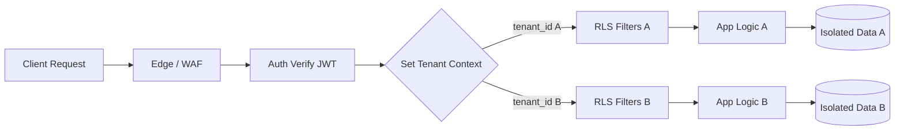
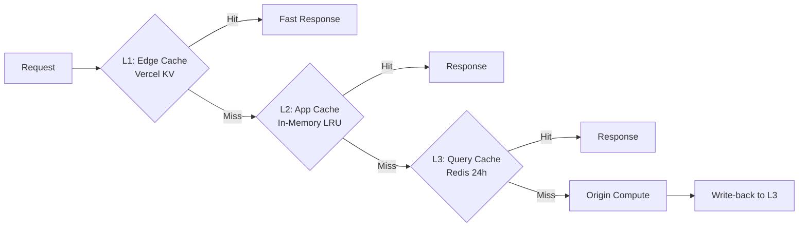

# Cross-Cutting Concerns, ADRs, and Risks

> ينطبق هذا القسم على كامل منصة **OmniRAG** بمكوّناتها الأساسية وطبقة **MCP Gateway** على حدٍّ سواء. يُفترض أن يكون القارئ قد اطّلع على [System Overview and Technology Decisions](./01-system-overview-and-technology-decisions.md) وعلى [Components, Data Model, and API Surface](./02-components-data-model-and-api-surface.md).

---

## 1. نموذج الموثوقية (Reliability Model)

### 1.1 أهداف مستوى الخدمة (SLOs) المقترحة

| المقياس | الهدف | القياس | نافذة |
|---|---|---|---|
| **Availability** | 99.9% | نسبة وقت التشغيل الفعل لـ `/api/chat/*` و`/api/mcp/*` | شهرياً |
| **Latency P50** | ≤ 800 ms | أول رمز (TTFT) في وضع `gemini-3.5-flash-lite` | أسبوعياً |
| **Latency P95** | ≤ 2.5 s | TTFT في وضع `gemini-3.6-flash` | أسبوعياً |
| **Ingestion Success Rate** | ≥ 99% | نسبة المستندات المُفهرسة بنجاح من إجمالي المُسلَّم | أسبوعياً |
| **Retrieval Recall@10** | ≥ 0.85 | مقياس داخلي على مجموعة تقييم مُحدّثة شهرياً | شهرياً |
| **Citation Coverage** | ≥ 95% | نسبة الإجابات في الوضع المقيّد التي تحتوي على مرجع واحد على الأقل | أسبوعياً |
| **MCP Tool Success Rate** | ≥ 99.2% | نسبة استدعاءات الأدوات الناجحة من إجمالي الاستدعاءات | يومياً |
| **RLS Leak Attempts Blocked** | 100% | محاولات اختراق العزل المرفوضة (مُختبَر باختبارات red-team) | عند كل إصدار |

### 1.2 استراتيجيات الموثوقية المعتمدة

| الاستراتيجية | الوصف | التطبيق في OmniRAG |
|---|---|---|
| **Idempotency Keys** | كل عملية كتابة تستقبل `Idempotency-Key` لِتُكرَّر بأمان | `POST /sources`, `POST /documents/upload`, `POST /chat/completions` |
| **Retry with Exponential Backoff + Jitter** | إعادة المحاولة التلقائية مع تخفيف الازدحام | عند فشل استدعاء Mistral / Unstructured / Gemini / MCP Server |
| **Circuit Breaker** | فتح قاطع الدائرة عند تكرار الفشل لحماية النظام الأوسع | نمط `closed → open → half-open` لكل مزوّد خارجي بمعدل فشل > 30% خلال 60 ثانية |
| **Bulkhead Pattern** | عزل الموارد بين المسارات الحرجة | تجمّع اتصالات منفصل لـ RAG، آخر لـ MCP، آخر لـ Ingestion |
| **Graceful Degradation** | تراجع أنيق عند تعطّل مكوّن | إذا فشل MCP Server → الاستمرار بـ RAG المحلي مع تنبيه |
| **Write-Ahead Audit Log** | كتابة سجل التدقيق قبل تنفيذ أي عملية كتابة | جدول `mcp_tool_calls` و`audit_log` يكتبان في معاملة واحدة |
| **Dead-Letter Queue (DLQ)** | طوابيس المهام الفاشلة لإعادة المعالجة اليدوية | Inngest/Trigger.dev DLQ لكل pipeline |

### 1.3 خطة النسخ الاحتياطي واستعادة البيانات

| الطبقة | التردد | الموقع | الاستعادة (RTO/RPO) |
|---|---|---|---|
| **Neon Postgres (metadata)** | نسخ احتياطي مستمر (PITR) + يومي كامل | Neon S3 + منطقة ثانوية | RTO: 30 min / RPO: 5 min |
| **Qdrant snapshots** | كل 6 ساعات + عند كل نشر إصدار جديد | Object Storage + منطقة ثانوية | RTO: 45 min / RPO: 6 h |
| **Vercel Blob / S3 (ملفات خام)** | متانة 99.999999999% (11-nine) عبر المزوّد | نفس المنطقة + منطقة ثانوية | RTO: 15 min / RPO: 0 |
| **OAuth Tokens** | مشفّرة ومكررة | قاعدة بيانات + نسخة احتياطية | RTO: 30 min / RPO: 5 min |
| **Audit Logs** | مستمر إلى Cold Storage | 7 سنوات (لمتطلبات GDPR/HIPAA/PCI) | RTO: 4 h / RPO: 1 h |

### 1.4 سيناريوهات الفشل المحتملة (Failure Modes) واستجابتها

| السيناريو | الاحتمال | الأثر | الاستجابة |
|---|---|---|---|
| **انقطاع Gemini API** | متوسط | عالٍ | Fallback إلى النموذج البديل `gemini-3.5-flash-lite` تلقائياً + تنبيه للمستخدم |
| **انقطاع Qdrant** | منخفض | عالٍ | البحث بالمعجم فقط من Neon FTS + تنبيه بانخفاض جودة الاسترجاع |
| **انقطاع Neon Postgres** | منخفض جداً | عالٍ | قراءة فقط من النسخة الاحتياطية + قائمة انتظار للكتابة |
| **تجاوز حدود Mistral/Unstructured** | متوسط | متوسط | Fallback إلى المحرك البديل (Unstructured ↔ Mistral) + تخفيض الجودة |
| **فشل MCP Server خارجي** | عالٍ | متوسط | تعطيل الخادم + الاستمرار بالأدوات المتاحة + إشعار |
| **اختراق Token OAuth** | منخفض | عالٍ | إبطال فوري + تدوير + إخطار المستخدم + مراجعة `mcp_tool_calls` |
| **هجوم Prompt Injection** | عالٍ | عالٍ | فلترة + وضع مقيّد افتراضي + تأكيد المستخدم لأي إجراء جانبي |

---

## 2. نموذج الأمان والامتثال (Security & Compliance)

### 2.1 نموذج الثقة (Zero-Trust Tenancy)

> **المبدأ الجوهري**: لا يُفترض بأي طلب أنه آمن حتى يثبت العكس، ولا يُسمح لأي عملية بعبور حدود `tenant_id` مهما كان مصدرها.

### 2.2 طبقات الأمان (Defense in Depth)

| الطبقة | الإجراء | التحقق |
|---|---|---|
| **Edge / Transport** | TLS 1.3 إلزامي، HSTS، Certificate Pinning اختياري | `tlsVersion` header في السجلات |
| **WAF** | حماية من SQLi/XSS/CSRF، Rate Limiting عام، Bot Detection | اختبار اختراق ربع سنوي |
| **Authentication** | NextAuth.js + JWT قصير (15 min) + Refresh (30 يوم) + MFA اختياري | اختبار JWT forgery، اختبار token replay |
| **Authorization** | RBAC + RLS + Scope-based API Keys | اختبار اختراق الصلاحيات (IDOR, privilege escalation) |
| **Tenant Isolation (DB)** | RLS مفعّل على كل الجداول + `SET app.current_tenant` لكل جلسة | اختبار Red Team بمحاولات اختراق |
| **Tenant Isolation (Vector)** | Qdrant Payload Filter بـ `tenant_id` إلزامي في كل استعلام | اختبار حقن payload |
| **Tenant Isolation (Storage)** | مسارات معزولة `/{tenant_id}/...` + Signed URLs قصيرة الصلاحية (≤ 15 min) | اختبار الوصول غير المصرّح |
| **Secrets Management** | تشفير AES-256-GCM لكل الرموز + تدوير كل 90 يوماً | اختبار key extraction |
| **Prompt Injection Defense** | وضع مقيّد افتراضي + تأكيد المستخدم للآثار الجانبية + فلترة المدخلات | اختبار يومي بأحدث payloads |
| **Audit Logging** | تسجيل كل عملية كتابة + كل استدعاء MCP tool | مراجعة أسبوعية |
| **Encryption at Rest** | AES-256 لجميع قواعد البيانات + Object Storage (SSE-S3/KMS) | فحص تكوين |
| **Encryption in Transit** | TLS 1.3 داخلياً بين الخدمات | فحص mTLS اختياري |
| **Key Management** | Vercel/AWS KMS + تدوير المفاتيح كل 12 شهر | اختبار التدوير |

### 2.3 متطلبات الامتثال التنظيمي

| التنظيم | النطاق في OmniRAG | المتطلبات الرئيسية |
|---|---|---|
| **GDPR** | جميع المستخدمين في الاتحاد الأوروبي | حق الوصول، حق المحو، حق قابلية النقل، DPO، موافقة صريحة، Data Processing Agreement |
| **HIPAA** | إذا اختار المستخدم خطة Enterprise مع بيانات صحية | BAA، سجل وصول PHI، تشفير، تدريب الموظفين، تقييم المخاطر |
| **PCI DSS** | معالجة بيانات البطاقات عند الترقية لخطط مدفوعة | SAQ A أو A-DEP، Tokenization، عدم تخزين CVV، تشفير PAN |

> **تنبيه**: يُمنع تخزين أي من بيانات PHI/PII التالية في السجلات أو التضمينات دون موافقة صريحة: الأرقام الوطنية، السجلات الطبية، أرقام البطاقات الكاملة.

### 2.4 مصفوفة التهديدات (STRIDE) — ملخص تنفيذي

| التهديد | السيناريو | التخفيف |
|---|---|---|
| **Spoofing** | تزوير هوية مستخدم عبر JWT مسروق | تجديد قصير + MFA + كشف الشذوذ |
| **Tampering** | تعديل payload لاستدعاء MCP tool على tenant آخر | Zod validation صارم + tenant_id إلزامي |
| **Repudiation** | إنكار المستخدم لتنفيذ إجراء | Audit log غير قابل للتعديل + توقيع HMAC |
| **Information Disclosure** | تسرب تضمينات أو بيانات عبر خطأ منطقي | RLS + اختبار اختراق مستمر + fuzzing |
| **Denial of Service** | إغراق API بطلبات ضخمة | Rate limiting متعدد الطبقات + WAF + quotas |
| **Elevation of Privilege** | تصعيد صلاحيات من tenant إلى admin | RBAC صارم + مبدأ أقل امتياز + اختبار دوري |

---

## 3. نموذج قابلية التوسع (Scalability Model)

### 3.1 استراتيجيات التوسع المعتمدة

| المكوّن | النمط | القيود | الإجراء |
|---|---|---|---|
| **Next.js API Routes** | Horizontal autoscaling عبر Vercel | Concurrency limits | تقسيم المسارات إلى Edge/Serverless حسب الحمل |
| **Inngest/Trigger.dev** | Serverless queue | Concurrency limits | ضبط `concurrency` و`throttle` لكل job |
| **Qdrant** | Sharding + Replication | RAM + Disk | ترقية إلى Dedicated Cluster عند > 1M vector/tenant |
| **Neon Postgres** | Serverless autoscaling | CU limits | ضبط `max_connections` + Connection Pooler |
| **Vercel Blob** | غير محدود عملياً | Cost | سياسات TTL + Compression |
| **Gemini API** | Rate limits ثابتة لكل حساب | RPM/RPD | Multi-key rotation + Backoff |

### 3.2 حدود التشغيل الحالية وحدود التحجيم

| المقياس | الحد الحالي | الإجراء عند بلوغ الحد |
|---|---|---|
| **عدد المستندات لكل tenant** | 100,000 | ترقية Qdrant + فصل collection |
| **حجم الملف الواحد** | 100 MB | Streaming upload + chunked processing |
| **عدد طلبات API/دقيقة لكل tenant** | 600 | Rate limiting + Quota plan |
| **عدد استدعاءات MCP/يوم لكل tenant** | 10,000 | ترقية الباقة |
| **عدد tenants المتزامنة** | 100,000 | Multi-region deployment |
| **حجم الـ context window المُسلَّم للنموذج** | 1,000,000 tokens | Compression + Reranking أكثر صرامة |

### 3.3 التخزين المؤقت متعدد الطبقات (Caching Strategy)

| الطبقة | TTL | المفتاح | الإبطال |
|---|---|---|---|
| **L1 Edge Cache** | 5 min | `tenant_id + query_hash` | عند تحديث المستندات |
| **L2 App Cache** | 60 sec | `tenant_id + tool_name` | عند تعطيل MCP server |
| **L3 Query Cache** | 24 h | `tenant_id + query_hash + mode` | عند حذف/إضافة مستند |
| **Embedding Cache** | 30 يوم | `content_hash` | إبطال يدوي عند تغيير النموذج |

---

## 4. المراقبة والقابلية للملاحظة (Observability)

### 4.1 الأعمدة الثلاثة (Three Pillars)

| العمود | الأداة | حالات الاستخدام |
|---|---|---|
| **Logs** | Vercel Logs + Axiom/Datadog | تتبع كل طلب + MCP calls |
| **Metrics** | Vercel Analytics + Datadog | RAG Recall@K، Latency، Cost |
| **Traces** | OpenTelemetry → Honeycomb/Datadog APM | تتبع رحلة استعلام RAG من البداية للنهاية |

### 4.2 المقاييس الذهبية (Golden Signals) لكل مكوّن

| الإشارة | المقياس | التنبيه عند |
|---|---|---|
| **Latency** | P50, P95, P99 لكل endpoint | P95 > 2× الهدف |
| **Traffic** | طلبات/دقيقة لكل tenant | تجاوز 80% من الحصة |
| **Errors** | نسبة 5xx و 4xx | > 1% خلال 5 min |
| **Saturation** | استخدام الـ CPU/Connection Pool | > 80% |

### 4.3 التنبيهات الحرجة (Critical Alerts)

| التنبيه | الشرط | الإجراء |
|---|---|---|
| **P1: Tenant Leak Attempt Detected** | محاولة RLS bypass واحدة أو أكثر | إيقاف فوري للحساب + تحقيق |
| **P1: Gemini API Outage** | فشل > 50% من الاستدعاءات لمدة 5 min | تنبيه + Fallback تلقائي |
| **P2: Qdrant Latency Spike** | P95 > 3 s لمدة 10 min | فحص الفهرس + ترقية |
| **P2: Cost Anomaly** | تكلفة يومية > 2× المتوسط | فحص الاستعلامات + تقييد |
| **P3: MCP Server Down** | خادم معطل > 30 min | إشعار للمستخدم + fallback |

### 4.4 سجل التدقيق (Audit Log Schema)

| الحقل | النوع | الوصف |
|---|---|---|
| `id` | UUID | معرف فريد |
| `tenant_id` | UUID | معرف المستأجر |
| `actor_id` | UUID | المستخدم / API Key / Service Account |
| `action` | string | نوع العملية (`create`, `read`, `update`, `delete`, `tool_call`) |
| `resource_type` | string | نوع المورد (`document`, `collection`, `mcp_server`, ...) |
| `resource_id` | UUID | معرف المورد |
| `ip_address` | INET | عنوان IP |
| `user_agent` | string | وكيل المستخدم |
| `request_id` | UUID | معرف الطلب للربط بالـ Trace |
| `metadata` | JSONB | بيانات إضافية |
| `created_at` | TIMESTAMPTZ | الطابع الزمني |

> **مهم**: سجل التدقيق غير قابل للتعديل أو الحذف من قِبل المستخدم. تُحفظ لمدة **7 سنوات** لمتطلبات GDPR/HIPAA/PCI.

---

## 5. سجل القرارات المعمارية (Architecture Decision Records)

### ADR-001: اختيار Qdrant كقاعدة بيانات متجهية مستقلة

| الحقل | القيمة |
|---|---|
| **الحالة** | ✅ معتمد |
| **التاريخ** | 2026-01-15 |
| **السياق** | الحاجة إلى بحث دلالي بأبعاد 3072 مع فلترة صارمة بـ `tenant_id` ودعم للوسائط المتعددة |
| **الخيارات المُقارنة** | Qdrant / pgvector / Pinecone / Weaviate |
| **القرار** | Qdrant كقاعدة مستقلة + pgvector كاحتياطي |
| **المبررات** | أداء ANN أفضل بـ 5-10× من pgvector، فلترة Payload أصلية، REST/gRPC APIs |
| **التبعات** | تكلفة إضافية، تعقيد تشغيلي، تزامن يدوي مع Postgres |
| **المخاطر** | فشل تزامن بين Qdrant وPostgres → حل عبر transactional outbox |

### ADR-002: اعتماد البحث الهجين (Hybrid) مع RRF

| الحقل | القيمة |
|---|---|
| **الحالة** | ✅ معتمد |
| **السياق** | البحث الدلالي وحده يُفوّت الكلمات المفتاحية الدقيقة، والمعجمي وحده يُفوّت المرادفات |
| **القرار** | Reciprocal Rank Fusion (RRF) مع أوزان قابلة للضبط (افتراضي 0.7 دلالي، 0.3 معجمي) |
| **المبررات** | RRF أبسط من Weighted Sum، ولا يحتاج معايرة دقيقة |
| **التبعات** | فهرسان منفصلان يجب الحفاظ على تزامنهما |

### ADR-003: استخدام طبقة MCP Gateway عديمة الحالة (Stateless)

| الحقل | القيمة |
|---|---|
| **الحالة** | ✅ معتمد |
| **السياق** | مواصفة MCP 2026-07-28 جعلت البروتوكول stateless بالكامل |
| **القرار** | استخدام `@modelcontextprotocol/server` v2.0 مع `createMcpHandler(factory)` عديم الحالة |
| **المبررات** | توافق مع موازنات التحميل round-robin على Vercel، تبسيط تشغيلي |
| **التبعات** | إعادة المصادقة في كل طلب (مقبولة بفضل OAuth Resource Indicators) |

### ADR-004: التوجيه الذكي بين `gemini-3.5-flash-lite` و`gemini-3.6-flash`

| الحقل | القيمة |
|---|---|
| **الحالة** | ✅ معتمد |
| **السياق** | `flash-lite` أرخص وأسرع، `flash` أفضل جودة |
| **القرار** | مُصنّف داخلي يُقدّر التعقيد ويروّت تلقائياً؛ يمكن للمستخدم التجاوز |
| **المبررات** | توفير يصل إلى 70% من التكلفة مع الحفاظ على الجودة في المهام الحرجة |
| **التبعات** | اختبار مستمر للمُصنّف + مراقبة الانحراف (drift) |

### ADR-005: اعتماد Inngest أو Trigger.dev للمهام غير المتزامنة

| الحفل | القيمة |
|---|---|
| **الحالة** | ✅ معتمد (بحاجة لقرار نهائي) |
| **السياق** | Ingestion pipeline قد يستغرق دقائق لسعة كبيرة |
| **القرار** | Inngest كخيار أساسي مع Trigger.dev كاحتياطي |
| **المبررات** | Inngest workflows مرنة + موثوقة + serverless-native |
| **التبعات** | قفل vendor؛ يمكن التخفيف بـ abstraction layer |

### ADR-006: نهج العزل عبر RLS + Payload Filter (متعدد الطبقات)

| الحقل | القيمة |
|---|---|
| **الحالة** | ✅ معتمد |
| **السياق** | تسرب بيانات بين المستأجرين = كارثة |
| **القرار** | 5 طبقات عزل (Auth → RLS → Qdrant Filter → Storage Paths → API Middleware) |
| **المبررات** | Defense in Depth، حتى لو فشلت طبقة واحدة |
| **التبعات** | أداء أقل هامشياً، تعقيد إضافي في كتابة الاستعلامات |

### ADR-007: معالجة المستندات بمحركين (Mistral OCR 4 + Unstructured)

| الحقل | القيمة |
|---|---|
| **الحالة** | ✅ معتمد |
| **السياق** | Mistral أدق في OCR، Unstructured أوسع في أنواع الملفات |
| **القرار** | اختيار تلقائي (`auto`) بناءً على نوع الملف، مع إمكانية الاختيار اليدوي |
| **المبررات** | أفضل ما في العالمين دون إجبار المستخدم على الاختيار |
| **التبعات** | تكلفة API مزدوجة، اختبار لجودة كل محرك |

### ADR-008: OAuth 2.0 مع Resource Indicators (RFC 8707) لخوادم MCP

| الحقل | القيمة |
|---|---|
| **الحالة** | ✅ معتمد |
| **السياق** | منع Token Misuse بين Resource Servers مختلفة |
| **القرار** | كل رمز OAuth مقيّد بـ Resource URI + التحقق من `iss` (RFC 9207) |
| **المبررات** | توافق مع مواصفة MCP 2026-07-28، حماية من Mix-up Attacks |
| **التبعات** | تعقيد إضافي في تدفق OAuth، كاش محدود |

---

## 6. المخاطر المعروفة واستراتيجيات التخفيف (Risk Register)

| # | المخاطرة | الاحتمال | الأثر | التخفيف |
|---|---|---|---|---|
| **R-01** | **هلوسة LLM (LLM Hallucination)** في الإجابات | عالٍ | عالٍ | وضع مقيّد افتراضي + Citation Verification إلزامي + درجة ثقة |
| **R-02** | **تضمينات مختلطة بين المستأجرين** (Vector leakage) | منخفض | كارثي | Qdrant payload filter + اختبار red-team شهري + تجزئة collection |
| **R-03** | **هجوم Prompt Injection** عبر محتوى مستخدم | عالٍ | عالٍ | وضع مقيّد افتراضي + تأكيد الآثار الجانبية + sandboxing للوكلاء |
| **R-04** | **تكلفة API غير متوقعة** (Gemini/Mistral/Unstructured) | متوسط | متوسط | Quotas صارمة + Cost Anomaly alerts + توجيه ذكي |
| **R-05** | **MCP Server مُخترق** يُسرّب بيانات المستأجر | منخفض | عالٍ | allowlist للنطاقات + فحص دوري + تشفير payload |
| **R-06** | **انقطاع Neon/Qdrant/Vercel** | منخفض | عالٍ | Multi-region read replicas + Fallback plan + DLQ |
| **R-07** | **تدهور جودة الاسترجاع** مع نمو حجم البيانات | متوسط | متوسط | Re-ranking تلقائي + تقييم شهري + re-tuning للأوزان |
| **R-08** | **اختراق حساب OAuth Token** لـ MCP server | منخفض | عالٍ | تدوير تلقائي + كشف الشذوذ + إبطال فوري |
| **R-09** | **مشاكل ترميز العربية** في البحث والتضمين | متوسط | عالٍ | تطبيع النص + اختبار مع corpus عربي + gemini-embedding-2 يدعم 100+ لغة |
| **R-10** | **تجاوز حصة التخزين** عند مستخدم مؤسسي | متوسط | منخفض | تنبيهات استباقية + ضغط تلقائي + ترقية الباقة |
| **R-11** | **عدم تطابق نماذج التضمين** بعد التحديث | منخفض | متوسط | اختبار الانحدار + خطة إعادة تضمين تدريجية |
| **R-12** | **نموذج LLM مُهمل** (deprecated) | منخفض | عالٍ | abstraction layer + خطة migration + اختبارات A/B |

---

## 7. مشاكل الـ 80% التي يغفلها الوكلاء (The 80% Problem)

> هذه القائمة تُلخّص الحالات الحرجة التي قد لا يغطيها وكيل الذكاء الاصطناعي افتراضياً، ويجب التحقق منها صريحاً.

### 7.1 العزل والأمان

- [ ] **فشل عزل Tenant**: في حالة تطبيق RLS يدوياً، نسيان تطبيق `WHERE tenant_id = ...` في استعلام واحد = تسرب كارثي. يجب اختبار Red Team شهري.
- [ ] **تخزين الأسرار في Logs**: قد يكتب الوكيل الرموز في `console.log` أو سجلات خطأ — يجب تصفير الحقول الحساسة.
- [ ] **CORS مفتوح**: قد يُمكّن الوكيل `*` في CORS — يجب تقييد النطاقات المسموحة.

### 7.2 معالجة المستندات

- [ ] **Unicode Bidirectional (BiDi)**: النص العربي المختلط مع إنجليزي/أرقام قد يُعرض بترتيب خاطئ.
- [ ] **PDF مشفّر**: مستندات بكلمة مرور قد تفشل صامتاً — يجب كشفها مسبقاً.
- [ ] **جداول معقدة**: Unstructured قد يُسطّح الجداول — يجب التحقق من صحة البنية.
- [ ] **صور داخل PDF**: OCR قد يفقد الإحداثيات — يجب تخزين bounding boxes.

### 7.3 الاسترجاع والجودة

- [ ] **استعلامات غامضة**: استعلام مكون من كلمة واحدة قد يُرجع نتائج غير ذات صلة — يلزم score threshold.
- [ ] **تضمينات قديمة**: تحديث نموذج التضمين دون إعادة تضمين المستندات = تناقض.
- [ ] **البحث في Q&A قديم**: مستند تم تحديثه لكن لم تتم إعادة فهرسته = معلومات قديمة.

### 7.4 MCP والأدوات الخارجية

- [ ] **Timeout طويل**: خادم MCP بطيء قد يُجمّد الوكيل — يلزم timeout صارم.
- [ ] **استجابة ضخمة**: بعض الأدوات تُرجع نتائج بحجم MB — يلزم streaming + truncation.
- [ ] **عدم تطابق الإصدار**: مواصفات MCP 2025 vs 2026 — يلزم اختبار توافق.

### 7.5 الأداء والتكلفة

- [ ] **Context Window Overflow**: جمع كل النتائج دون truncation قد يتجاوز 1M token.
- [ ] **Embedding duplication**: إعادة تضمين نفس المستند في كل ingestion = تكلفة مضاعفة.
- [ ] **Rate Limit Cascade**: فشل مزوّد خارجي قد يُولّد موجة إعادة محاولات = انهيار.

### 7.6 اللائحة والامتثال

- [ ] **نسيان Right to be Forgotten**: طلب حذف GDPR قد لا يحذف التضمينات — يلزم تنظيف Qdrant.
- [ ] **Audit Log غير مكتمل**: عدم تسجيل استدعاءات MCP = خرق امتثال.

---

## 8. المراجعات والاختبارات المعمارية المطلوبة (Architecture Reviews)

| نوع المراجعة | التكرار | الحضور | المخرجات |
|---|---|---|---|
| **Design Review** | قبل كل ميزة رئيسية | مهندس معماري + قائد تقني + أمن | وثيقة ADR محدثة |
| **Security Review** | ربع سنوي + عند كل تغيير أمني | فريق الأمن + DevSecOps | تقرير ثغرات + خطة معالجة |
| **Performance Review** | شهرياً | SRE + مهندس RAG | تقرير SLOs + تحسينات |
| **Cost Review** | شهرياً | Finance + Tech Lead | تقرير التكلفة + opportunities |
| **Disaster Recovery Drill** | نصف سنوي | فريق كامل | تقرير RTO/RPO مُقاس |
| **Penetration Test** | سنوياً + عند كل تغيير أمني كبير | مزوّد خارجي | تقرير + خطة علاج |

---

## 9. اعتبارات خاصة بطبقة MCP

### 9.1 حدود الاستدعاء والتسعير

| البند | القيمة |
|---|---|
| **Max MCP servers لكل tenant** | 50 |
| **Max tool calls/دقيقة لكل خادم** | 60 (قابل للضبط) |
| **Max tool calls/يوم لكل tenant** | 10,000 |
| **Max iterations للوكيل** | 5 (قابل للضبط حتى 10) |
| **Max payload size لأداة** | 10 MB |
| **Timeout لكل استدعاء** | 30 ثانية (افتراضي) |

### 9.2 سياسات الأمان الإضافية

- **Allowlist للنطاقات**: فقط نطاقات MCP servers المعتمدة مسموح بها (لا wildcards).
- **تأكيد المستخدم لكل Side Effect**: أي أداة تكتب/ترسل/تنشئ تتطلب موافقة صريحة.
- **تشفير OAuth Tokens**: AES-256-GCM في Postgres + تدوير كل 90 يوم.
- **Audit Log غير قابل للعبث**: HMAC signed + Append-only.

### 9.3 خطة الطوارئ لـ MCP

| السيناريو | الإجراء |
|---|---|
| **خادم MCP مُخترق** | تعطيل فوري + إبطال الرموز + تنبيه المستخدمين + تحقيق |
| **أداة MCP تُرجع بيانات tenant آخر** | إيقاف + تحليل + إبلاغ |
| **هجوم DDoS على Gateway** | Rate limiting مُشدد + Cloudflare + تعطيل مؤقت |
| **عدم تطابق schema الأداة** | رفض الاستدعاء + تنبيه + عزل الأداة |

---

## 10. خطة اعتماد نموذج النشر الإنتاجي (Production Readiness Checklist)

| الفئة | العنصر | الحالة |
|---|---|---|
| **الأمان** | جميع الأسرار في KMS | ☐ |
| **الأمان** | RLS مفعّل ومُختبر | ☐ |
| **الأمان** | MFA اختياري للمستخدمين | ☐ |
| **الأمان** | Audit Log يعمل | ☐ |
| **الأمان** | اختبار اختراق حديث | ☐ |
| **الموثوقية** | نسخ احتياطي مُختبر | ☐ |
| **الموثوقية** | Circuit breakers مفعّلة | ☐ |
| **الموثوقية** | DLQ للمهام الفاشلة | ☐ |
| **الموثوقية** | Runbook للحوادث | ☐ |
| **قابلية التوسع** | Load test ناجح | ☐ |
| **قابلية التوسع** | Connection pooling مهيأ | ☐ |
| **قابلية التوسع** | Caching متعدد الطبقات | ☐ |
| **المراقبة** | Golden Signals مُعرّفة | ☐ |
| **المراقبة** | تنبيهات P1/P2/P3 مفعّلة | ☐ |
| **المراقبة** | Distributed tracing يعمل | ☐ |
| **الامتثال** | GDPR right-to-delete مُختبر | ☐ |
| **الامتثال** | Data Processing Agreement جاهز | ☐ |
| **الامتثال** | سياسة الاحتفاظ مُطبّقة | ☐ |
| **MCP** | OAuth Resource Indicators | ☐ |
| **MCP** | Side Effect Confirmation UI | ☐ |
| **MCP** | Health checks دورية | ☐ |
| **MCP** | Rate limiting لكل خادم | ☐ |

---

> **خاتمة**: هذا القسم وثيقة حيّة تُحدَّث مع كل تغيير معماري كبير. أي قرار جديد يجب أن يُضاف كـ ADR، وأي مخاطرة جديدة تُضاف إلى سجل المخاطر. **التوثيق ليس ترفاً بل عقدٌ مع الفريق القادم ومع الامتثال ومع المستخدمين أنفسهم.**