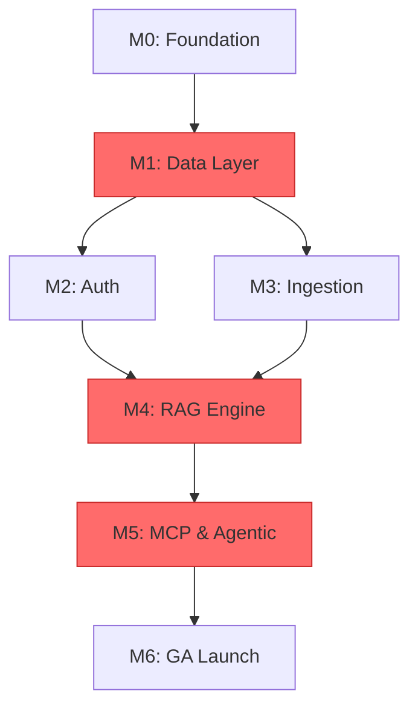

# استراتيجية التسليم والمراحل الزمنية (Delivery Strategy and Milestones)

> تحدد هذه الوثيقة مراحل التسليم، والتبعيات الحرجة بينها، ومعايير الخروج القابلة للتحقق لكل مرحلة، وتسلسل التنفيذ المعتمد لمشروع OmniRAG.

---

## 1. نظرة عامة على نموذج التسليم (Delivery Model)

تعتمد OmniRAG نموذج **التسليم المرحلي ذو البوابات (Phased Gate-Based Delivery)** مع **سباقات قابلة للتوازي (Parallel Tracks)** داخل كل مرحلة. كل مرحلة لها **هدف قابل للإثبات (Provable Outcome)** لا يُسمح بالانتقال للمرحلة التالية قبل تحقيقه بالكامل.

### 1.1 مبادئ التسليم المعتمدة

| المبدأ | التطبيق في OmniRAG |
|---|---|
| **Spec-Driven** | كل بطاقة مهمة (Task Card) في [الأقسام التالية](./02-agent-sized-task-decomposition.md) مستمدة من هذه الوثيقة |
| **Vertical Slicing** | كل مرحلة تُسلّم شريحة كاملة رأسياً (UI + API + DB) قابلة للنشر |
| **Test + Eval Gates** | كل بوابة مرحلة تتضمن اختبارات + تقييمات (evals) قبل الانتقال |
| **Conductor Mode** | مهام معقدة (مثل RAG Engine) تُنفّذ تحت إشراف موصل بشري عبر وكيل كبير |
| **Orchestrator Mode** | مهام متكررة (مثل CRUD endpoints) تُنفّذ بوكلاء صغار مع اختبارات آلية |
| **Rollback-First** | كل ميزة تُنشر خلف Feature Flag للتراجع الفوري |

---

## 2. مراحل التسليم الست (Six Delivery Phases)

### المرحلة 0: التأسيس والتجهيز (Foundation & Bootstrap)

**الهدف:** تجهيز البنية التحتية للمشروع مع بيئة تطوير موحدة، وحوكمة الوكلاء (Agent Harness)، ومراقبة الجودة قبل كتابة أي كود منتج.

| البُعد | التفاصيل |
|---|---|
| **المدة المقدرة** | 3 — 5 أيام |
| **المخرج الرئيسي** | مستودع جاهز + Harness عامل + CI/CD أخضر |
| **التبعيات المُسبقة** | لا شيء (نقطة البداية) |
| **نمط الوكيل** | Orchestrator (مهام تهيئة قابلة للتكرار) |

#### مهام المرحلة 0

- [ ] إنشاء مستودع Git بنية Monorepo (`apps/web`, `packages/db`, `packages/ai`, `packages/mcp`)
- [ ] كتابة `AGENTS.md` الجذري بالقواعد الموحدة لكل الوكلاء
- [ ] إنشاء مجلد `.claude/skills/` وكتابة المهارات الأولية (Skills):
  - `prisma-migration` — لتطبيق ترحيلات قاعدة البيانات بأمان
  - `nextjs-route-builder` — لهيكل نقاط نهاية API
  - `qdrant-collection-manager` — لإنشاء مجموعات Qdrant مع Payload Schema
  - `rls-policy-auditor` — للتدقيق على سياسات Row-Level Security
- [ ] كتابة `MEMORY.md` لتوثيق القرارات المعمارية (Architectural Decision Records)
- [ ] تجهيز بيئات Vercel (Preview, Staging, Production) مع Domain Protection
- [ ] تجهيز قاعدة Neon Postgres بثلاثة فروع بيئية (dev/staging/prod) مع Branches
- [ ] تجهيز حساب Qdrant Cloud بمجموعات منفصلة لكل بيئة
- [ ] تجهيز أسرار API في Vercel Environment Variables (مشفّرة)
- [ ] تجهيز CI/CD Pipeline مع Jobs: Lint → TypeCheck → Unit → Integration → Build → Preview Deploy

#### معايير الخروج (Exit Criteria) للمرحلة 0

| المعيار | طريقة التحقق |
|---|---|
| جميع المهام مكتملة في GitHub Issues | مراجعة بشرية للقائمة |
| `pnpm install && pnpm dev` يعمل دون أخطاء | اختبار يدوي + CI run |
| `AGENTS.md` وSkills موجودة في المستودع | `git ls-files \| grep AGENTS.md` |
| CI pipeline أخضر على commit فارغ | GitHub Actions run history |
| نشر Preview يعمل ويتعرض لـ URL صحي | `curl -I https://preview-...vercel.app` يعيد 200 |
| لا أسرار (Secrets) مكشوفة في الكود | `gitleaks` scan نظيف |

---

### المرحلة 1: البنية التحتية للبيانات والعزل (Data Infrastructure & Tenant Isolation)

**الهدف:** إنشاء طبقة البيانات الكاملة مع عزل المستأجرين (Tenant Isolation) المُفعّل، قبل بناء أي ميزة فوقها — لأن خرق العزل يُلغي المنتج بأكمله.

| البُعد | التفاصيل |
|---|---|
| **المدة المقدرة** | 5 — 8 أيام |
| **المخرج الرئيسي** | Schema كامل + RLS مُختبر + سياسات عزل خضراء |
| **التبعيات المُسبقة** | المرحلة 0 |
| **نمط الوكيل** | Orchestrator (مهام DDL متكررة) |

#### مهام المرحلة 1

- [ ] تنفيذ DDL لجداول `users`, `sources`, `documents`, `chunks`, `conversations`, `messages`
- [ ] تفعيل Row-Level Security على جميع الجداول الحساسة
- [ ] كتابة سياسات RLS مع اختبار لكل سياسة (RLS Policy Test Suite)
- [ ] إنشاء فهارس `GIN` للبحث النصي الكامل (TSVector) للعربية والإنجليزية
- [ ] إنشاء Collections في Qdrant مع Payload Schema يتضمن `tenant_id` إلزامي
- [ ] كتابة Middleware `tenant-context.ts` يُعيّن `app.current_tenant` لكل طلب
- [ ] تطبيق اختبارات اختراق (Penetration Tests) لمحاولات تخطي RLS
- [ ] توثيق مخطط العزل متعدد الطبقات الخمس في `docs/security/isolation.md`

#### معايير الخروج للمرحلة 1

| المعيار | طريقة التحقق |
|---|---|
| جميع الجداول الحساسة عليها RLS مفعل | استعلام: `SELECT tablename, rowsecurity FROM pg_tables WHERE schemaname='public'` |
| اختبار اختراق RLS ناجح | اختبار آلي يحاول قراءة بيانات مستخدم آخر من 5 جداول → كلها تفشل |
| اختبارات الوحدة للـ RLS خضراء | `pnpm test:rls` يعيد 0 failures |
| فهارس GIN موجودة ومُختبرة | استعلام EXPLAIN لاستعلام عربي وإنجليزي |
| Qdrant collections معزولة بـ payload filter إلزامي | اختبار آلي يُثبت رفض أي استعلام بدون `tenant_id` |

> ⚠️ **نقطة حاسمة:** إذا فشلت أي حالة من حالات العزل، يجب إصلاحها قبل الانتقال. لا تنازل هنا — خرق العزل يدمّر الثقة والمُتطلبات التنظيمية (GDPR/HIPAA/PCI).

---

### المرحلة 2: المصادقة والـ Onboarding (Auth & Onboarding Flow)

**الهدف:** تدفق تسجيل دخول وتسجيل حساب موثوق مع Tenant Provisioning تلقائي، قبل إضافة أي ميزات بيانات.

| البُعد | التفاصيل |
|---|---|
| **المدة المقدرة** | 4 — 6 أيام |
| **المخرج الرئيسي** | تدفق تسجيل دخول/تسجيل/إعداد مُحسَّن وآمن |
| **التبعيات المُسبقة** | المرحلة 1 |
| **نمط الوكيل** | Conductor (مهام حساسة أمنياً) |

#### مهام المرحلة 2

- [ ] تكامل NextAuth.js / Clerk مع OAuth Providers (Google, GitHub)
- [ ] تدفق تسجيل بـ Email/Password مع Email Verification
- [ ] MFA اختياري (TOTP)
- [ ] إنشاء `tenant_id` تلقائي عند أول تسجيل (Tenant Provisioning)
- [ ] صفحة `/auth` كاملة (Login, Register, MFA Setup) مع دعم RTL
- [ ] JWT مع `tenant_id` مضمّن + تشفير + Refresh Token Rotation
- [ ] Rate Limiting على نقاط نهاية المصادقة (5 محاولات/15 دقيقة)
- [ ] صفحة `/dashboard` فارغة مع شريط جانبي وتنقل أساسي (Shell)

#### معايير الخروج للمرحلة 2

| المعيار | طريقة التحقق |
|---|---|
| تسجيل مستخدم جديد ينشئ tenant_id ويُعيد توجيهه لـ `/dashboard` | اختبار E2E (Playwright) |
| محاولة تسجيل دخول بكلمة مرور خاطئة 6 مرات → حساب مُقفل | اختبار آلي |
| JWT ينتهي بعد 60 دقيقة ويُجدد تلقائياً | اختبار وحدة |
| OAuth مع Google يعمل ويعود بـ tenant_id صحيح | اختبار E2E |
| صفحة `/dashboard` تظهر Shell فارغ مع Language Toggle يعمل | اختبار بصري |
| تقييم UX: زمن التسجيل من نقر "Sign Up" للوصول لـ Dashboard ≤ 45 ثانية | LM Judge على لقطات شاشة |

---

### المرحلة 3: خط أنابيب الاستيعاب الأساسي (Core Ingestion Pipeline)

**الهدف:** قدرة المستخدم على رفع ملف (PDF/Text) واستيعابه ومُعالجته وفهرسته، مع كل خط أنابيب البيانات يعمل بأمان وكفاءة.

| البُعد | التفاصيل |
|---|---|
| **المدة المقدرة** | 8 — 12 يوم |
| **المخرج الرئيسي** | رفع ملف PDF → استيعاب → معالجة → تقسيم → تضمين → بحث |
| **التبعيات المُسبقة** | المرحلتان 1 و 2 |
| **نمط الوكيل** | Conductor لـ OCR/Embedding، Orchestrator لـ CRUD |

#### مهام المرحلة 3

- [ ] منطقة File Upload Zone في `/sources` مع Drag-and-Drop
- [ ] استقبال الملف → تخزين في Vercel Blob مع مسار معزول `/{tenant_id}/files/`
- [ ] إنشاء سجل `documents` بحالة `pending`
- [ ] قائمة انتظار Inngest/Trigger.dev للمعالجة غير المتزامنة
- [ ] تكامل Mistral Document AI لمعالجة PDF مع OCR
- [ ] تكامل Unstructured Transform كبديل/تكميل
- [ ] كشف اللغة (ar/en/mixed) لكل فقرة
- [ ] تطبيع النص العربي (توحيد الهمزات، التاء، الأرقام)
- [ ] Smart Chunking مع 5 استراتيجيات (Paragraph, Sentence, Heading, Semantic, Hybrid)
- [ ] توليد التضمينات عبر `gemini-embedding-2` (3072-dim) مع Task Prefix
- [ ] تخزين مزدوج: Qdrant (vectors) + Neon (text + metadata)
- [ ] تحديث حالة المستند → `indexed` أو `failed` مع Failure Log
- [ ] صفحة Ingestion Status في `/dashboard` مع تتبع مباشر
- [ ] معالج Auto للاختيار بين Mistral و Unstructured حسب نوع الملف

#### معايير الخروج للمرحلة 3

| المعيار | طريقة التحقق |
|---|---|
| رفع PDF (10 صفحات) → استيعاب كامل في ≤ 90 ثانية | اختبار أداء |
| رفع PDF ممسوح ضوئياً (Scanned) → OCR ناجح بمعدل دقة ≥ 95% | اختبار golden dataset من 5 ملفات |
| مستند عربي يحتوي 5000 كلمة → تقسيم سليم دون كسر جمل | اختبار يدوي + عينات |
| اختبار Retrieval: استعلام عن محتوى المستند يُرجع Chunk صحيح في top-3 | اختبار آلي |
| اختبار Tenant Isolation: مستخدم A لا يستطيع رؤية مستندات B | اختبار RLS |
| اختبار فشل: رفع ملف فاسد → حالة `failed` + رسالة خطأ واضحة | اختبار وحدة |

> 📌 **التوازي داخل المرحلة:** يمكن تنفيذ مهام Mistral/Unstructured integration بالتوازي مع مهام Qdrant integration لأنهما مستقلان تقنياً.

---

### المرحلة 4: محرك RAG والبحث الهجين (Hybrid RAG Engine)

**الهدف:** قلب المنتج — قدرة البحث الدلالي والمعجمي ودمجهما، مع الاستعلام باللغة الطبيعية وإرجاع إجابات مع مراجع.

| البُعد | التفاصيل |
|---|---|
| **المدة المقدرة** | 10 — 14 يوم |
| **المخرج الرئيسي** | سؤال بالعربية أو الإنجليزية → إجابة مع مراجع ودرجات ثقة |
| **التبعيات المُسبقة** | المرحلة 3 |
| **نمط الوكيل** | Conductor (نواة ذكاء اصطناعي حساسة) |

#### مهام المرحلة 4

- [ ] Query Parser مع كشف اللغة + كشف النية + استخراج الكيانات
- [ ] Query Expansion عبر HyDE (Hypothetical Document Embeddings)
- [ ] بحث دلالي متوازي في Qdrant مع Payload Filter إلزامي بـ `tenant_id`
- [ ] بحث معجمي متوازي في Neon Postgres عبر `tsvector`
- [ ] Reciprocal Rank Fusion (RRF) لدمج القوائم
- [ ] Cross-Encoder Re-ranking (اختياري قابل للتفعيل)
- [ ] تجميع السياق (Context Assembly) مع ترتيب حسب الصلة
- [ ] توليد الإجابة عبر `gemini-3.5-flash-lite` أو `gemini-3.6-flash` مع Streaming
- [ ] Smart Model Routing (Flash-Lite للاستعلامات البسيطة، Flash للمعقدة)
- [ ] إرفاق المراجع (Citations) مع رقم الصفحة والمقتطف
- [ ] درجة ثقة (Confidence Score) بصرية
- [ ] وضع المحادثة Private (البيانات الخاصة فقط) — المرحلة الأولى
- [ ] صفحة `/chat` كاملة مع Chat Interface و Message Bubbles
- [ ] سجل المحادثات (Conversation History) مع بحث

#### معايير الخروج للمرحلة 4

| المعيار | طريقة التحقق |
|---|---|
| استعلام عربي يُرجع إجابة صحيحة في ≥ 80% من الحالات | Eval على golden dataset من 30 سؤال/مستند |
| استعلام إنجليزي يُرجع إجابة صحيحة في ≥ 85% من الحالات | Eval على golden dataset من 30 سؤال/مستند |
| بحث هجين أفضل من البحث الدلالي وحده (Recall@10) | مقارنة قبل/بعد بـ evals |
| Streaming يعمل: أول رمز ≤ 800ms | اختبار أداء |
| Citation Verification: كل ادعاء مُدعّم بمصدر | LM Judge على 50 عينة |
| Tenant Isolation مُحافظ عليه في كل طبقة بحث | اختبار اختراق |
| متوسط زمن استعلام End-to-End ≤ 3 ثوانٍ (Flash-Lite) | اختبار أداء |
| **Eval Gate:** رضا بشري (Human Preference) ≥ 4/5 على 30 إجابة | تقييم بشري |

> 🎯 **Eval Gate حرج:** هذه المرحلة لا تُعتبر ناجحة إلا إذا حققت معايير التقييم (Evals) المحددة. الاختبارات وحدها لا تكفي لأن جودة الإجابات غير حتمية (non-deterministic).

---

### المرحلة 5: تكاملات MCP والـ Agentic RAG (MCP Layer & Agentic RAG)

**الهدف:** تحويل OmniRAG من تطبيق RAG إلى منصة وكيل ذكي قادر على التفاعل مع خوادم MCP الخارجية والويب.

| البُعد | التفاصيل |
|---|---|
| **المدة المقدرة** | 12 — 18 يوم |
| **المخرج الرئيسي** | MCP Gateway عامل + 5 خوادم MCP مدمجة + Agent Loop |
| **التبعيات المُسبقة** | المرحلة 4 |
| **نمط الوكيل** | Conductor (أمان + OAuth) + Orchestrator (Tool Wrappers) |

#### مهام المرحلة 5

**5.1 البنية التحتية لـ MCP (4 — 5 أيام)**
- [ ] تطبيق `@modelcontextprotocol/server` v2.0 (مواصفة 2026-07-28)
- [ ] MCP Gateway Handler في `/api/mcp/[...path]/route.ts`
- [ ] MCPClientPool مع تخزين مؤقت 60 ثانية
- [ ] جداول `mcp_server_configs`, `mcp_oauth_tokens`, `mcp_tool_calls`, `mcp_health_checks`
- [ ] تشفير AES-256 للرموز والمفاتيح
- [ ] MCPAuditLogger شامل

**5.2 المصادقة والأمان (3 — 4 أيام)**
- [ ] MCPOAuthManager مع RFC 8707 (Resource Indicators)
- [ ] التحقق من `iss` وفق RFC 9207
- [ ] PKCE Flow إلزامي لكل OAuth
- [ ] نظام Side-Effect Confirmation (تأكيد المستخدم قبل كل إجراء ذو أثر)

**5.3 خوادم MCP الأساسية (3 — 5 أيام)**
- [ ] Notion MCP (قراءة/كتابة الصفحات)
- [ ] GitHub MCP (قراءة Repository + إنشاء Issues)
- [ ] Google Drive MCP (جلب الملفات)
- [ ] Slack MCP (قراءة الرسائل)
- [ ] Web Search MCP (بحث حي مع 3 مزودين)

**5.4 Agentic RAG Engine (3 — 4 أيام)**
- [ ] Task Planner يحلل الاستعلام ويختار الأدوات
- [ ] Agent Loop مع maxSteps افتراضي = 5
- [ ] Tool Scoping: `serverId__toolName`
- [ ] دمج نتائج RAG + MCP + Web
- [ ] Post-Generation Actions مع تأكيد المستخدم
- [ ] صفحة `/mcp-hub` لإدارة الخوادم

#### معايير الخروج للمرحلة 5

| المعيار | طريقة التحقق |
|---|---|
| كل طلب MCP مستقل تماماً (Stateless) | اختبار: 100 طلب متتالي بدون Session ID |
| RLS مطبق على كل جداول MCP | اختبار اختراق |
| Token Misuse غير ممكن (RFC 8707) | اختبار يحاول استخدام رمز Notion مع GitHub → مرفوض |
| Mix-up Attack غير ممكن (RFC 9207) | اختبار يحاول استبدال `iss` → مرفوض |
| كل استدعاء أداة ذو أثر جانبي يتطلب موافقة | اختبار آلي يرفض بدون تأكيد |
| Audit Log يُسجل كل استدعاء مع latency | مراجعة عينات |
| Notion MCP: جلب صفحة + البحث يعمل | اختبار E2E |
| Agent Loop ينتهي في ≤ 5 تكرارات أو يُرجع خطأ واضح | اختبار آلي |
| صفحة `/mcp-hub` تضيف/تعطل/تختبر خوادم | اختبار UI |

---

### المرحلة 6: الميزات المتقدمة والتوسع (Advanced Features & Scale)

**الهدف:** إكمال الميزات المتبقية في PRD، تحسينات الأداء، اختبارات الحمل، والتجهيز للإطلاق العام (GA).

| البُعد | التفاصيل |
|---|---|
| **المدة المقدرة** | 10 — 15 يوم |
| **المخرج الرئيسي** | منتج جاهز للإطلاق العام |
| **التبعيات المُسبقة** | المراحل 1 — 5 |
| **نمط الوكيل** | Orchestrator مع تقييم بشري مكثف |

#### مهام المرحلة 6

**6.1 ميزات PRD المتبقية**
- [ ] صفحة `/knowledge` (Collection Manager, Document Explorer, Chunk Viewer, Chunk Editor, Semantic Search Test, Embedding Visualizer)
- [ ] أوضاع المحادثة الثلاثة الباقية (Hybrid, General, Analysis)
- [ ] جميع المصادر في `/sources` (URL Crawler, RSS, YouTube, Google Drive, Confluence, Email IMAP, External DB, API Custom)
- [ ] SyncScheduler مع Cron Expressions
- [ ] SourceHealthMonitor
- [ ] BulkImporter
- [ ] صفحة `/analytics` مع مقاييس Recall@K, MRR, NDCG
- [ ] صفحة `/api-docs` مع API Playground و EmbedWidget
- [ ] صفحة `/settings` كاملة بجميع التبويبات

**6.2 التحسينات**
- [ ] Vercel Edge Functions للبحث والتوجيه
- [ ] KV Cache للاستعلامات الشائعة (TTL: 5 دقائق)
- [ ] Batch Processing للتضمينات (8,192 token/request)
- [ ] Connection Pooling لـ Neon
- [ ] Optimistic Updates في الواجهة

**6.3 الأمان والامتثال**
- [ ] تدقيق GDPR: تصدير البيانات + حذف الحساب
- [ ] Prompt Injection Guards
- [ ] Audit Log شامل مع Retention Policy
- [ ] Security Headers (CSP, HSTS, X-Frame-Options)

**6.4 الإطلاق**
- [ ] Load Testing (1000 مستخدم متزامن)
- [ ] Disaster Recovery Plan
- [ ] Documentation للمستخدمين
- [ ] Status Page
- [ ] Launch Checklist

#### معايير الخروج للمرحلة 6

| المعيار | طريقة التحقق |
|---|---|
| كل صفحات PRD مكتملة | مراجعة بصرية + Checklist |
| اختبار الحمل: 1000 مستخدم متزامن، p95 latency ≤ 2s | k6 أو Artillery load test |
| اختبار GDPR: تصدير + حذف بيانات مستخدم خلال 24 ساعة | اختبار آلي |
| Penetration Test Report بدون ثغرات حرجة | تقرير من أداة OWASP ZAP |
| كل أوضاع المحادثة الأربعة تعمل | اختبار E2E لكل وضع |
| كل المصادر الـ 10 مُدمجة ومُختبرة | اختبار لكل مصدر |
| Uptime في staging ≥ 99.5% لأسبوع كامل | مراقبة |

---

## 3. خارطة الطريق الزمنية (Timeline Roadmap)

| المرحلة | المدة | التراكم | معلم رئيسي (Milestone) |
|---|---|---|---|
| **M0 — Foundation** | 3 — 5 أيام | 5 أيام | CI/CD أخضر + Harness جاهز |
| **M1 — Data Layer** | 5 — 8 أيام | 13 يوم | عزل مستأجرين مُختبَر |
| **M2 — Auth** | 4 — 6 أيام | 19 يوم | تسجيل دخول يعمل |
| **M3 — Ingestion** | 8 — 12 يوم | 31 يوم | رفع PDF → استيعاب كامل |
| **M4 — RAG Engine** | 10 — 14 يوم | 45 يوم | سؤال/جواب مع مراجع |
| **M5 — MCP + Agentic** | 12 — 18 يوم | 63 يوم | وكيل ذكي مع 5 خوادم MCP |
| **M6 — GA Launch** | 10 — 15 أيام | 78 يوم | إطلاق عام |

> **الإجمالي التقديري:** 11 — 13 أسبوعاً (78 يوم) من نقطة الصفر إلى الإطلاق العام.

---

## 4. التبعيات الحرجة بين المراحل (Critical Dependencies)

### 4.1 نقاط الاختناق (Bottlenecks)

| المرحلة | سبب الاختناق | تخفيف |
|---|---|---|
| **M1** | العزل خط أحمر — خرق واحد يُلغي المنتج | اختبار اختراق يدوي قبل الانتقال + مراجعة كود مزدوجة |
| **M4** | جودة RAG غير حتمية، تتطلب تقييمات متعددة | Eval Harness مبكر + Golden Dataset من اليوم الأول |
| **M5** | OAuth مع 4+ مزودين + MCP spec جديد | فريقان متوازيان: Gateway + Auth |

### 4.2 مسارات متوازية (Parallel Tracks)

| المرحلة | المسار A | المسار B | المسار C |
|---|---|---|---|
| **M3** | تكامل Mistral OCR | تكامل Unstructured | واجهة `/sources` |
| **M5** | MCP Gateway + Notion/GitHub | OAuth + Side-Effect UI | باقي خوادم MCP |
| **M6** | ميزات PRD | تحسينات أداء | أمان واختبارات |

---

## 5. بوابات الجودة (Quality Gates)

كل مرحلة يجب أن تجتاز هذه البوابات قبل الانتقال:

### 5.1 بوابة الاختبارات (Test Gate)

| نوع الاختبار | المعيار | الأداة |
|---|---|---|
| Unit Tests | تغطية ≥ 80% على المنطق الأساسي | Vitest |
| Integration Tests | كل API endpoint مُختبر | Vitest + Supertest |
| E2E Tests | السيناريوهات الحرجة تعمل | Playwright |
| RLS Tests | عزل المستأجرين محكم | Custom Test Suite |
| Security Tests | لا ثغرات حرجة (High/Critical) | OWASP ZAP |

### 5.2 بوابة التقييمات (Eval Gate)

| نوع التقييم | المعيار | التنفيذ |
|---|---|---|
| **Retrieval Recall@K** | ≥ 0.80 على golden dataset | اختبار آلي |
| **Answer Quality (LM Judge)** | ≥ 4/5 على 50 عينة | GPT-4 أو Claude Judge |
| **Arabic Quality Eval** | ≥ 4/5 على عينات عربية | LM Judge + مراجعة بشرية |
| **Citation Accuracy** | ≥ 95% ادعاءات لها مصدر | LM Judge |
| **Side-Effect Safety** | 0 تنفيذ بدون تأكيد | اختبار آلي |

### 5.3 بوابة المراجعة البشرية (Human Review Gate)

| العنصر | المعيار |
|---|---|
| مراجعة كود (Code Review) | موافقة مالك المشروع على كل PR |
| مراجعة أمنية (Security Review) | موافقة على تغييرات Auth/RLS/MCP |
| تقييم UX | رضا بشري ≥ 4/5 على 5 مهام حرجة |
| تقييم جودة عربية | مراجعة لغوية للـ UI والإجابات |

---

## 6. توزيع الوكلاء حسب المرحلة (Agent Allocation)

| المرحلة | وضع Conductor | وضع Orchestrator | النموذج المُوصى |
|---|---|---|---|
| M0 | — | كل المهام | نموذج صغير (Haiku-class) |
| M1 | — | DDL + RLS | نموذج صغير |
| M2 | Auth flow، OAuth | Middleware، UI Shell | كبير + صغير |
| M3 | OCR/Embedding logic | Upload UI، CRUD | كبير + صغير |
| M4 | RAG pipeline، Prompt | Components، Streaming | **نموذج كبير فقط** |
| M5 | OAuth Security، Agent Loop | Tool Wrappers | كبير + صغير |
| M6 | ميزات حساسة | ميزات متكررة | كبير + صغير |

> 📌 **القاعدة:** كل ما يتعلق بـ **Prompt Engineering، RAG Quality، Agent Decisions، Security OAuth** يذهب للنموذج الكبير تحت Conductor Mode. كل ما هو **CRUD، UI boilerplate، DDL** يذهب لنموذج صغير في Orchestrator Mode.

---

## 7. مخاطر التسليم والتخفيف (Delivery Risks)

| المخاطرة | الاحتمال | الأثر | التخفيف |
|---|---|---|---|
| **انقطاع Mistral أو Unstructured API** | متوسط | عالي | Circuit Breaker + Fallback + كاش التضمينات |
| **تأخر إصدار MCP SDK v2** | منخفض | عالي | استخدام `@modelcontextprotocol/sdk` القديم كاحتياطي |
| **ارتفاع تكلفة Gemini Embedding** | متوسط | متوسط | تخزين مؤقت + Batch + متجهات أقل أبعاداً عند الحاجة |
| **مشاكل جودة التضمين للعربية** | متوسط | عالي | Eval يومي على عينات عربية + تنظيف dataset |
| **أزمة سعة Qdrant** | منخفض | عالي | Sharding + مراقبة استخدام + توسيع مسبق |
| **حدود Vercel Serverless Timeout** | متوسط | متوسط | تقسيم المهام الطويلة + Inngest للمهام الثقيلة |

---

## 8. المقاييس الرئيسية للنجاح (KPIs)

| المقياس | الهدف عند الإطلاق |
|---|---|
| زمن استعلام RAG (p95) | ≤ 3 ثوانٍ |
| دقة الاسترجاع Recall@10 | ≥ 0.80 |
| جودة الإجابات (LM Judge) | ≥ 4/5 |
| زمن الاستيعاب (PDF 10 صفحات) | ≤ 90 ثانية |
| Uptime | ≥ 99.5% |
| نجاح OAuth flows | ≥ 98% |
| **0 خروقات Tenant Isolation** | مطلق |

---

## 9. الخطوات التالية الفورية (Next Steps)

1. **اليوم:** مراجعة هذه الوثيقة والموافقة على المراحل الست
2. **اليوم + 1:** بدء المرحلة 0 — إنشاء المستودع وكتابة `AGENTS.md`
3. **اليوم + 5:** اجتياز بوابة المرحلة 0 (CI/CD أخضر)
4. **الأسبوع 1:** بدء المرحلة 1 (Data Infrastructure)

---

## 10. القسم التالي

تنتقل الآن إلى: [تقسيم المهام بحجم الوكيل](./02-agent-sized-task-decomposition.md) — حيث تُفصَّل كل مرحلة من المراحل الست إلى بطاقات مهام (Task Cards) بحجم وكيل مع معايير نجاح صريحة.