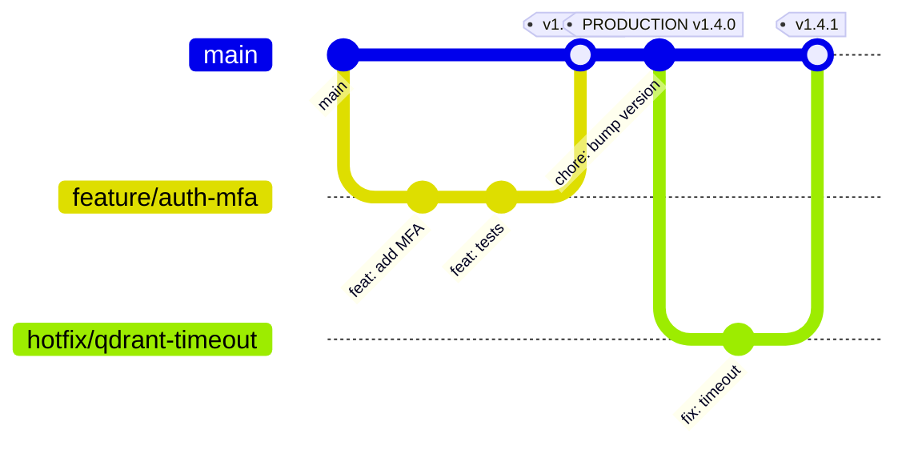
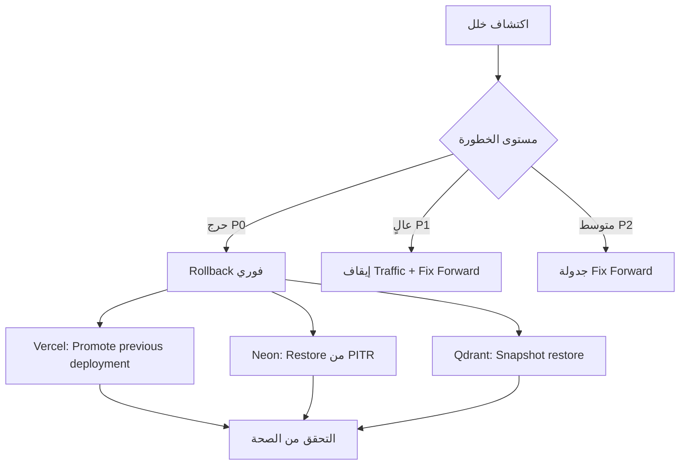

# Environments, CI/CD, and Deployment

> **القسم 1 من 2** — يغطي تدفق الترقية، مراحل خط الأنابيب، أهداف النشر، واستراتيجية التراجع.
> القسم التالي: [Observability, SLOs, and Cost Governance](./02-observability-slos-and-cost-governance.md)

---

## 1. نظرة عامة على فلسفة النشر

يُطبَّق OmniRAG نموذج **Promote-Through-Environments** (ترقية متتابعة عبر البيئات) مع بوابات جودة آلية وبشرية، بحيث لا يصل أي تغيير إلى بيئة الإنتاج دون اجتياز اختبارات تلقائية وعينات تقييم (Eval Samples) مُحددة سلفاً.

| المبدأ | التطبيق في OmniRAG |
|---|---|
| **Trunk-Based Development** | فرع `main` دائماً قابل للنشر؛ ميزات قصيرة العمر (≤ 48 ساعة) عبر Feature Flags |
| **Continuous Deployment للإنتاج** | كل دمج ناجح في `main` يُنتج **Preview Deployment** تلقائياً؛ النشر للإنتاج عبر **Promote Action** يدوي من قِبل المالك |
| **Environment Parity** | نفس تعريف البنية (IaC) ونسخة التبعيات وبيانات الاعتماد (عبر Vercel Environments) لكل البيئات |
| **Zero-Downtime Deployments** | النشر عبر Vercel Edge Network مع Health Gate قبل تحويل الحركة |
| **GitOps-lite** | تعريفات البنية في `infra/` ضمن المستودع؛ التغييرات تمر بنفس خط أنابيب الكود |

---

## 2. تعريف البيئات الأربع

| البيئة | الغرض | الرابط | قاعدة البيانات | المستأجرون | أدوات خارجية |
|---|---|---|---|---|---|
| **Local** | تطوير على جهاز المطوّر | `localhost:3000` | Neon Branch لكل مطوّر | مالك واحد (المطوّر) | Gemini API key تجريبي، Qdrant محلي عبر Docker |
| **Preview** | مراجعة كل Pull Request وميزات قيد التطوير | رابط فريد لكل PR (`{pr-number}-omnirag.vercel.app`) | Neon Branch تلقائي لكل Preview | مالك واحد | نفس بيانات الإنتاج ولكن بحدود Rate أخفض |
| **Staging** | اختبار قبول، تقييم الجودة، اختبار الحمل | `staging.omnirag.app` | Neon Branch `staging` مع بذرة بيانات مُنمّاة | حساب اختبار واحد + بيانات صناعية | Gemini API key منفصل، Qdrant Cloud مجاني، Inngest Dev Server |
| **Production** | الخدمة الفعلية للمستخدمين | `app.omnirag.com` + نطاقات فرعية | Neon Production + Read Replica | جميع المستأجرين الحقيقيين | جميع المزودين بمفاتيح إنتاجية، Qdrant Production Cluster |

> **عزل قوي:** كل بيئة لها متغيرات بيئية منفصلة (`NEON_DATABASE_URL`, `QDRANT_URL`, `GEMINI_API_KEY`, …) ولا تتشارك أي سر مع غيرها. تُدار الأسرار عبر Vercel Environment Variables مع تشفير في حالة السكون.

---

## 3. خريطة فروع Git وتدفق الترقية



| نوع الفرع | عمره الأقصى | يدمج في | نشر تلقائي |
|---|---|---|---|
| `feature/*` | 48 ساعة | `main` | Preview فقط |
| `fix/*` | 24 ساعة | `main` | Preview فقط |
| `hotfix/*` | بدون حد | `main` (مباشرة) | Preview + خيار Promote عاجل للإنتاج بعد موافقة |
| `release/*` | أسبوع واحد | `main` | Preview + Staging |

---

## 4. مراحل خط أنابيب CI/CD

### 4.1 الجدول التفصيلي للمراحل

| # | المرحلة | الهدف | الأدوات | معيار النجاح | زمن مستهدف |
|---|---|---|---|---|---|
| 1 | **Checkout & Setup** | استنساخ الكود وتثبيت التبعيات | GitHub Actions, pnpm | نجاح `pnpm install --frozen-lockfile` | < 90 ثانية |
| 2 | **Lint & Format** | فرض معايير الكود | ESLint, Prettier, TypeScript `--noEmit` | 0 أخطاء، 0 تحذيرات | < 60 ثانية |
| 3 | **Unit Tests** | اختبار الوحدات | Vitest, Testing Library | تغطية ≥ 80% للملفات المتغيرة | < 3 دقائق |
| 4 | **Contract Tests** | التحقق من توافق API مع `openapi.yaml` | Schemathesis, OpenAPI Validator | 0 انتهاكات عقد | < 90 ثانية |
| 5 | **Integration Tests** | اختبار تدفقات end-to-end في Staging | Playwright + قاعدة بيانات Ephemeral | نجاح جميع السيناريوهات الحرجة | < 5 دقائق |
| 6 | **Security Scan** | فحص أمني شامل | Snyk (deps), Trivy (container), Semgrep (SAST), gitleaks (secrets) | 0 ثغرات حرجة أو عالية | < 2 دقيقة |
| 7 | **Build** | بناء حاوية Next.js وقياس حجمها | `next build`, Bundle Analyzer | حجم الحزمة ≤ 250 KB (JS أولي) | < 4 دقائق |
| 8 | **Deploy to Preview** | نشر على بيئة المعاينة | Vercel CLI | نشر ناجح + URL صحي | < 90 ثانية |
| 9 | **Preview Smoke Tests** | اختبار دخاني على URL المعاينة | Playwright (اختبار صحة الصفحة الرئيسية، تسجيل الدخول، محادثة) | نجاح 10/10 اختبارات | < 3 دقائق |
| 10 | **Eval Gate** | تشغيل مجموعة تقييمات على عيّنة 50 حالة | LM Judge (gemini-3.6-flash) + روبوتيك Rubrics | درجة الإجابات ≥ 0.85، Recall@5 ≥ 0.80، نسبة هلوسات ≤ 2% | < 6 دقائق |
| 11 | **Promotion to Staging** | نشر تلقائي على Staging لاختبار القبول | Vercel | نجاح، صحة `/api/health` | < 90 ثانية |
| 12 | **Production Smoke Tests** | اختبار دخاني للإنتاج بعد النشر | نفس مجموعة Playwright | نجاح | < 5 دقائق |

> **مُلخَّص:** خط أنابيب كامل PR يستغرق ≈ 22 دقيقة. النشر للإنتاج بعد الدمج في `main` يتم عبر **Promote Action** يدوي (لا تلقائي) ليتسنى للمالك مراجعة تقرير التقييم.

### 4.2 ملف GitHub Actions كنموذج

```yaml
# .github/workflows/ci.yml
name: OmniRAG CI

on:
  pull_request:
    branches: [main]
  push:
    branches: [main]

concurrency:
  group: ${{ github.workflow }}-${{ github.ref }}
  cancel-in-progress: true

jobs:
  quality-gate:
    runs-on: ubuntu-latest
    timeout-minutes: 30
    steps:
      - uses: actions/checkout@v4
      - uses: pnpm/action-setup@v4
      - uses: actions/setup-node@v4
        with: { node-version: 20, cache: pnpm }
      - run: pnpm install --frozen-lockfile
      - run: pnpm lint
      - run: pnpm typecheck
      - run: pnpm test:unit --coverage
      - run: pnpm test:contract
      - run: pnpm audit --prod
      - uses: snyk/actions@master
        env: { SNYK_TOKEN: ${{ secrets.SNYK_TOKEN }} }

  build-and-preview:
    needs: quality-gate
    runs-on: ubuntu-latest
    steps:
      - uses: actions/checkout@v4
      - run: pnpm install --frozen-lockfile
      - run: pnpm build
      - uses: actions/upload-artifact@v4
        with: { name: build, path: .next, retention-days: 1 }
      - name: Deploy to Vercel Preview
        run: vercel deploy --token=${{ secrets.VERCEL_TOKEN }}

  eval-gate:
    needs: build-and-preview
    runs-on: ubuntu-latest
    steps:
      - uses: actions/checkout@v4
      - run: pnpm install --frozen-lockfile
      - run: pnpm eval:run --env=preview --dataset=v1
        env:
          PREVIEW_URL: ${{ needs.build-and-preview.outputs.preview_url }}
          GEMINI_API_KEY: ${{ secrets.GEMINI_EVAL_KEY }}
      - uses: actions/upload-artifact@v4
        with: { name: eval-report, path: reports/eval.json }

  integration-staging:
    if: github.event_name == 'push' && github.ref == 'refs/heads/main'
    needs: eval-gate
    runs-on: ubuntu-latest
    steps:
      - run: pnpm test:e2e --project=chromium-staging
        env:
          BASE_URL: https://staging.omnirag.app
      - uses: actions/upload-artifact@v4
        with: { name: playwright-report, path: playwright-report }
```

---

## 5. بوابة التقييم (Eval Gate) — العقد غير القطعي

بما أن OmniRAG يعتمد على نماذج لغوية كبيرة في طبقة RAG ووكيل MCP، فإن الاختبارات التقليدية وحدها لا تكفي. يُشترط **Eval Gate** قبل أي ترقية لمرحلة Staging:

| الاختبار | المقياس | الهدف | الحكم |
|---|---|---|---|
| **استرجاع دلالي** | Recall@5 على مجموعة 50 مستند ثنائي اللغة | ≥ 0.80 | فشل إذا انخفض > 5% عن خط الأساس |
| **دقة الإجابات** | Rubric بشري آلي (LM Judge) على 30 سؤال/جواب مُعتمد | ≥ 0.85 | فشل إذا انخفض > 3% |
| **نسبة الهلوسات** | كشف المراجع غير المُوثّقة | ≤ 2% | فشل إذا تجاوز الحد |
| **زمن الاستجابة p95** | مقياس E2E من الاستعلام إلى أول رمز | ≤ 1.8 ثانية | فشل إذا تجاوز 2.5 ثانية |
| **نجاح استدعاء MCP** | نسبة نجاح أدوات MCP على سيناريوهات الاختبار | ≥ 95% | فشل إذا انخفض > 2% |
| **سلامة العزل** | محاولة قراءة بيانات مستأجر آخر | 0 نجاح | فشل قاطع |
| **دعم العربية** | صحة الردود على 20 سؤالاً عربياً | ≥ 0.85 | فشل إذا انخفض > 5% |

> تُحفظ مجموعة التقييم (`datasets/v1.jsonl`) في المستودع مع بيانات اعتمادها. أي تعديل على المنطق يستلزم إضافة حالة اختبار مكافئة قبل القبول.

---

## 6. استراتيجية Feature Flags

تُدار Feature Flags عبر **Vercel Edge Config** أو **GrowthBook** لربط تفعيل الميزات بالمستأجرين الفرديين دون نشر جديد:

| العلم | النوع | الافتراضي | الحالات |
|---|---|---|---|
| `mcp_layer_enabled` | Release | `false` (Staging)، `true` (Production لمشتركي Enterprise) | تفعيل/تعطيل طبقة MCP بالكامل |
| `agentic_loop_max_iterations` | Experiment | `3` | اختبار أداء الوكيل مع 1/3/5/7 تكرارات |
| `hybrid_search_algorithm` | Experiment | `rrf` | مقارنة `rrf` / `weighted_sum` / `convex` على 10% من الحركة |
| `multimodal_chat_enabled` | Release | `true` | تعطيل مؤقت عند ارتفاع تكاليف Gemini |
| `kill_switch_external_search` | Operational | `false` | طوارئ: إيقاف البحث الخارجي عند تجاوز الميزانية |

> **القاعدة:** كل علم له **Kill Switch** مقابل (`*_kill_switch`) ليتم إيقاف الميزة فوراً دون نشر.

---

## 7. أهداف النشر (Deployment Targets)

### 7.1 النشر الأساسي على Vercel

| المكوّن | الهدف | الإعدادات |
|---|---|---|
| **Next.js App** | Vercel (منطقة `iad1` كمنطقة افتراضية) | App Router، RSC، Node 20 Runtime |
| **API Routes** | Vercel Serverless | maxDuration: 60s للـ Ingestion، 30s للـ Search، 300s للـ Streaming |
| **Edge Middleware** | Vercel Edge | التحقق من JWT، تحديد اللغة، Rate Limiting |
| **Background Jobs** | Inngest Cloud | معالجة المستندات، الزحف، إعادة التضمين |
| **Static Assets** | Vercel CDN | الأيقونات، ملفات الترجمة، الـ Bundle الأولي |

### 7.2 خدمات البيانات

| الخدمة | الهدف | الملاحظات |
|---|---|---|
| **Neon Postgres** | Production Branch + Auto-scaling | Read Replica في `eu-west-1`، Connection Pooling عبر PgBouncer |
| **Qdrant Cloud** | Production Cluster (3 nodes) | Replication factor = 2، Snapshot يومي إلى S3 |
| **Vercel Blob** | ملفات المستخدم | مع Signed URLs، دورة حياة 7 أيام للملفات المؤقتة |
| **Vercel KV** | جلسات، Rate Limit، Cache | TTL تكيفي حسب نوع البيانات |
| **Inngest** | أحداث غير متزامنة | Retry policy: 3 محاولات، Exponential Backoff |

### 7.3 بدائل النشر المعتمدة

| البديل | متى يُستخدم | الفارق |
|---|---|---|
| **Cloudflare Pages + Workers** | عند الحاجة لـ Edge compute أرخص | R2 بدلاً من Blob، D1 بدلاً من Neon |
| **AWS Amplify + Fargate** | المؤسسات التي تطلب AWS فقط | تكاليف أعلى، تحكم أفضل في الشبكة |
| **Railway / Fly.io** | النشر الذاتي لـ Qdrant وNeon البديلة | تحكم كامل، جهد تشغيلي أعلى |
| **Self-hosted K8s** | عملاء المؤسسة ذوو المتطلبات التنظيمية | Terraform + Helm Charts في `infra/k8s/` |

---

## 8. استراتيجية التراجع (Rollback)

### 8.1 مستويات التراجع



| المستوى | زمن الاستجابة المستهدف | الإجراء | الأداة |
|---|---|---|---|
| **L1: Application Rollback** | < 60 ثانية | العودة إلى آخر نشر ناجح عبر Vercel Dashboard أو API | `vercel rollback` |
| **L2: Database PITR** | < 5 دقائق | استعادة فرع Neon من نقطة زمنية (آخر ساعة) | Neon Console + Branch restore |
| **L3: Qdrant Snapshot** | < 15 دقيقة | استعادة المجموعة من آخر Snapshot | Qdrant API + S3 |
| **L4: Feature Flag Disable** | < 30 ثانية | إيقاف العلم المتسبب في الخلل | Edge Config API |
| **L5: Emergency Maintenance** | < 5 دقائق | صفحة صيانة + إيقاف جميع الطلبات | Vercel Maintenance Mode |

### 8.2 إجراءات تلقائية

| الحالة | الإجراء التلقائي | من ينفّذ |
|---|---|---|
| نسبة أخطاء 5xx > 5% لمدة 5 دقائق | إيقاف النشر الحالي + Rollback إلى آخر نسخة صحية + تنبيه PagerDuty | مراقب الصحة في Vercel |
| فشل 3 من فحوصات Health متتالية | تحويل Traffic إلى CDN مع صفحة صيانة + Rollback | Health Check Worker |
| تجاوز ميزانية API خارجية (Gemini) بنسبة 110% | تعطيل `multimodal_chat_enabled` + إشعار الفريق | Scheduled Job يومي |
| فشل في استدعاء MCP متكرر (> 50% في 10 دقائق) | تعطيل الخادم المتأثر + إشعار المستخدم | Inngest Function |

### 8.3 Post-Mortem

كل حادث P0/P1 يُلزم بـ **Post-Mortem** خلال 48 ساعة وفق قالب **Blameless**:

| الحقل | الوصف |
|---|---|
| **Timeline** | تسلسل زمني دقيق بالدقائق |
| **Root Cause** | التحليل الفني لـ "لماذا" حدث الخلل |
| **Contributing Factors** | عوامل مساعدة (Configuration drift، غياب اختبار، …) |
| **Customer Impact** | عدد المستأجرين المتأثرين، مدة التعطل، البيانات المفقودة |
| **Action Items** | مهام تحسين بملاك وتواريخ (مُتتبَعة في Linear) |
| **Detection & Response Quality** | تقييم زمن الاكتشاف والاستجابة |

---

## 9. إدارة الإصدارات (Release Management)

### 9.1 ترقيم الإصدارات (Semantic Versioning)

```
MAJOR.MINOR.PATCH[-rc.N]

مثال: 1.4.0         (إصدار إنتاج مستقر)
       1.5.0-rc.2    (مرشح إصدار)
       1.4.1         (إصلاح عاجل)
```

| النوع | تكرار | محتوى |
|---|---|---|
| **Major** (X.0.0) | كل 3-6 أشهر | تغييرات كاسرة (API، مخطط البيانات، طبقة MCP) |
| **Minor** (1.X.0) | كل 2-4 أسابيع | ميزات جديدة متوافقة مع الإصدارات السابقة |
| **Patch** (1.4.X) | عند الحاجة | إصلاحات أخطاء، تحديثات أمنية |
| **Pre-release** | قبل كل Major/Major Feature | فترة تجريبية في Production لـ 5% من المستأجرين |

### 9.2 سجل التغيير (CHANGELOG)

يُولَّد تلقائياً عبر `release-please` من رسائل Commit وفق **Conventional Commits**:

```
feat(mcp): add Notion MCP server integration
fix(search): handle empty vector results gracefully
chore(deps): bump @modelcontextprotocol/server to 2.0.0
perf(rag): cache semantic embedding for repeat queries
docs(api): update OAuth 2.0 flow documentation
```

### 9.3 سياسات الإيقاف (Deprecation)

| المرحلة | المدة | الإجراء |
|---|---|---|
| **إعلان الإيقاف** | قبل 90 يوماً | رأس `Sunset: <date>` + `Deprecation` في OpenAPI |
| **تشغيل متوازٍ** | 30 يوماً | الميزة القديمة تعمل بالتوازي مع البديل |
| **تحذير في Logs** | 14 يوماً | رسالة `console.warn` عند استخدام الميزة المُهمّلة |
| **إيقاف نهائي** | بعد 90 يوماً | حذف الكود، إعلان في CHANGELOG |

---

## 10. إدارة البنية التحتية (IaC)

### 10.1 تعريف البنية ككود

| الطبقة | الأداة | الموقع |
|---|---|---|
| **Vercel Project** | `vercel.json` + Vercel CLI | جذر المستودع |
| **Neon Database** | Neon API + Terraform | `infra/neon/` |
| **Qdrant Cluster** | Qdrant Cloud API + Helm | `infra/qdrant/` |
| **DNS & Domains** | Cloudflare + Terraform | `infra/cloudflare/` |
| **CI/CD Secrets** | GitHub OIDC + Doppler | `infra/secrets/` |
| **مراقبة** | Terraform (Datadog/Grafana) | `infra/monitoring/` |

> **قاعدة:** أي تغيير في البنية التحتية يمر عبر Pull Request مع مراجعة من مالك ثانٍ، ويُختبر في Staging قبل الإنتاج.

### 10.2 نموذج Terraform لـ Neon

```hcl
# infra/neon/main.tf
resource "neondb_project" "omnirag_prod" {
  name       = "omnirag-production"
  region_id  = "aws-us-east-1"

  branch {
    name                 = "main"
    parent_id            = null
    protect              = true
    default_branch       = true
    cpu_quota            = 2
    memory_quota         = 8192
    compute_size         = "1.5x4"
  }

  branch {
    name      = "staging"
    parent_id = neondb_project.omnirag_prod.branch[0].id
  }

  endpoint {
    branch_id = neondb_project.omnirag_prod.branch[0].id
    type      = "read_write"
    autoscaling_limit_min_cu = 0.5
    autoscaling_limit_max_cu = 8
  }
}
```

---

## 11. قبول القسم — Checklist

يجب أن يستوفي هذا القسم المعايير التالية قبل الانتقال للقسم التالي:

- [ ] **البيئات الأربع مُعرَّفة** بحدود واضحة وعزل كامل للأسرار
- [ ] **خط أنابيب CI/CD** يغطي Lint → Unit → Contract → Integration → Security → Build → Preview → Eval → Staging
- [ ] **Eval Gate** مع مقاييس قابلة للقياس (Recall، Rubric، p95، نسبة الهلوسات، عزل المستأجرين)
- [ ] **استراتيجية Feature Flags** مع Kill Switch مقابل لكل ميزة حساسة
- [ ] **5 مستويات للتراجع** من Application Rollback إلى Emergency Maintenance
- [ ] **إدارة إصدارات** بـ SemVer + CHANGELOG + سياسات إيقاف 90 يوماً
- [ ] **IaC كامل** عبر Terraform لجميع خدمات البيانات
- [ ] **Post-Mortem إلزامي** لكل حادث P0/P1 خلال 48 ساعة
- [ ] **Trunk-Based Development** مع Preview تلقائي لكل PR
- [ ] **Promote Action يدوي** للإنتاج (لا نشر تلقائي للإنتاج)

---

## 12. ملاحظات تنفيذية لفريق الـ AI Agents

| الملاحظة | التوضيح |
|---|---|
| **عدم تجاوز Eval Gate** | أي Agent يحاول نشر تغيير يُخفق في التقييم يجب أن يُبلّغ المستخدم بدلاً من المتابعة |
| **Feature Flags قبل الـ Refactor** | عند إعادة هيكلة ميزة موجودة، ضعها خلف Flag أولاً (5% → 25% → 100%) |
| **Database Migrations** | كل Migration يجب أن يكون **forward-compatible** ومراجعته من DBA قبل الإنتاج |
| **Secrets في الكود** | أي Agent يصدر سرّاً إلى Git سيُطلق `gitleaks` ويُفشل الـ Pipeline فوراً |
| **Rollback أولاً** | عند الشك، الـ Rollback دائماً أرخص من تصحيح الخطأ في الإنتاج |

---

> **القسم التالي:** [Observability, SLOs, and Cost Governance](./02-observability-slos-and-cost-governance.md) — يحدد السجلات والقياسات والتتبعات وSLOs والتنبيهات وميزانيات التكلفة لربط كل ما سبق بقياسات تشغيلية قابلة للقياس.