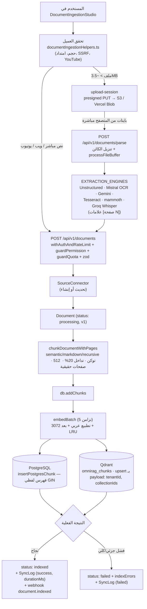

# تدفقات البيانات

توثق هذه الصفحة التدفقين المركزيين في OmniRAG بناءً على الكود الفعلي: (أ) استيعاب المستند من الرفع حتى التخزين المتجهي، و(ب) استعلام المستخدم من المحادثة حتى الاسترجاع والإجابة بالاستشهادات.

---

## (أ) تدفق استيعاب المستند

المسار الكامل: تحقق من طرف العميل → (رفع مباشر اختياري) → استخراج النص → `POST /api/v1/documents` → تجزئة → تضمين → كتابة مزدوجة في PostgreSQL وQdrant.

### المراحل بالتفصيل

1. **التحقق من طرف العميل** (`src/components/sources/documentIngestionHelpers.ts`): `validateUploadedFile` يفحص الحجم مقابل `maxFileSizeMb` (الافتراضي 50MB) والامتداد/الـ MIME مقابل قائمة `SUPPORTED_EXTENSIONS` (pdf, docx, pptx, xlsx, txt, md, json, csv, أكواد برمجية، صور، صوت وفيديو). `validateWebFileUrl` يطبق حرس SSRF مبدئياً (بروتوكول http/https فقط، رفض `localhost` والنطاقات الخاصة `127.*/10.*/192.168.*/172.16-31.*`...) — والخادم يعيد التحقق دائماً عبر `src/lib/mcp/net.ts`. `validateYoutubeUrl` يستخرج معرّف الفيديو (11 حرفاً).
2. **الرفع المباشر (اختياري للملفات الكبيرة):** `POST /api/v1/documents/upload-session` يفاوض المزود — `s3` (رابط presigned PUT محصور بمسار `uploads/{tenantId}/…` ومرتبط بـ Content-Type وينتهي بعد 15 دقيقة، انظر `src/lib/uploads/directUpload.ts`) أو `vercel-blob` (عبر `/api/v1/documents/upload-token`) أو `none` (رفع عادي عبر الخادم).
3. **الاستخراج:** `POST /api/v1/documents/parse` ينزّل كائن التخزين (`downloadS3Object`) ويمرر المخزن إلى `processFileBuffer` في `src/lib/services/unstructuredService.ts` الذي يوجه عبر سجل `EXTRACTION_ENGINES` (`src/lib/services/extraction/engines.ts`): محركات محلية (mammoth للـ DOCX، PPTX محلي، نص عادي، صوت/فيديو عبر Groq Whisper) وسحابية (Mistral OCR مع ذاكرة LRU، Unstructured Jobs/Partition، Gemini، Tesseract للصور وشرائح PPTX المصممة). خطوط PDF/OCR تدمج علامات `[صفحة N]` في النص لاستشهادات بصفحات حقيقية.
4. **الاستيعاب:** `POST /api/v1/documents` — الغلاف `withAuthAndRateLimit` ثم `guardPermission('documents:write')` و`guardQuota('maxDocuments')`، ثم تحقق zod (`createDocumentSchema`: عنوان ≤500 حرف، محتوى ≤4 ملايين حرف، `language` من `ar|en|auto`، `collectionIds` ≤50، `chunkingConfig` مقيّد). تتحقق المجموعات المرجعية من وجودها فعلاً للمستأجر (لا معرفات معلقة).
5. **المصدر والمستند:** يُحدَّث `SourceConnector` المشار إليه (documentCount+1، status healthy) أو يُنشأ جديد بمعرّف `src-{type}-{8}`، ثم يُسجل `Document` بحالة `processing` وإصدار أولي v1.
6. **التجزئة الموحدة:** `chunkDocumentWithPages` من `src/lib/rag/chunker.ts` — الاستراتيجية الافتراضية `semantic` (أو `markdown`/`recursive`)، الحجم الافتراضي 512 توكن (مقيّد [128, 4096]) بتداخل 20% (مقيّد [0, 50]) مع تحويل 2.5 حرف/توكن، وتحول علامات `[صفحة N]` إلى `pageNumber` حقيقي لكل مقطع.
7. **التضمين والفهرسة المزدوجة** (`db.addChunks` في `src/lib/storage/db.ts`): توليد التضمينات بدفعة `embedBatch` (تزامن محدود بـ 5) من `src/lib/rag/embedding.ts` — كل نص يُطبَّع عربياً (`normalizeArabicForSearch`) قبل التضمين، البعد موحد 3072 (`PLATFORM_EMBEDDING_DIMENSIONS`)، مع ذاكرة LRU (500) ومتجه fallback حتمي عند غياب المفاتيح (لا يُخزن في الذاكرة). ثم:
   - إدراج صفوف لفظية في PostgreSQL (`insertPostgresChunk` — فهرس البحث النصي GIN)،
   - upsert دفعة واحدة للمتجهات إلى مخزن المستأجر (Qdrant: مجموعة `omnirag_chunks` بفهارس payload على `tenantId` و`documentId` و`collectionIds` — انظر `src/lib/storage/qdrant.ts`).
8. **إقفال الدورة:** حالة المستند تنقلب إلى `indexed` أو `failed` حسب النتيجة الفعلية مع `indexErrors`، ويسجل `SyncLog` بالمدة المقيسة، ويطلق webhook `document.indexed` بعد الاستجابة عبر `after()` (best-effort).

### مخطط التدفق

---

## (ب) تدفق استعلام المستخدم

المسار الكامل في `src/app/api/v1/chat/stream/route.ts` + `performHybridSearch` في `src/lib/rag/engine.ts`: مصادقة وحصص → خطافات أمان → بحث هجين (متجهي + لفظي + RRF) → بناء سياق واستشهادات → بث توليد متعدد المزودين مع إخفاء PII وأدوات MCP.

### المراحل بالتفصيل

1. **الطلب:** `ChatStudio` عبر `useChat` يرسل `prompt` و`mode` (analysis/hybrid/general/private) و`collectionIds` وسجل رسائل العميل إلى `POST /api/v1/chat/stream`.
2. **الحرس:** `withAuthAndRateLimit` → تحميل مفاتيح البيئة الديناميكية (`getEnv`) → `guardPermission('chat:use')` → فحص ميزانية التوكن الشهرية (`getTokenBudgetStatus` — رد 429 عند الاستنفاد).
3. **خطافات ما قبل النموذج** (`src/lib/harness/hook-harness.ts`): `pre_auth` ثم `pre_inference` (دفاع عن حقن التعليمات) — أي حظر يرد كرسالة أمنية داخل بروتوكول البث نفسه (`blockedStreamResponse`).
4. **البحث الهجين** (`performHybridSearch`):
   - كشف الاستعلامات التجميعية (`isAggregativeQuery` — معجم عربي/إنجليزي مطبع) وتوسيعها إلى 3 مناظير استرجاع (`buildAggregativeQueryViews`) مع تثبيت المستند المسمّى (`findNamedDocumentInQuery` بتداخل كلمات مطبع عربياً).
   - توسيع HyDE اختياري (`generateHydeDocument`) للذراع المتجهي فقط.
   - ذراعان متوازيان: **متجهي** — تضمين المنظور/السؤال عبر `generateEmbedding` ثم بحث Qdrant بفلترة `tenantId`/`collectionIds` وسقف تشابه `MIN_SIMILARITY_SCORE`؛ **لفظي** — `searchPostgresLexical` على النص الأصلي المطبَّع.
   - **حارس مصدر المتجهات:** `isTenantEmbeddingStale` يكشف متجهات من نموذج/إصدار pipeline مختلف (provenance = model#v2) — ينزل وزن الدلالي إلى 0 ويزحزح اللفظي إلى ≥0.7 ويجدول `selfHealStaleCorpus` في الخلفية.
   - **دمج RRF:** `computeRrfScore` بـ k=60 وأوزان 0.7 دلالي / 0.3 لفظي (معدلة حسب التقادم)، فلترة بالأرضية الدلالية أو إصابة لفظية، ثم إعادة ترتيب LLM اختيارية في وضع analysis فقط (تُتخطى للاستعلامات التجميعية).
   - **تغطية المدى وسبق السياق:** للمستند المسمّى تُحمّل شبكة مقاطعه كاملة (بصفحات 500) وتدمج بدرجة أرضية، ثم يُطبق `CONTEXT_CHUNK_CAP` بتوزيع round-robin بين المستندات، وترتيب نهائي بترتيب الكتاب الطبيعي (صفحة/موضع) للاستعلام المسمّى.
5. **فحص ما قبل التوليد:** `pre_generation` يفحص المقاطع المسترجعة ذاتها بحثاً عن حقن غير مباشر.
6. **السياق والاستشهادات:** `buildCitations` يبني قائمة استشهادات مرقمة (عنوان المستند، الصفحة الحقيقية، الدرجة الفعلية، مقتطف ≤120 حرفاً، رابط مصدر خارجي أو رابط عميق) — وترسل كأول data part من البث. `buildContextBlock` يرقم المصادر `[المصدر n]` ويضيف خريطة ترتيب القراءة للمستندات الأحادية.
7. **الأدوات:** `collectTenantMcpTools` يجمع أدوات سيرفرات المستأجر السليمة (مع تصفية الأدوات الخارجية في وضع `private`)، و`buildTenantMcpTools` يحولها لأدوات AI SDK — الأدوات ذات الأثر الجانبي تمر بإجازة بشرية (`approvedToolCall` يُنفذ عبر `runToolSafely`/`executeMcpToolCall`).
8. **التوليد المتدفق بسلسلة fallback:** `streamText` على النموذج الأساسي، وعند فشله قبل بث أي حرف ينتقل لـ `getFallbackModels` (المزودون بلا مفتاح يُتخطون). التعليمات النظامية من `buildAgenticSystemInstruction` (سياسة شمولية + استشهادات `[n]` مضمّنة)، الذاكرة = آخر 10 رسائل، `temperature: 0.2`، `stopWhen: stepCountIs(5)`، ومهلة `CHAT_GENERATION_TIMEOUT_MS` (55 ثانية على Vercel).
9. **البث والإقفال:** كل `text-delta` يمر عبر `createPIIStreamRedactor` (إخفاء PII مخزّن)؛ بعدها أجزاء `data-pending-tool`/`data-tool-calls`/`data-meta` (الموديل المستخدم والتوكنات) → `recordTokenUsage` ذرياً → خطاف `post_inference` تدقيقاً على النص الكامل → اقتراحات متابعة اختيارية عبر `generateTextResilient` (تُتخطى عند إصابة حصة المزود).

### مخطط التدفق

```mermaid
flowchart TD
    U["ChatStudio (useChat)"] -->|"prompt + mode + collectionIds + محفوظات"| R["POST /api/v1/chat/stream<br/>withAuthAndRateLimit + chat:use + ميزانية التوكن"]
    R --> H1["HookHarness: pre_auth"]
    H1 --> H2["HookHarness: pre_inference<br/>(دفاع حقن التعليمات)"]
    H2 --> HS["performHybridSearch"]
    subgraph HS ["البحث الهجين — src/lib/rag/engine.ts"]
        direction TB
        AGG{"استعلام تجميعي؟<br/>isAggregativeQuery"}
        AGG -->|"نعم"| MV["توسيع multi-query (3 مناظير)<br/>+ تثبيت المستند المسمّى"]
        AGG -->|"لا"| Q1
        MV --> Q1["HyDE اختياري"]
        Q1 --> S1[("Qdrant<br/>بحث دلالي · tenantId/collectionIds · scoreThreshold")]
        Q1 --> S2[("PostgreSQL<br/>searchPostgresLexical · GIN عربي/إنجليزي")]
        S1 & S2 --> STALE{"متجهات قديمة؟<br/>isTenantEmbeddingStale"}
        STALE -->|"نعم"| W0["وزن دلالي=0 + selfHealStaleCorpus"]
        STALE -->|"لا"| RRF
        W0 --> RRF["دمج RRF (k=60 · 0.7/0.3)<br/>+ فلترة بالأرضية"]
        RRF --> RE{"mode=analysis؟"}
        RE -->|"نعم"| RR["rerankChunks (LLM)"]
        RE -->|"لا"| CAP
        RR --> CAP["CONTEXT_CHUNK_CAP<br/>توزيع round-robin + ترتيب الكتاب"]
    end
    HS --> H3["HookHarness: pre_generation<br/>(فحص المقاطع المسترجعة)"]
    H3 --> CTX["buildCitations + buildContextBlock<br/>(استشهادات [n] + خريطة ترتيب القراءة)"]
    CTX --> TOOLS["collectTenantMcpTools + buildTenantMcpTools<br/>(تصفية private · موافقة بشرية للأثر الجانبي)"]
    TOOLS --> GEN["streamText بسلسلة fallback<br/>buildAgenticSystemInstruction · آخر 10 رسائل · temp 0.2"]
    GEN --> PII["createPIIStreamRedactor على كل text-delta"]
    PII --> OUT["بث SSE إلى العميل<br/>data-citations أولاً ثم text-delta<br/>ثم data-meta / data-suggestions"]
    OUT --> POST["recordTokenUsage + HookHarness: post_inference<br/>+ اقتراحات متابعة اختيارية"]
```

> **ملاحظة التدهور الصادق:** إن لم يكن هناك مزود نماذج مهيأ، يبث المسار المقاطع المسترجعة أصلاً مع إشعار صريح بدل الفشل الصامت — وإن فشلت جميع نماذج سلسلة fallback يُصنّف الخطأ (حصة 429 / مهلة / خطأ مزود) ويُبث برسالة عربية واضحة.

---

## انظر أيضاً

- [نظرة عامة على البنية](overview.md) — طبقات النظام واختيار التقنيات
- [بنية المجلدات](directory-structure.md) — مواقع الملفات المشار إليها أعلاه
- [دليل متغيرات البيئة](../01-getting-started/configuration.md)
- [دليل التثبيت](../01-getting-started/installation.md)
