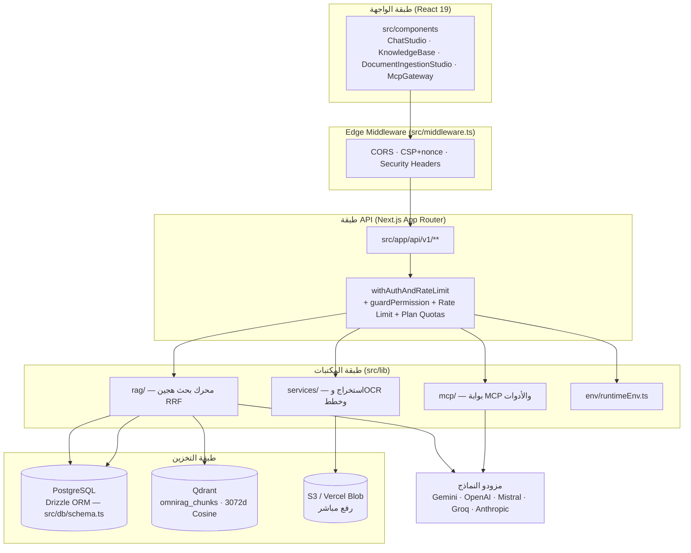

# نظرة عامة على البنية

OmniRAG منصة RAG مؤسسية متعددة المستأجرين (Multi-Tenant Enterprise RAG & MCP Agentic Engine) مبنية على Next.js App Router مع React، وتخزين مزدوج: PostgreSQL (عبر Drizzle ORM) للبيانات العلائقية والبحث اللفظي، وQdrant للبحث المتجهي الدلالي. الإصدار الحالي في `package.json` هو 0.12.x، والمشروع خاص (`"private": true`).

---

## طبقات النظام

يتدفق الطلب عبر أربع طبقات رئيسية:

1. **طبقة الواجهة (Client):** مكوّنات React في `src/components` (استوديو المحادثة `ChatStudio`، قاعدة المعرفة `KnowledgeBase`، استوديو الاستيعاب `DocumentIngestionStudio`، بوابة MCP `McpGateway`...) تعمل داخل مخطط مساحة العمل في `src/app/(workspace)`. الاتصال بالخادم عبر `fetchWithAuth` (`src/lib/auth/fetchWithAuth.ts`) وReact Query.
2. **طبقة الوسيط والمسارات (Edge/API):** `src/middleware.ts` يطبق ترويسات الأمان وCORS وCSP بـ nonce لكل طلب على كل المسارات؛ مسارات API في `src/app/api/v1/**` تمر جميعها عبر غلاف `withAuthAndRateLimit` (`src/lib/api/withAuthAndRateLimit.ts`) الذي يوفر المصادقة والتصاريح (`guardPermission`) وحدود المعدل الدائمة (PostgreSQL) وحصص الخطط.
3. **طبقة المكتبات (`src/lib`):** منطق العمل: محرك RAG الهجين (`src/lib/rag`)، طبقة التخزين (`src/lib/storage`)، بوابة MCP (`src/lib/mcp`)، الاستخراج (`src/lib/services/extraction`)، الأمان (`src/lib/security`)، خطط العملاء (`src/lib/services/planService`)، والبيئة الديناميكية (`src/lib/env/runtimeEnv.ts`).
4. **طبقة التخزين والمزودين:** PostgreSQL (Drizzle — `src/db`)، Qdrant (`src/lib/storage/qdrant.ts` — مجموعة `omnirag_chunks` ببُعد 3072 ومسافة Cosine)، تخزين الكائنات S3/Blob (`src/lib/uploads`)، ومزودو نماذج الذكاء الاصطناعي عبر سجل متعدد المزودين (`src/lib/ai/registry`).

---

## التقنيات المستخدمة (من `package.json`)

| المجال              | التقنية                                                                                                                                                                     |
| ------------------- | --------------------------------------------------------------------------------------------------------------------------------------------------------------------------- |
| الإطار              | Next.js `^16.3.1` (App Router) + React `^19.2.8` / `react-dom`                                                                                                              |
| اللغة               | TypeScript `^5.9.3`، ESLint 10 + typescript-eslint، Prettier                                                                                                                |
| ORM وقاعدة البيانات | `drizzle-orm ^0.45` + `drizzle-kit`، `pg` (Node Postgres)، `pg-boss` لطوابير المهام، `mysql2` (موصلات قواعد البيانات)                                                       |
| البحث المتجهي       | `@qdrant/js-client-rest ^1.11`                                                                                                                                              |
| الذكاء الاصطناعي    | Vercel AI SDK (`ai ^7`) مع مزودين: `@ai-sdk/google`، `@ai-sdk/openai`، `@ai-sdk/anthropic`، `@ai-sdk/mistral`، `@ai-sdk/groq`، `@ai-sdk/openai-compatible`، `@google/genai` |
| MCP                 | `@modelcontextprotocol/sdk ^1.30` + `@ai-sdk/mcp`                                                                                                                           |
| استخراج المستندات   | `pdf-parse`، `pdf-lib`، `mammoth` (DOCX)، `exceljs`، `pptxgenjs`، `docx`، `jszip`، `tesseract.js` (OCR)                                                                     |
| الوسائط             | `youtube-transcript`، `youtube-captions-scraper`، `@distube/ytdl-core`، `imapflow` (البريد)، `nodemailer`                                                                   |
| الواجهة             | Tailwind CSS v4، `lucide-react`، `motion`، `@tanstack/react-query`، `react-markdown` + `shiki`، `katex` + `katex4arabic`، `mermaid`، `echarts`، `d3`                        |
| التخزين والرفع      | `@vercel/blob`، واجهة S3 متوافقة (Tigris/R2/MinIO) عبر رفع مباشر بـ presigned URLs                                                                                          |
| الاختبار            | `vitest` + `jsdom`                                                                                                                                                          |

---

## تعدد المستأجرين (Multi-Tenancy)

العزل مبني على `tenantId` متدفق في كل طبقات النظام:

- **قاعدة البيانات:** كل جدول في `src/db/schema.ts` (`documents`، `chunks`، `sources`، `conversations`، `messages`، `collections`، `mcp_servers`، `audit_logs`، `tool_calls`، `api_keys`...) يحمل عمود `tenantId` مع فهارس مركبة، وكل استعلام في طبقة `src/lib/storage` يستقبل `tenantId` صراحة.
- **Qdrant:** كل نقطة متجهة تحمل `tenantId` في payload مع فهرس keyword، فيتم الفلترة server-side داخل كل بحث (انظر `src/lib/storage/qdrant.ts`).
- **API:** سياق المصادقة `authCtx.tenantId` من `withAuthAndRateLimit` يمرر لكل معالج، ولا يقرأ أي مسار بيانات إلا ضمن هذا النطاق.
- **الملكية والمساحات:** جدول `tenants` و`memberships` و`teams` و`invitations` يدير أعضاء المساحات (`src/lib/services/membershipService.ts`)، والخطط وحصص الاستخدام عبر `src/lib/services/planService.ts` (ميزانية توكن شهرية، سقف مستندات).
- **عزل الأدوات:** وضع `private` في المحادثة يصفّي أدوات MCP الخارجية (`slack_`، `github_`، `web_`، `fetch_`) كي لا تتسرب بيانات المستأجر لخدمات طرف ثالث (`collectTenantMcpTools` في `src/lib/rag/engine.ts`).
- **أمان البيئة:** مفاتيح البنية الحساسة (`DATABASE_URL`، `QDRANT_URL`، مفاتيح المزودين) لا تُكتب من طلبات المستأجرين في الإنتاج (`SENSITIVE_RUNTIME_ENV_KEYS` في `src/lib/env/runtimeEnv.ts`).

---

## Next.js App Router

- **المساحات:** المجموعة `src/app/(workspace)` تضم شاشات التطبيق (`/chat`، `/knowledge`، `/mcp`، `/analytics`، `/settings`) مع `layout.tsx` و`loading.tsx` مشتركة، و`src/app/auth` لصفحة المصادقة، و`error.tsx` / `global-error.tsx` / `not-found.tsx` للجذمور.
- **مسارات API:** تحت `src/app/api` مسارات `v1/**` (المسار العام)، إضافة إلى `health` (فحص حيوية خفيف)، `mcp`، `genai`، `docs`، `sdlc-analyze`. مسارات v1 تغطي: `chat/stream` (بث SSE بروتوكول AI SDK UI-message)، `chat/completions`، `documents` (+ `parse`، `upload-session`، `upload-token`، `versions`، `status`، `web-fetch`)، `collections`، `sources`، `conversations`، `search`، `auth/**` (login/register/logout/session/sso/workspaces)، `members`، `teams`، `invitations`، `plan`، `providers`، `api-keys`، `webhooks`، `jobs/tick`، `mcp/**` (servers/calls/oauth/presets/health/generate-tool)، `env-config`، `analytics`، `storage`، `settings`، `shares`/`share`، `files`، `youtube`، `pipeline-templates`، `diagnostics`.
- **الوسيط (Edge):** `src/middleware.ts` يعمل على كل المسارات (باستثناء الملفات الثابتة): ترويسات أمان غير مشروطة، CORS مقيّد بـ `ALLOWED_ORIGINS` على `/api/*` فقط، وCSP صارم بـ nonce لكل طلب صفحة يمر عبر `x-csp-nonce` إلى `layout.tsx`.
- **إعدادات `next.config.ts`:** `serverExternalPackages` لـ `tesseract.js` و`pg-boss` و`pg` و`imapflow` و`mysql2` (وحدات Node-only تعمل خارج حزمة الخادم)، حد `serverActions.bodySizeLimit: '10mb'`، و`allowedDevOrigins` لنطاقات Cloud Run للتطوير.
- **البث الحي:** مسار `/api/v1/chat/stream` يستخدم `createUIMessageStream` من AI SDK ليقدم توكناً بتوكن مع أجزاء بيانات منظمة (استشهادات، موافقات أدوات، مقترحات متابعة، بيانات وصفية).

---

## مبادئ أفقية

- **الأمان كخطوة أولى:** خطافات `HookHarness` (`src/lib/harness/hook-harness.ts`) على مراحل `pre_auth` / `pre_inference` / `pre_generation` / `post_inference` تفحص حقن التعليمات قبل وبعد النموذج، مع إخفاء PII على كل delta من البث (`src/lib/security/piiStreamRedactor.ts`).
- **الصدق في التدهور:** كل مسار يتصرف بصدق عند غياب التهيئة (أداة بحث حي بلا مفاتيح ترد "غير مهيأة"، بلا مزود نماذج يعرض إشعاراً صريحاً) بدلاً من بيانات مزيفة؛ النتائج التجريبية موسومة `simulated: true`.
- **الاسترجاع الهجين:** دمج Dense (Qdrant/pgvector) وLexical (PostgreSQL GIN عربي/إنجليزي) بـ Reciprocal Rank Fusion (k=60، أوزان 0.7/0.3) — تفاصيل التدفق في [تدفقات البيانات](data-flow.md).

---

## انظر أيضاً

- [بنية المجلدات](directory-structure.md) — خريطة شجرة المشروع ووظيفة كل مجلد
- [تدفقات البيانات](data-flow.md) — مسارا الاستيعاب والاستعلام خطوة بخطوة
- [دليل النشر](../01-getting-started/deployment.md) — خيارات النشر ومتطلبات الإنتاج
- [دليل متغيرات البيئة](../01-getting-started/configuration.md)
