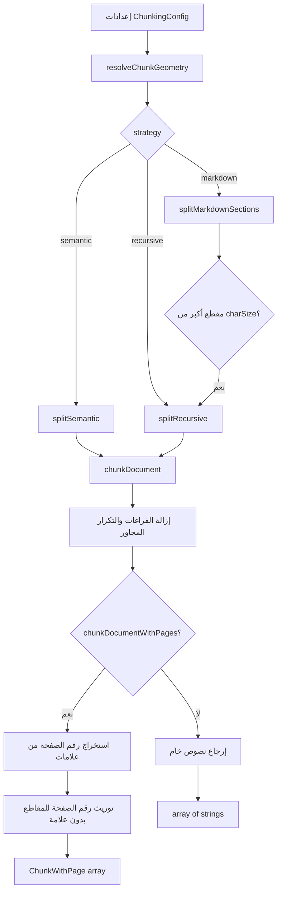

# استراتيجيات التجزئة (Chunking)

يتولى `src/lib/rag/chunker.ts` عملية تجزئة المستندات في OmniRAG بشكل موحّد، وهو المرجع الوحيد لهندسة المقاطع وأحجامها. قبل وجوده، كان النظام يحتوي على ثلاث أدوات تجزئة متفرقة (مسار المستندات، memory-backed sync، تجزئة PDF صفحة بصفحة)، مما أدّى إلى اختلاف شبكات المقاطع لنفس المستند. الدالة الموحدة `chunkDocument` هي المسار الإلزامي لكل قنوات الإدخال.

## فقرة تمهيدية

الهدف من التجزئة الموحدة:

- **حتمية**: نفس المدخل + نفس الإعدادات ⇒ نفس المقاطع في كل مرة.
- **وعي بالحدود**: تفضيل التقسيم على حدود الفقرات والجمل بدلاً من قطع الكلمات في منتصف token، وهو أمر جوهري لجودة التضمين في العربية (لا توجد مسافات داخل كثير من الـ tokens).
- **قابلة للضبط لكن محدودة**: يمكن للمُستهلِك تعديل الحجم/التداخل/الاستراتيجية، لكن جميع القيم تُقصَّ إلى نطاقات سليمة.
- **وعي بالصفحات**: تحافظ `chunkDocumentWithPages` على أرقام الصفحات الحقيقية المُستخرَجة من علامات `[صفحة N]` بدلاً من وضع `pageNumber: 1` افتراضياً.

## الاستراتيجيات المدعومة

| الاستراتيجية | الوصف                                                                                                                           | الاستخدام الأمثل                         |
| ------------ | ------------------------------------------------------------------------------------------------------------------------------- | ---------------------------------------- |
| `semantic`   | نافذة منزلقة واعية بالحدود مع تراجع حتى 35% من الحجم للبحث عن نقطة نهاية طبيعية (سطر فارغ، نقطة، علامة ترقيم)                   | النصوص العامة، المستندات المختلطة        |
| `markdown`   | تقسيم على حدود العناوين `#…` إلى `######…` مع الاحتفاظ بسطر العنوان داخل المقطع، ثم تقسيم recursive لأي قسم يتجاوز الحجم        | المستندات ذات العناوين الواضحة، التقارير |
| `recursive`  | تطبيق الفاصل الأقوى (`\n\n` ثم `\n` ثم `. ` ثم `، ` ثم `؛ ` ثم `؟ ` ثم `! ` ثم مسافة ثم حرف) مع إعادة التركيب لمنع فتات المقاطع | النصوص الخام، السجلات، الكود             |

### ترتيب الفواصل في `RECURSIVE_SEPARATORS`

```typescript
const RECURSIVE_SEPARATORS = ['\n\n', '\n', '. ', '، ', '؛ ', '؟ ', '! ', ' ', ''];
```

## الإعدادات الافتراضية (Ingestion Settings)

من `src/lib/config/ingestionSettings.ts`:

| الحقل           | الافتراضي     | النطاق المسموح                    | الغرض                                |
| --------------- | ------------- | --------------------------------- | ------------------------------------ |
| `maxFileSizeMb` | `50`          | `5`–`150`                         | حد حجم الرفع بالـ MB                 |
| `pagesPerChunk` | `25`          | `5`–`100`                         | حجم دفعة الصفحات المرسلة لمحلل PDF   |
| `chunkStrategy` | `semantic`    | `semantic`/`markdown`/`recursive` | استراتيجية التقسيم للمستندات الجديدة |
| `chunkSize`     | `512` (token) | `128`–`4096`                      | حجم المقطع المستهدف بالـ tokens      |
| `chunkOverlap`  | `20` (%)      | `0`–`50`                          | نسبة التداخل بين المقاطع المتجاورة   |

الاستراتيجية الواحدة المدعومة تاريخياً (`code` أو `sliding`) تُحوَّل تلقائياً إلى `recursive` لتبقى مدعومة دون إعلانات منفصلة.

### التحويل من tokens إلى أحرف

```typescript
export const CHARS_PER_TOKEN = 2.5;
```

كل قيمة `chunkSize` تُحوَّل إلى `charSize = tokenSize * 2.5` ثم تُقيَّد بـ `Math.floor`. التداخل يُحوَّل إلى `overlapChars = floor(charSize * (overlapPercent / 100))` ثم يُحسب `step = max(1, charSize - overlapChars)` لضمان تقدم النافذة.

## دوال التجزئة الأساسية

| الدالة                   | الملف                    | الدور                                                                     |
| ------------------------ | ------------------------ | ------------------------------------------------------------------------- |
| `chunkDocument`          | `src/lib/rag/chunker.ts` | نقطة الدخول العامة الموحدة لكل قنوات الإدخال                              |
| `chunkDocumentWithPages` | `src/lib/rag/chunker.ts` | تجزئة مع استخراج رقم الصفحة من علامات `[صفحة N]` و`[قسم الصفحات X إلى Y]` |
| `resolveChunkGeometry`   | `src/lib/rag/chunker.ts` | تطبيع/تقييد الإعدادات إلى هندسة فعلية (char/step/overlap)                 |
| `splitMarkdownSections`  | `src/lib/rag/chunker.ts` | تقسيم على حدود العناوين ثم recursive للمقاطع المتضخمة                     |
| `splitRecursive`         | `src/lib/rag/chunker.ts` | تنفيذ الـ Recursive Character Text Splitter مع حمل السياق                 |
| `splitSemantic`          | `src/lib/rag/chunker.ts` | نافذة منزلقة واعية بالحدود مع نمط regex للنهايات الطبيعية                 |
| `estimateTokenCount`     | `src/lib/rag/chunker.ts` | تقدير عدد الـ tokens باستخدام نفس ثابت `CHARS_PER_TOKEN`                  |

## سلوك استخراج أرقام الصفحات

تعتمد `chunkDocumentWithPages` على التعبير النمطي التالي لاكتشاف العلامات:

```typescript
const PAGE_MARKER_RE =
  /\[\s*(?:قسم\s*الصفحات|صفحة|صفحه)\s*([\d\u0660-\u0669]+)(?:\s*إلى\s*([\d\u0660-\u0669]+))?\s*\]/g;
```

- يدعم الأرقام العربية-الهندية (٠-٩) عبر `toWesternDigits`.
- يلتقط نطاق "[قسم الصفحات X إلى Y]" المُستخدَم في `processPdfWithBatchedPipeline`.
- المقطع الذي لا يحوي علامة يرث رقم الصفحة من المقطع السابق (inheritance) لتفادي تعيين `null` بعد قطع فقرة عبر حد النافذة.

## تجزئة PDF ومسارات الاستخراج

`src/lib/pdf/pdfChunker.ts` لا يُجزِّئ النص داخل PDF مباشرة، بل يُقطِّع الـ PDF نفسه إلى دفعات صفحات، ثم يمرّر كل دفعة إلى محرّك استخراج (OCR/تحليل) حسب السُلَّم التالي:

| الوضع          | سلّم المحرّكات (من الأسرع إلى الأبطأ)                                         |
| -------------- | ----------------------------------------------------------------------------- |
| `auto`         | Native (ببوابة جودة) → Mistral → Unstructured → Gemini → Native → Tesseract   |
| `mistral`      | Mistral → Unstructured → Gemini → Native → Tesseract                          |
| `unstructured` | Unstructured → Gemini → Native → Tesseract                                    |
| `gemini`       | Gemini → Native → Tesseract                                                   |
| `local`        | Native (ببوابة جودة) → Tesseract → Native low-confidence (بلا أي اتصال سحابي) |

### بوابة جودة النص الأصلي (Native Quality Gate)

لا يُقبل النص الأصلي إلا إذا استوفى:

- طول مضغوط لا يقل عن `100` حرف، ولا يقل عن `min(pages * 120, 250)`.
- نسبة المحارف الحقيقية/الرقمية ≥ `0.5` (`NATIVE_MIN_MEANINGFUL_RATIO`).
- لا يحوي أكثر من `5` علامات `(cid:N)` (CMap مكسور).

### أحجام الدفعات التكيُّفية في `slicePdfIntoChunks`

- الملفات ≤ `30 MB`: تُرسَل كاملة دفعة واحدة (تجنّباً لتكرار القواميس المشتركة عند `copyPages`).
- الملفات بين `5`–`15 MB`: `pagesPerChunk` يُخفَّض إلى `10`.
- الملفات > `15 MB`: يُخفَّض إلى `5` لتفادي خطأ `413 Request Entity Too Large`.

## سلوك النص العربي في التجزئة

- **التطبيع الموحَّد**: `normalizeArabicForSearch` يُطبَّق على كل نص قبل التضمين والاسترجاع المعجمي (انظر `embeddings.md` و`retrieval.md`)، مما يضمن تجانس نقاط التمثيل في فضاء المتجهات.
- **الفواصل العربية في recursive**: `،` و`؛` و`؟` و`!` مدرجة صراحة في `RECURSIVE_SEPARATORS` لتفادي قطع الجمل العربية عند الواو والفاصلة.
- **التداخل والنوافذ**: لا توجد معالجة خاصة للنص العربي في النافذة المنزلقة بخلاف ما سبق، لأن `boundaryRe` يشمل علامات الترقيم العربية الموحَّدة (`. `, `! `, `؟ `, `؛ `, `، `, `, `).

## مخطط انسيابي لاتخاذ القرار



## انظر أيضاً

- [خط أنابيب RAG](./pipeline.md)
- [التضمين (Embeddings)](./embeddings.md)
- [استخراج النصوص من PDF](../08-integrations/pdf-parsing.md)
- [بنية قاعدة البيانات](../05-database/schema.md)
