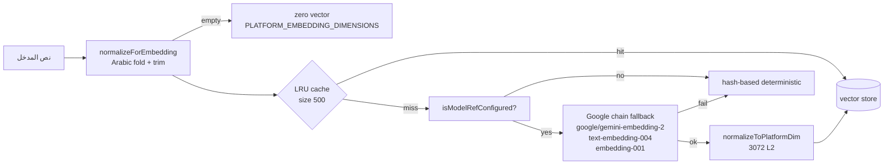
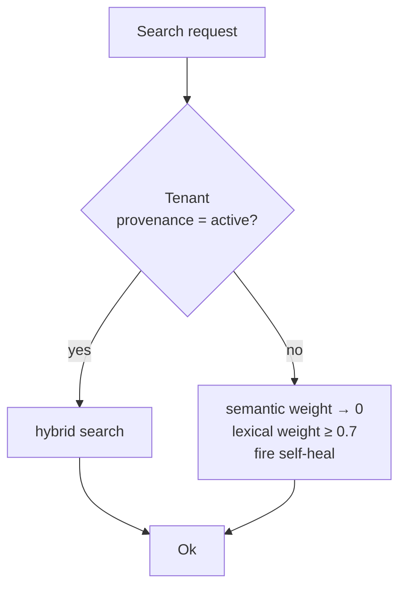
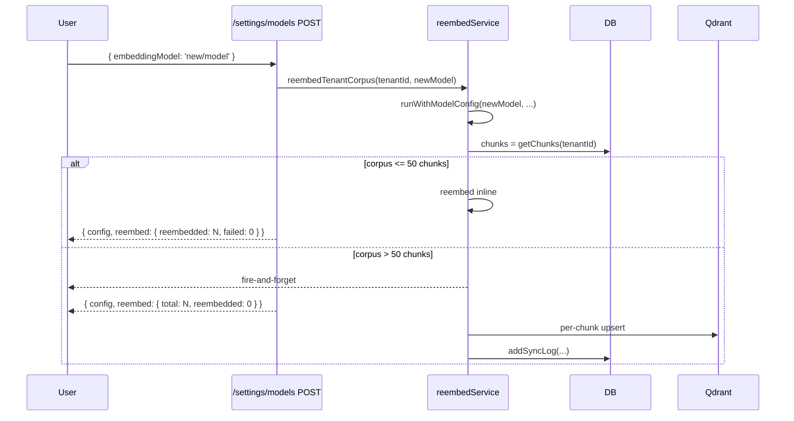

# Embeddings & Vector Backends

يصف هذا المستند خط أنابيب التضمين (embedding pipeline) في OmniRAG: النماذج المدعومة، التطبيع العربي الموحّد، إعادة التضمين الإجبارية عند تغيير النموذج، وجداول المتجهات الديناميكية في pgvector ومجموعة `omnirag_chunks` في Qdrant.

## المكونات الأساسية



## النماذج المدعومة

- أي مزود من مزوّدي Vercel AI SDK (`@ai-sdk/google`, `@ai-sdk/openai`, `@ai-sdk/mistral`, `@ai-sdk/openai-compatible`, `@ai-sdk/anthropic`, `@ai-sdk/groq`) يكشف عن `embed()` يمر عبر `resolveEmbeddingModel`.
- مزوّد Google القديم (`LEGACY_DEFAULT_PROVIDER`) يستخدم سلسلة fallback:
  1. `primaryRef` (المكوّن من المستخدم).
  2. `google/gemini-embedding-2`.
  3. `google/text-embedding-004`.
  4. `google/embedding-001`.

النموذج النشط يُقرأ من `DEFAULT_AI_MODELS.embeddingModel` عبر `getAiModel('embeddingModel')` ويُتجاوز ديناميكياً بمكوّن `MODEL_CONFIG_COOKIE` أو رأس `x-ai-model-config` (راجع `parseModelConfigFromRequest`).

### الافتراضي

```ts
DEFAULT_AI_MODELS.embeddingModel = 'google/text-embedding-004';
```

## بُعد المنصّة الموحّد

```ts
PLATFORM_EMBEDDING_DIMENSIONS = 3072;
```

- كل النواقل تُطبَّع إلى هذا البُعد قبل الفهرسة:
  - تطابق → يُعاد كما هو.
  - أصغر → ملء دوري (cyclic fill) + L2-normalize.
  - أكبر → اقتطاع + L2-normalize.
- L2-normalize يحافظ على قابلية المقارنة مع المتجهات المفهرسة سابقاً.

## التطبيع العربي الموحّد

```ts
function normalizeForEmbedding(text: string): string {
  return normalizeArabicForSearch(text).trim();
}
```

- `normalizeArabicForSearch` في `src/lib/storage/postgres.ts` يطبّق:
  - طي الهمزات (أ/إ/آ → ا).
  - إزالة التشكيل/التنوين.
  - توحيد التاء المربوطة/المفتوحة.
  - توحيد الياء/الألف المقصورة.
  - إزالة الفراغات الزائدة.
- **العقد المطلق**: نفس النص قبل التضمين في الفهرسة وعند الاستعلام → لا تختلف نقطة المتجه بسبب `الأسئلة`/`الاسئله`.
- للنصوص غير العربية: no-op.

## إصدار خط أنابيب التضمين

```ts
EMBEDDING_PIPELINE_VERSION = 2;
```

- v1: نص خام (ما قبل v0.12.4).
- v2: نص مطبَّع عربياً.

`embeddingProvenanceId(modelRef)` = `<model>#v<version>` يُخزَّن في `TenantSettings.indexedEmbeddingModel` ويقارن في كل بحث:



عند التطابق → البحث الهجين الطبيعي. عند الاختلاف → تخفيض الوزن الدلالي إلى 0 وزيادة الوزن المعجمي، وإطلاق `selfHealStaleCorpus` في الخلفية (لا يحجب البحث).

## الكاش في الذاكرة

- `Map<string, number[]>` بسعة 500، سياسة LRU (حذف أقدم مفتاح عند الامتلاء).
- المفتاح: `<primaryRef>:<normalizedText>` → يضمن تمييز النماذج المختلفة.
- **مهم**: fallback hash vector لا يُكاش (وإلا سيبقى متجه ملوّث حتى LRU eviction).

## إعادة التضمين الإجبارية (Mandatory Re-embed)



### نقاط الفحص

- `INLINE_REEMBED_MAX = 50` (ثابت).
- إذا لم يكن `isModelRefConfigured(modelConfig.embeddingModel)` → 409 `EMBEDDING_MODEL_NOT_CONFIGURED` (يمنع استبدال المتجهات بهاش ملوّث).
- استدعاء يدوي: `POST /api/v1/settings/models/reembed` (مع `?check=1` للفحص فقط).

## جداول المتجهات الديناميكية

### pgvector (`src/lib/storage/vectors/adapters/pgvector.ts`)

```ts
const DEFAULT_TABLE = 'vector_chunks';
function tableForDimension(dimension: number): string {
  return dim === 3072 ? DEFAULT_TABLE : `${DEFAULT_TABLE}_d${dim}`;
}
```

- كل بُعد يحصل على جدوله الخاص (لأن pgvector يُثبّت البُعد في العمود).
- عند عدم توفّر الامتداد `vector` أو امتيازات `CREATE EXTENSION`، يعلَم المخزن `unavailable` ويُرجع `false`/`[]` بدلاً من رمي خطأ (fail-soft).
- الأعمدة المعروفة `tenantId, documentId, documentTitle, content, chunkIndex, pageNumber, language, collectionIds` تذهب لأعمدة مخصّصة؛ الباقي في `metadata JSONB`.
- الفهارس: `(tenant_id)`, `(document_id)`.

### Qdrant

- اسم المجموعة الموحّد: `omnirag_chunks`.
- يُنشأ عند أول إدراج، أبعاد افتراضية `3072`، مقياس `Cosine`.
- يُحقَّق في `/api/v1/diagnostics` (يبلّغ عن `points_count`, `vector_size`, `distance`).

### جدول التبديل

| الخلفيّة   | الاختيار                 | الاستخدام                                                    |
| ---------- | ------------------------ | ------------------------------------------------------------ |
| `pgvector` | `vectorStoreId=pgvector` | نشر صغير بدون Qdrant.                                        |
| `qdrant`   | `vectorStoreId=qdrant`   | ANN سريع، تصفية حمولة، توسع أفقي.                            |
| `memory`   | `vectorStoreId=memory`   | فقط عند `vectorStoreExplicit=true` (تجنب سلوك افتراضي ضعيف). |

التبديل عبر `POST /api/v1/storage` (يقبل `vectorStoreId`/`objectStoreId` معرّفات موثّقة من الكتالوج).

## تفاصيل التنفيذ

- `generateEmbedding(text)` يضمن:
  1. التطبيع.
  2. فحص الكاش.
  3. فحص تهيئة النموذج → fallback.
  4. fallback إلى مزوّدات أخرى (Google chain).
  5. تطبيع الأبعاد.
  6. الكاش.
- `embedBatch(texts, concurrency=5)` يوازي بأمان (5 طلبات متوازية) ويحافظ على ترتيب النتائج.
- كل مقطع جديد يحمل `language: 'ar' | 'en'` ويُسجَّل في metadata.

## اختبارات مرجعية

- `src/__tests__/modelRef.test.ts` — بناء/تحليل `provider/model`.
- `src/__tests__/qdrantPointId.test.ts` — صياغة point id.
- `src/__tests__/reembedService.test.ts` — سيناريو إعادة التضمين.
- `src/__tests__/vectorStores.test.ts` — عقود المتاجر (pgvector/memory).
- `src/__tests__/objectStores.test.ts` — عقود مخازن الكائنات.

## انظر أيضاً

- [retrieval](retrieval.md) — كيف تُستخدم المتجهات مع الذراع المعجمي وRRF.
- [chunking](chunking.md) — كيف تُولّد المقاطع قبل التضمين.
- [pipeline](../04-api/admin-operations.md) — اختيار قالب الاستخراج (يؤثر على حجم/تداخل المقاطع).
- [storage adapters](../05-database/storage-adapters.md) — كل مخزن متجه/كائن.
