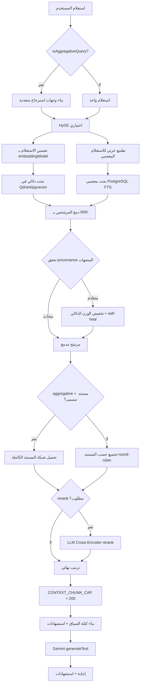

# خط أنابيب RAG

يصف هذا المستند خط أنابيب الاسترجاع المعزز بالتوليد (Retrieval-Augmented Generation) في OmniRAG من لحظة وصول استعلام المستخدم وحتى صدور الإجابة المُستشهَدة. كل التفاصيل الواردة هنا مستخرجة مباشرةً من الكود، لا من وثائق خارجية.

## فقرة تمهيدية

محرك RAG في OmniRAG مبني فوق Vercel AI SDK v7 ونموذج Gemini من Google، ويستفيد من متجر متجهات (Qdrant افتراضياً أو pgvector) وقاعدة PostgreSQL للبحث المعجمي (FTS). يتميز المحرك بثلاث خصائص تشغيلية محورية:

- **استرجاع هجين مع RRF**: يدمج البحث المتجهي (Dense Vector) والبحث المعجمي (Sparse Lexical) عبر Reciprocal Rank Fusion مع ثابت `k=60` وأوزان `0.7` للدلالي و`0.3` للمعجمي.
- **كشف أوضاع aggregative**: يكتشف الاستعلامات التجميعية ("ما هي الدروس في الكتاب؟") ويُفعّل وضع الاسترجاع الشامل بدلاً من top-k.
- **حماية provenance المتجهات**: يكشف تلقائياً عند تقادم متجهات المستأجر (نموذج/إصدار تضمين قديم) ويُجدوِل إعادة التضمين في الخلفية.

## الدوال الرئيسية

| الدالة                       | الملف                     | الدور                                                                                        |
| ---------------------------- | ------------------------- | -------------------------------------------------------------------------------------------- |
| `performHybridSearch`        | `src/lib/rag/engine.ts`   | نقطة الدخول الموحدة للاسترجاع الهجين مع RRF، aggregative، rerank، وتغطية المستندات المُسمّاة |
| `computeRrfScore`            | `src/lib/rag/engine.ts`   | حساب درجة Reciprocal Rank Fusion بدمج ترتيب الدلالي والمعجمي                                 |
| `isAggregativeQuery`         | `src/lib/rag/engine.ts`   | كشف الاستعلامات التجميعية (تعداد، فهرسة، تفصيل شامل) بمطابقة معجمية عربية/إنجليزية           |
| `findNamedDocumentInQuery`   | `src/lib/rag/engine.ts`   | مطابقة عنوان المستند المُشار إليه بالاسم في الاستعلام لاستخدام تغطية كاملة                   |
| `buildAggregativeQueryViews` | `src/lib/rag/engine.ts`   | توليد 2-3 وجهات استرجاع متنوعة للاستعلامات التجميعية (Multi-Query)                           |
| `generateHydeDocument`       | `src/lib/rag/engine.ts`   | توليد مستند افتراضي (HyDE) لتحسين الاستعلام الدلالي                                          |
| `rerankChunks`               | `src/lib/rag/reranker.ts` | إعادة ترتيب LLM Cross-Encoder فوق المرشحين الناجحين في عتبة التشابه                          |
| `buildCitations`             | `src/lib/rag/engine.ts`   | بناء قائمة الاستشهادات المرقّمة من المقاطع المسترجعة                                         |
| `buildContextBlock`          | `src/lib/rag/engine.ts`   | تجميع كتلة السياق مع خريطة ترتيب المستند عند توحيد المصدر                                    |
| `generateRagCompletion`      | `src/lib/rag/engine.ts`   | توليد الإجابة النهائية عبر Gemini مع استشهادات مدمجة وتاريخ المحادثة                         |
| `selectSmartModel`           | `src/lib/rag/engine.ts`   | اختيار النموذج حسب الوضع وطول/محتوى الاستعلام                                                |
| `collectTenantMcpTools`      | `src/lib/rag/engine.ts`   | جمع أدوات MCP المتاحة للمستأجر مع فلتر وضع الخصوصية                                          |
| `runToolSafely`              | `src/lib/rag/engine.ts`   | استدعاء آمن لأدوات MCP يحوّل الأخطاء الصلبة إلى نتائج منظمة                                  |

## المراحل من الاستعلام إلى الإجابة

## الأوضاع الرئيسية

### وضع الاسترجاع القياسي

- استعلام واحد يُضمَّن ويُمرَّر إلى المتجهات (Qdrant أو pgvector) مع `scoreThreshold` افتراضي `0.15` (`SYSTEM_CONFIG.RAG.MIN_SIMILARITY_SCORE`).
- الاستعلام نفسه يُنظَّم عربياً عبر `normalizeArabicForSearch` ويُرسَل إلى `searchPostgresLexical` في PostgreSQL.
- نتائج الذراعين تُدمج في `itemMap`، تُفهرس ترتيباتها، ثم تُطبَّق `computeRrfScore`.
- تطبيق عتبة التشابه بعد الدمج: المقطع يحتفظ بدرجته إذا اجتاز Qdrant cosine floor **أو** تطابق معجمياً.

### وضع aggregative (التجميعي)

يُكتشف عبر `isAggregativeQuery` ويستهدف الاستعلامات التي تطلب تعداداً شاملاً ("اذكر دروس الكتاب"، "ما هي الفصول"، "table of contents"). يُفعّل المسار التالي:

1. **Multi-Query Retrieval**: توليد 2-3 وجهات متنوعة (الأصلية + هيكلية "فهرس ومحتويات" + محتوى "الفصول والوحدات") مع حقن عنوان المستند المسمى إن وُجد.
2. **تضمين كل وجهة** ودمج نتائجها عبر RRF عبر الوجهات.
3. **Named-Document Span Coverage**: تحميل شبكة مقاطع المستند المسمى بالكامل (بحدود `CONTEXT_CHUNK_CAP = 200`) ودمجها.
4. **تخطّي rerank**: Cross-Encoder يُعاقب المقاطع الهيكلية (عناوين الفصول، الفهارس) فيعطّل في هذا الوضع.

### تغطية المستند بالكامل (Full-Document Coverage)

عند مطابقة استعلام aggregative لمستند بالاسم (مثل "كتاب الفيزياء ثالث ثانوي اليمن") عبر `findNamedDocumentInQuery` بحساب تداخل المفردات الطبيعية، يفعّل المحرك:

- تحميل مقاطع المستند صفحة بصفحة (`getChunksByDocument` بحجم صفحة 500) حتى بلوغ `CONTEXT_CHUNK_CAP`.
- ترتيب نهائي بترتيب الكتاب الطبيعي (`pageNumber` ثم `chunkIndex`) بدل ترتيب التشابه، لمنع النموذج من الإجابة من جزء واحد فقط.

### إدارة الأوزان عند تقادم المتجهات

| الحالة                                     | الوزن الدلالي الفعلي | الوزن المعجمي الفعلي |
| ------------------------------------------ | -------------------- | -------------------- |
| متجهات محدّثة                              | `0.7`                | `0.3`                |
| متجهات بتقادم provenance                   | `0`                  | `≥ 0.7`              |
| (يُجدوَل `selfHealStaleCorpus` في الخلفية) |                      |                      |

## ثوابت النظام الرئيسية

من `src/lib/config/systemConfig.ts`:

| الثابت                    | القيمة | الغرض                                               |
| ------------------------- | ------ | --------------------------------------------------- |
| `ENGINE_OVERFETCH_FACTOR` | `6`    | مضاعف over-fetch لكل backend قبل الدمج              |
| `RRF_CONSTANT_K`          | `60`   | ثابت RRF القياسي                                    |
| `HYBRID_WEIGHTS.SEMANTIC` | `0.7`  | وزن البحث الدلالي                                   |
| `HYBRID_WEIGHTS.LEXICAL`  | `0.3`  | وزن البحث المعجمي                                   |
| `MIN_SIMILARITY_SCORE`    | `0.15` | عتبة التشابه الأدنى                                 |
| `CONTEXT_CHUNK_CAP`       | `200`  | سقف دفاعي لعدد المقاطع قبل تسليمها للنموذج          |
| `RERANK.LLM_BUDGET`       | `100`  | عدد المرشحين المُرسَلين لـ LLM reranker في طلب واحد |
| `RERANK.LLM_WEIGHT`       | `0.7`  | وزن درجة LLM في الدمج مع درجة RRF                   |

## Pipeline Mode Depths

تعليمات النظام في `buildAgenticSystemInstruction` تفرض سياسة شمولية لكل وضع محادثة (`analysis`, `hybrid`, `general`, `private`): كل وضع يُلزِم النموذج بتغطية جميع المقاطع المسترجعة، لا الاكتفاء بـ top-2.

## انظر أيضاً

- [التجزئة (Chunking)](./chunking.md)
- [التضمين (Embeddings)](./embeddings.md)
- [الاسترجاع الهجين (Retrieval)](./retrieval.md)
- [بنية قاعدة البيانات](../05-database/schema.md)
- [النماذج والإعدادات](../01-getting-started/configuration.md)
