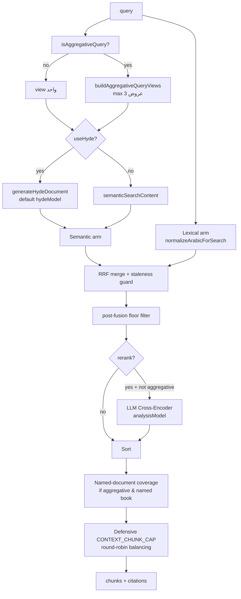

# Retrieval: Hybrid Search, Reranking, Citations

يصف هذا المستند محرك الاسترجاع الهجين في `src/lib/rag/engine.ts`: البحث المتجهي + المعجمي + RRF، إعادة ترتيب LLM Cross-Encoder، الاستشهادات، كشف حقن الأوامر في المحتوى المسترجع، وتكامل pgvector/Qdrant.

## خريطة عالية المستوى



## المُدخلات

- `SearchQuery` (محدّد في `src/lib/types/omnirag`):
  - `tenantId`, `query`, `collectionIds?`, `language?`, `topK?`, `scoreThreshold?`
  - `semanticWeight?`, `lexicalWeight?`
  - `rerank?`, `useHyde?`

مخطّط Zod يفرض القيود:

- `topK` ∈ [1, 400]
- `scoreThreshold` ∈ [0.01, 1]
- `semanticWeight`/`lexicalWeight` ∈ [0, 1]

## الأوزان الافتراضية (من SYSTEM_CONFIG)

```ts
ENGINE_OVERFETCH_FACTOR = 6;
RRF_CONSTANT_K = 60;
HYBRID_WEIGHTS = { SEMANTIC: 0.7, LEXICAL: 0.3 };
MIN_SIMILARITY_SCORE = 0.15;
CONTEXT_CHUNK_CAP = 200;
RERANK = { LLM_BUDGET: 100, LLM_WEIGHT: 0.7 };
```

- `topK` صار معلومة over-fetch: `overfetchHint = clamp(topK ?? 40, 8, CONTEXT_CHUNK_CAP)` و `overfetchLimit = max(overfetchHint * 6, CONTEXT_CHUNK_CAP)`.
- لا قصّ ثابت أعلى-أرضية التشابه — كل ما يجتاز الأرضية يدخل البركة.

## دمج RRF

```ts
function computeRrfScore(semanticRank, lexicalRank, semanticWeight, lexicalWeight, k = 60) {
  let score = 0;
  if (semanticRank > 0) score += (1 / (k + semanticRank)) * semanticWeight;
  if (lexicalRank > 0) score += (1 / (k + lexicalRank)) * lexicalWeight;
  return score;
}
```

- كل backend يُرجع قائمة مرتّبة → `semanticRank` و`lexicalRank` (1-based).
- عند تطابق عنصر في القائمتين → مجموع المساهمتين.
- الترتيب النهائي: حسب `score` تنازلياً.

## حارس تجانُب المتجهات (Vector Provenance Guard)

- قبل بدء البحث: `isTenantEmbeddingStale(tenantId)` يقارن `TenantSettings.indexedEmbeddingModel` مع النموذج النشط.
- عند التباين:
  - `effectiveSemanticWeight = 0` (المتجهات cross-space تعطي ضوضاء).
  - `effectiveLexicalWeight = max(0.7, lexicalWeight)` (الكلمات ترفع).
  - `void selfHealStaleCorpus(tenantId)` لإعادة التضمين في الخلفية.

## البحث متعدد-العروض (Multi-Query)

```ts
function buildAggregativeQueryViews(query, namedDocTitle?) {
  const coreSubject = query.replace(/[?؟!.]/g, '').trim();
  const titleHint = namedDocTitle ? ` في ${namedDocTitle}` : '';
  return Array.from(
    new Set([
      query,
      `فهرس ومحتويات وعناوين${titleHint}: ${coreSubject}`,
      `الفصول والوحدات والدروس وعناوين الأقسام الرئيسية${titleHint}: ${coreSubject}`,
    ]),
  ).slice(0, 3);
}
```

- كل عرض يُضمَّن ويُمرَّر إلى مخزن المتجهات؛ النتائج تُدمج عبر RRF مع ثابت `RRF_CONSTANT_K`.
- مفيد للأسئلة aggregative ("اذكر كل الدروس") حيث يكون التشابه قريباً من فصل واحد.

### كشف aggregative

- قائمة مفردات (`دروس، فصول، وحدات، محاور، عناوين، اجزاء، محتويات، فهرس، منهج، ...`).
- محاور تعداد (`اذكر، اسرد، عدد، استعرض، اعرض، لخص، اجمع، احصر، استقصي، حصر`).
- علامات استغراق (`بالتفصيل الممل، بشكل شامل، كل شيء، تغطية كاملة، من اوله الى اخرة، بالكامل`).
- إنجليزية: `lessons, chapters, units, sections, topics, contents, curriculum, outline, syllabus, table of contents`.

## Named-Document Anchoring

- `findNamedDocumentInQuery(query, tenantId)`:
  - استخراج tokens (بعد التطبيع العربي وإزالة stopwords).
  - لكل مستند في المستأجر: `overlap = |queryTokens ∩ titleTokens| / |queryTokens|`.
  - اختر أعلى overlap (≥ 0.2) مع كاسرات تعادل (absolute hits, createdAt).
- عند aggregative + named-doc: تحميل كل مقاطع المستند المُسمى ودمجها بترتيب الكتاب.
- إعادة ترتيب نهائية: مقاطع الكتاب بترتيب الصفحة/chunkIndex، البقية حسب score.

## استخراج المعجمي

- `searchPostgresLexical(query, tenantId, limit, collectionIds)` في `src/lib/storage/postgres.ts`:
  - يطبّق `normalizeArabicForSearch` على الاستعلام والمقاطع.
  - FTS/trigram — التنفيذ الفعلي داخل `lib/storage/postgres.ts` (انظر الاختبارات `lexicalTenantIsolation.test.ts`).

## تصفية ما بعد الدمج

```ts
const filteredList = mergedList.filter((item) => {
  const passedSemantic = (item.semanticScore || 0) >= semanticFloor;
  const passedLexical = item.lexicalRank !== null && item.lexicalRank > 0;
  return passedSemantic || passedLexical;
});
```

- عنصر يبقى إذا: (أ) اجتاز أرضية Qdrant cosine، أو (ب) تطابق معجمياً.

## إعادة ترتيب LLM (Cross-Encoder)

```ts
const RERANK_LLM_BUDGET = 100;
const RERANK_LLM_WEIGHT = 0.7;

export async function rerankChunks(query, chunks) {
  if (chunks.length <= 1) return chunks;
  const chunksToRerank = chunks.length > RERANK_LLM_BUDGET ? chunks.slice(0, RERANK_LLM_BUDGET) : chunks;
  // يبني prompt بصيغة [ID: i] Document Title / Snippet
  // يطلب scores عبر generateObject + zod schema (0..10)
  // يدمج: final = (llmScore/10) * 0.7 + originalScore * 0.3
}
```

- يمر فقط لمقترحات non-aggregative (الـ cross-encoder يميّز الإجابة المباشرة، وهذا يضر استرجاع الفصول/العناوين).
- إذا فشل (timeout/parse) → يحتفظ بالترتيب الأصلي، لا يقصّ.
- الـ chunks الزائدة عن `LLM_BUDGET` تُلحق بذيل RRF للحفاظ على recall.

## تغطية الكتاب المُسمى (Named-Document Span Coverage)

- للتجميع aggregative على كتاب مُسمى: تحميل كل المقاطع حتى `CONTEXT_CHUNK_CAP` بترتيب chunk_index.
- المقاطع المفقودة من البركة تدخل بـ `score = scoreThreshold * 0.9` (لا يتفوق على الحقيقي، لكن يُضمن تمثيلها).
- مفيد لأسئلة "اذكر كل دروس كتاب X".

## موازنة الوثائق (Document-Coverage Balancing)

- للتجميع غير-المُسمى: round-robin بين المستندات عند تجاوز `CONTEXT_CHUNK_CAP`.
- للتجميع المُسمى: يُعطى الكتاب المُسمى الأولوية، الباقي يملأ الفتحة.

## الاستشهادات (Citations)

- `buildCitations(contextChunks)` يُعيد:
  - `index` (1-based)، `chunkId`, `documentId`, `documentTitle`, `pageNumber`.
  - `score` (RRF حقيقي، بدون تركيب 0.85).
  - `snippet` (120 حرف + ellipsis عند الاقتطاع).
  - `sourceUrl` (إن وُجد في `metadata.sourceUrl/url/originalUrl/source.url` وإلا `/?tab=knowledge&doc=<id>`).

### تنسيق السياق للنموذج

- `buildContextBlock(contextChunks)` يُلحق:
  - `[المصدر N - <title> (صفحة X)]:\n<content>` لكل مقطع.
  - إذا كل المقاطع من مستند واحد → يضيف خريطة قراءة (من صفحة X إلى صفحة Y بترتيب الموضع).

## كشف حقن الأوامر (Prompt Injection Shield)

- `HookHarness.run('pre_generation')` يطبّق قائمة أنماط موسّعة على:
  - استعلام المستخدم (`pre_inference`).
  - كل قطعة مُسترجعة (`pre_generation`) — السطح الأخطر في RAG.
- الأنماط تغطي:
  - إعادة ضبط التعليمات: `ignore previous instructions`, `ل[ا-ي]? (تجاهل|انسى|تناسى) التعليمات`.
  - استخراج الـ system prompt: `reveal your system prompt`.
  - تسريب المفاتيح: `dump api keys`, `اعرض مفاتيح السر`.
  - تجاوزات الأسلوب: `DAN mode`, `jailbreak`.
  - محاولات تعليمات ضمنية داخل مستندات.
- الرد: `{ allow: false, reason, code }` → 400 (pre_inference) أو 403 (pre_auth).

## تكامل pgvector

- `pgvectorStore.search({ vector, tenantId, collectionIds, limit, scoreThreshold })`:
  - يحقن شرط `tenant_id` و `collection_ids` في SQL.
  - `tenant_id` مفهرس، `collection_ids` GIN/jsonb.
  - `score_threshold` يتحول إلى `<=>` cosine في pgvector.
- مناسب للنشر الذاتي الصغير؛ Qdrant للأحمال الكبيرة.

## تكامل Qdrant

- `qClient.search(collectionName, { vector, filter: { must: [{ key:'tenantId', match:{value}}, { key:'collectionIds', match:{any}}]}, limit, score_threshold })`.
- payload: `{ tenantId, documentId, documentTitle, content, chunkIndex, pageNumber, language, collectionIds, metadata }`.
- `score_threshold` → Qdrant filter داخلي.
- المجموعة `omnirag_chunks` بُعد افتراضي 3072، مقياس Cosine (يُنشأ عند أول إدراج).

## وضع الخصوصية (Private Mode)

- `mode === 'private'` يُصفّي أدوات MCP الخارجية:
  ```ts
  const externalPrefixes = ['slack_', 'github_', 'web_', 'fetch_'];
  toolsToOffer = toolsToOffer.filter((t) => !externalPrefixes.some((pref) => t.startsWith(pref)));
  ```
- يُحذّر النموذج في `systemInstruction` بأن لا أدوات خارجية.

## اختبارات مرجعية

- `src/__tests__/rrf.test.ts`, `rrfScore.test.ts` — صيغة RRF.
- `src/__tests__/aggregativeRetrieval.test.ts` — multi-view، named-doc coverage.
- `src/__tests__/lexicalTenantIsolation.test.ts` — فلترة `tenantId`.
- `src/__tests__/injectionShield.test.ts` — أنماط الكشف.
- `src/__tests__/modelConfigPropagation.test.ts` — انتشار النموذج عبر الطلب.

## انظر أيضاً

- [embeddings](embeddings.md) — التطبيع، إعادة التضمين، provenance.
- [chunking](chunking.md) — كيف تُولّد المقاطع قبل التضمين.
- [search & collections API](../04-api/search-collections.md) — واجهة HTTP.
- [pipeline](../04-api/admin-operations.md) — قوالب الاستخراج (تؤثر على حجم/تداخل المقاطع).
