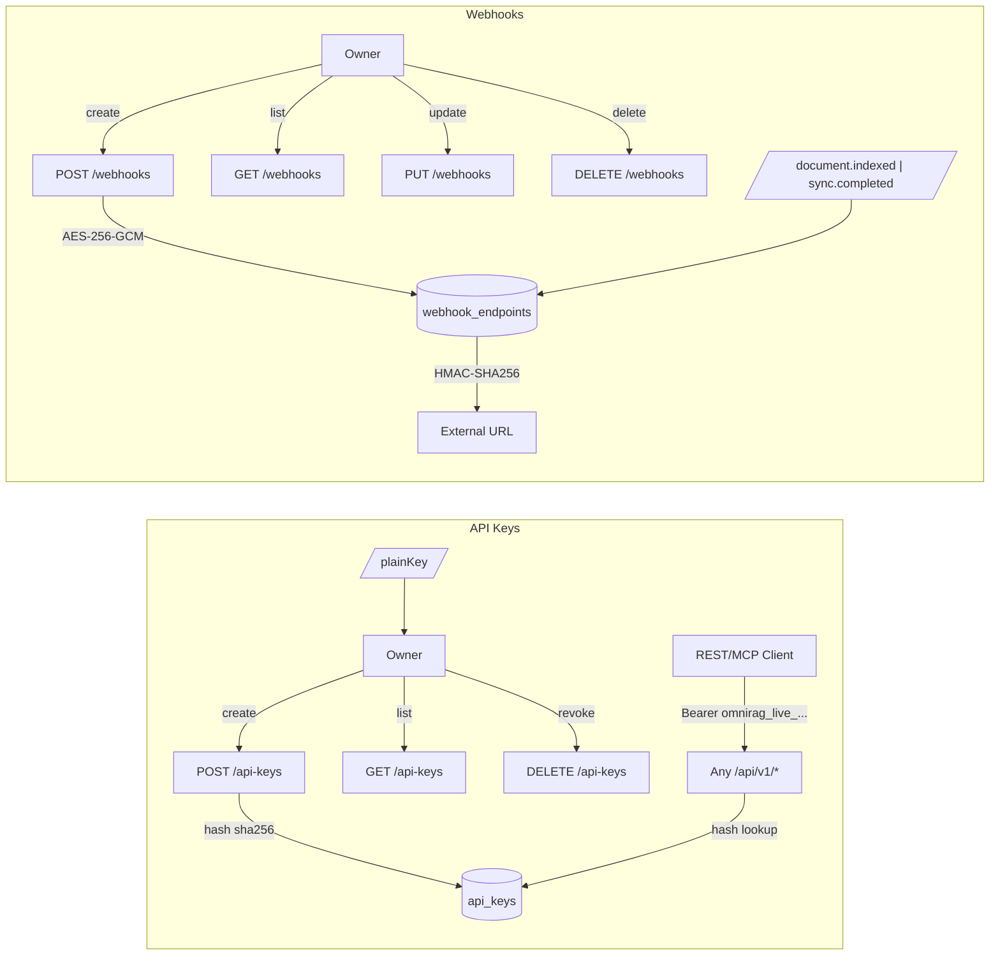

# API Keys & Webhooks API

مجموعة مسارات `/api/v1/api-keys` و `/api/v1/webhooks`: إدارة مفاتيح API الخاصة بالمستأجر (لعملاء REST، استدعاء MCP، الأتمتة)، وإدارة webhooks الصادرة لتكاملات المؤسسات.



## المصادقة والصلاحيات

| المسار                      | الصلاحية                    |
| --------------------------- | --------------------------- |
| `GET/POST/DELETE /api-keys` | `apiKeys:manage` (مالك فقط) |
| `GET /webhooks`             | `settings:read`             |
| `POST/PUT/DELETE /webhooks` | `settings:write`            |

---

## API Keys

### `GET /api/v1/api-keys`

يُعيد قائمة مفاتيح المستأجر بالـ public view (`prefix` فقط، بدون hash ولا plain).

```json
{
  "success": true,
  "keys": [
    {
      "id": "key-...",
      "name": "Prod MCP",
      "prefix": "omnirag_live_ab3f9c21",
      "scopes": [],
      "rateLimitPerMinute": null,
      "mcpTools": null,
      "expiresAt": null,
      "lastUsedAt": "...",
      "revokedAt": null,
      "createdAt": "..."
    }
  ]
}
```

### `POST /api/v1/api-keys`

ينشئ مفتاحاً. **النص الصريح يُعرض مرة واحدة**.

```json
{
  "name": "MCP Production",
  "scopes": ["chat:use"],
  "expiresInDays": 90,
  "rateLimitPerMinute": 60,
  "mcpTools": ["web_live_search", "search_knowledge_base"]
}
```

الاستجابة:

```json
{
  "success": true,
  "message": "تم إنشاء مفتاح API. انسخه الآن — لن يظهر مرة أخرى.",
  "plainKey": "omnirag_live_<96 hex>",
  "key": {/* public view */}
}
```

| الحقل                | القيود                                                            |
| -------------------- | ----------------------------------------------------------------- |
| `name`               | ≤200 حرف، افتراضي "مفتاح API".                                    |
| `scopes`             | string[]، ≤50.                                                    |
| `expiresInDays`      | رقم موجب (يكتب `expiresAt`).                                      |
| `expiresAt`          | ISO date string.                                                  |
| `rateLimitPerMinute` | 1..100000 (لكل مفتاح)، يقيد الطلبات/دقيقة عبر `apikey:<id>`.      |
| `mcpTools`           | string[]، ≤200، يُقيّد `tools/list` و`tools/call` لـ MCP gateway. |

- رموز: 400 `400_BAD_RATE_LIMIT`، `400_BAD_MCP_TOOLS`، 403 quota (`maxApiKeys`).
- يُحفظ فقط `keyHash = sha256(plainKey)`. النص لا يمكن استرجاعه.

### `DELETE /api/v1/api-keys`

```json
{ "id": "key-..." }
```

إبطال فوري (يحذف الصف أو يحدد `revokedAt`). الطلبات اللاحقة بنفس الـ Bearer → 401 `401_API_KEY_INACTIVE`.

### المصادقة بالمفتاح

- كل المسارات تقبل `Authorization: Bearer omnirag_live_<96 hex>` بدلاً من الـ session.
- `apiKeyMcpTools` يطبَّق فقط على MCP gateway (`/api/mcp/[...path]`).
- `apiKeyScopes` يُمرَّر إلى النظام لكن لا يُستخدم حالياً كقيد إضافي (الـ gate الفعلي هو `tenantId`).

### رموز الأخطاء

| الكود                      | المعنى                      |
| -------------------------- | --------------------------- |
| `401_BAD_API_KEY`          | تالف/غير قابل للتجزئة.      |
| `401_INVALID_API_KEY`      | غير معروف أو ملغى.          |
| `401_API_KEY_INACTIVE`     | منتهي أو مُلغى.             |
| `429_API_KEY_RATE_LIMITED` | تجاوز السقف الخاص بالمفتاح. |

---

## Webhooks

### `GET /api/v1/webhooks`

```json
{
  "success": true,
  "events": ["document.indexed", "document.deleted", "sync.completed"],
  "webhooks": [
    { "id": "wh-...", "name": "...", "url": "...", "events": ["document.indexed"], "enabled": true, "hasSecret": true }
  ]
}
```

### `POST /api/v1/webhooks`

ينشئ endpoint. سر التوقيع يُعرض مرة واحدة.

```json
{ "name": "Notif Service", "url": "https://hooks.example.com/omni", "events": ["document.indexed"], "enabled": true }
```

الاستجابة (201):

```json
{
  "success": true,
  "message": "تم إنشاء نقطة النهاية. انسخ سر التوقيع الآن — لن يظهر مرة أخرى.",
  "plainSecret": "<64 hex>",
  "signatureHeader": "X-OmniRAG-Signature",
  "webhook": {/* public view, hasSecret: true */}
}
```

### `PUT /api/v1/webhooks`

تحديث + تدوير السر (عبر `regenerateSecret: true`).

### `DELETE /api/v1/webhooks`

حذف endpoint.

### صيغة التسليم

كل webhook يُرسل:

```
POST <url>
Content-Type: application/json
X-OmniRAG-Timestamp: <unix-ms>
X-OmniRAG-Signature: sha256=<hex(hmacSha256(secret, `${timestamp}.${body}`))>
User-Agent: OmniRAG-Webhooks/1.0

{ "id": "evt-...", "type": "document.indexed", "tenantId": "...", "data": {...}, "createdAt": "..." }
```

يُوقَّع بـ HMAC-SHA256. الـ secret يُشفّر في الـ DB بـ AES-256-GCM (`MCP_OAUTH_ENCRYPTION_KEY`).

## انظر أيضاً

- [authentication](../06-security/authentication.md) — تدفق الجلسة + Bearer.
- [protections](../06-security/protections.md) — تشفير AES-256-GCM، حدود المعدل.
- [mcp](mcp.md) — كيف تُطبَّق `mcpTools` whitelist على الـ MCP gateway.
