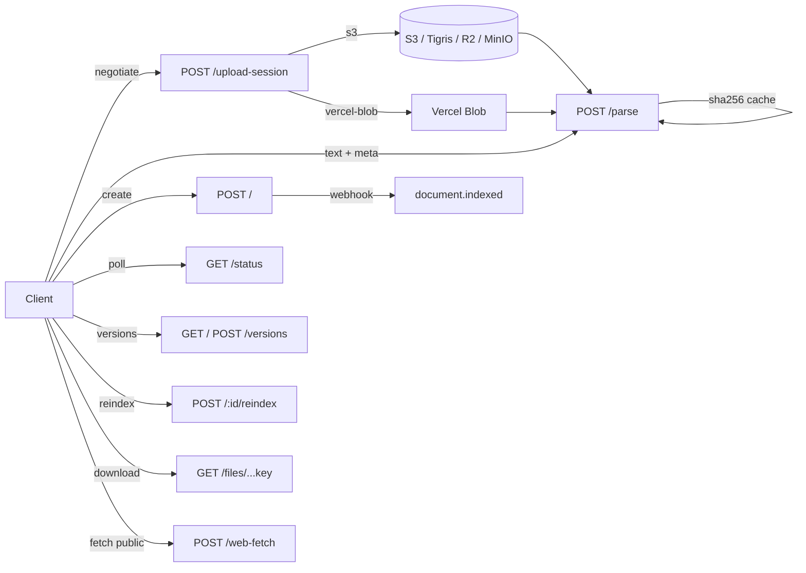
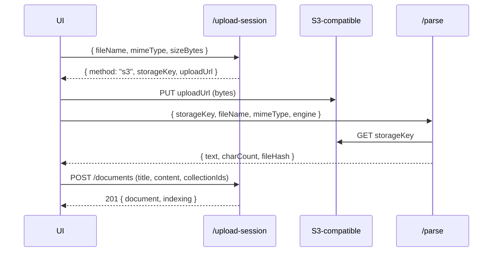

# Documents API

تدير هذه المجموعة دورة حياة المستندات: الإدراج (text مباشر، رفع مباشر، رفع كبير عبر S3/Blob، استخراج من رابط عام)، التجزئة، الفهرسة، الإصدارات، إعادة الفهرسة، استعلام الحالة، وخدمة ملف مباشر عبر `uploads/` و`generated/` بمسار موحد تحت `/api/v1/documents/*` و `/api/v1/files/[...key]`.

تستخدم جميع المسارات (ما عدا `/api/v1/files/[...key]` الذي يتحقق فقط من البادئة) مصادقة الجلسات أو مفاتيح API عبر `withAuthAndRateLimit` ثم `guardPermission(authCtx, 'documents:*')`.

## المخطط العام



## المصادقة والحدود

- كل المسارات محمية عبر `withAuthAndRateLimit` — الافتراضي: 30 طلب/دقيقة لكل IP، قابل للتخصيص لكل route.
- مفاتيح API يتم التحقق منها مقابل hash في `api_keys` (راجع [api-keys-webhooks](api-keys-webhooks.md)).
- CORS + Origin: يحرس `isSameOriginRequest` (csrf) — الـ Bearer من خارج الموقع مسموح، الـ Cookie من موقع آخر مرفوض.

---

## `POST /api/v1/documents/upload-session`

تفاوض على طريقة الرفع قبل إرسال أي بايتات. ينتج ثلاث نتائج: `s3` (رابط PUT موقّع)، `vercel-blob` (التوكين عبر SDK المتصفح)، أو `none` (ارتد إلى المسار التقليدي).

| الحقل       | النوع  | الوصف                                                     |
| ----------- | ------ | --------------------------------------------------------- |
| `fileName`  | string | اسم الملف (يُستخدم لبناء الـ storage key ولفحص الامتداد). |
| `mimeType`  | string | اختياري — إن غاب يُفترض `application/octet-stream`.       |
| `sizeBytes` | number | اختياري — يفحص ضد `DIRECT_UPLOAD_MAX_BYTES`.              |

الاستجابة (S3):

```json
{
  "method": "s3",
  "storageKey": "uploads/<tenantId>/<filename>",
  "uploadUrl": "https://<bucket>...",
  "contentType": "application/pdf",
  "expiresInMs": 900000
}
```

- خطأ 400 `400_MISSING_FILE_NAME`، 415 `415_UNSUPPORTED_TYPE`، 413 `413_FILE_TOO_LARGE`.
- الصلاحية: `documents:write`.

## `POST /api/v1/documents/upload-token`

معالج توكنات رفع Vercel Blob (متاح فقط عند `VERCEL` و `BLOB_READ_WRITE_TOKEN`). يجب أن يبدأ `pathname` بـ `uploads/<tenantId>/` — وإلا يُرفض. الحد: 50MB.

- خطأ 503 `503_BLOB_NOT_CONFIGURED`، 500 `500_UPLOAD_TOKEN_ERROR`.

## `POST /api/v1/documents/parse`

استخراج النص من ملف عبر ثلاث طرق (Content-Type):

- `application/json` مع `storageKey` أو `blobUrl` أو `fileData` (base64).
- `multipart/form-data` بمفتاح `file`/`document`/`upload` أو `fileData`.
- raw stream كنص.

يدعم الرؤوس:

- `x-max-file-size-mb` (1..50).
- `x-pages-per-chunk` (1..200).
- `x-skip-cache: true` لتعطيل كاش OCR.

اختيار المحرك: `engine` ∈ `auto | mistral | unstructured | local`، ومفاتيح لكل مزود: `mistralApiKey`, `unstructuredApiKey`, `groqApiKey`, `model`.

```json
{
  "storageKey": "uploads/.../file.pdf",
  "fileName": "manual.pdf",
  "mimeType": "application/pdf",
  "engine": "auto",
  "pagesPerChunk": 25
}
```

الاستجابة:

```json
{
  "text": "...extracted text...",
  "charCount": 12345,
  "wordCount": 2050,
  "totalPages": 12,
  "chunksProcessed": 1,
  "engineUsed": "Mistral Document AI",
  "fileSizeMb": "1.23",
  "isCacheHit": false,
  "fileHash": "<sha256>"
}
```

- كاش في الذاكرة `BoundedOcrCache` (25 مدخل / 8M chars) مفصول بـ `${tenantId}:${fileHash}` لمنع تسرّب OCR بين المستأجرين.
- صلاحيات: `documents:write`. `maxDuration = 60` على Vercel Hobby.
- اختياري: أرشفة خام إلى مخزن الكائنات عند `ARCHIVE_UPLOADS=true`.

## `GET /api/v1/documents/status`

استجابة خفيفة لواجهة المعرفة لاستطلاع حالة المستندات (`processing | indexed | failed`) أثناء الفهرسة.

```json
{
  "statuses": [{ "id": "doc-...", "status": "processing", "chunkCount": 0, "updatedAt": "...", "indexErrors": null }],
  "processingCount": 3,
  "timestamp": "2026-09-02T..."
}
```

الصلاحية: `documents:read`.

## `GET/POST /api/v1/documents/versions`

- `GET?documentId=...`: قائمة الإصدارات (`currentVersion`, `versions[]`).
- `POST`: إجراءات `revert` أو `create` (Zod discriminator). محتوى الإصدار محدود بـ 4M حرف.

الصلاحيات: `documents:read` (GET) / `documents:write` (POST). يستخدم نموذج التضمين النشط لإعادة التضمين عند الاسترجاع.

## `POST /api/v1/documents/web-fetch`

جلب ملف عام من رابط `http(s)`، فحص SSRF (`assertPublicHttpUrl`)، تنزيل عبر `safeFetchBinary` (60s، حد حجم 1..50MB)، ثم استخراج النص بنفس محركات استوديو الرفع.

```json
{ "url": "https://example.com/file.pdf", "engine": "auto", "fileName": "optional.pdf", "maxFileSizeMb": 25 }
```

الاستجابة تتضمن `text`, `charCount`, `wordCount`, `totalPages`, `engineUsed`, `requestedEngine`, `fileName`, `mimeType`, `sizeBytes`, `sourceUrl`, `tenantId`.

- أخطاء: 400 `400_URL_REJECTED`، 400 `400_INVALID_BODY`، 415 `415_UNSUPPORTED_TYPE`، 422 `422_EMPTY_DOWNLOAD`/`422_NO_TEXT_EXTRACTED`، 502 `502_FETCH_FAILED`.

## `POST /api/v1/documents/[id]/reindex`

إعادة بناء شبكة المقاطع والمتجهات لمستند موجود. يستدعي `db.reindexDocument(id, tenantId)` ويحدّث الحالة إلى `indexed`/`failed`.

الاستجابة:

```json
{ "success": true, "document": {...}, "indexing": { "indexed": 12, "failed": 0, "total": 12, "errors": [] } }
```

- 404 إذا لم يوجد المستند ضمن المستأجر.
- يستخدم نموذج التضمين النشط عبر `parseModelConfigFromRequest`.

## `POST /api/v1/documents`

يختلف هذا المسار عن `parse` بأنه يأخذ نصاً مجهزاً (`title`, `content` <= 4M حرف) ويولّد مستنداً + مقاطع + فهرسة متجهة. يدعم `collectionIds` (حتى 50) و`chunkingConfig` (`semantic | markdown | recursive`).

الاستجابة (201):

```json
{
  "success": true,
  "document": { "id": "doc-...", "status": "indexed", "chunkCount": 18, ... },
  "source": { "id": "src-file-...", ... },
  "chunkCount": 18,
  "indexing": { "indexed": 18, "failed": 0, "errors": [] }
}
```

- يرسل webhook `document.indexed` بعد الاستجابة (best-effort).
- الصلاحية: `documents:write`، و`guardQuota('maxDocuments')`.

## `GET /api/v1/documents`

- بدون `documentId`: قائمة المستندات.
- مع `documentId`: مقاطع المستند (حدود + إزاحة).

## `DELETE /api/v1/documents?id=...`

حذف مستند وإرسال `document.deleted`. الصلاحية: `documents:delete`.

## `GET /api/v1/files/[...key]`

يخدم الكائنات المؤمّنة (مرفوعات + artifacts مولّدة) من مخزن الكائنات المختار للمستأجر. يتحقق من البادئة (`uploads/<tenantId>/...` أو `generated/<tenantId>/...`) — لا يمكن لمستأجر قراءة كائنات غيره حتى لو عرف المفتاح.

- 404 `404_NOT_FOUND` لمفاتيح خارج النطاق.
- 503 `503_UNAVAILABLE` إن كان المخزن غير مهيأ.
- MIME والـ `Content-Disposition` (inline/attachment) يُشتقان من الامتداد.

## دورة الرفع الكبيرة (S3 / Blob)



البديل Vercel Blob: `upload-session` يعيد `handleUploadUrl: '/api/v1/documents/upload-token'` ثم يستخدم المتصفح `@vercel/blob` SDK الذي يحقق الـ `pathname` prefix داخلياً.

## رموز الأخطاء الشائعة

| الكود                     | المعنى                                  |
| ------------------------- | --------------------------------------- |
| `400_MISSING_FILE_NAME`   | لم يُرسل `fileName`.                    |
| `400_BAD_FORM_DATA`       | جسم فارغ أو غير قابل للتحليل.           |
| `400_URL_REJECTED`        | فحص SSRF فشل.                           |
| `413_FILE_TOO_LARGE`      | تجاوز الحد (10MB افتراضياً، 50MB قصوى). |
| `415_UNSUPPORTED_TYPE`    | امتداد/MIME غير مسموح.                  |
| `422_PDF_UNREADABLE`      | PDF بلا طبقة نصية ولا OCR متاح.         |
| `422_UNREADABLE_DOCUMENT` | لا نص قابل للاستخراج.                   |
| `502_FETCH_FAILED`        | فشل تنزيل `web-fetch`.                  |
| `503_BLOB_NOT_CONFIGURED` | مسار Vercel Blob غير مهيأ.              |
| `EMPTY_CONTENT`           | المستند بلا محتوى (reindex).            |

## انظر أيضاً

- [auth](auth.md) — المصادقة ومفاتيح API.
- [chunking](../03-rag-engine/chunking.md) — استراتيجيات التجزئة والحدود.
- [embeddings](../03-rag-engine/embeddings.md) — نموذج التضمين وإعادة التضمين.
- [connectors](../08-integrations/connectors.md) — الموجز ذاته للموصلات.
