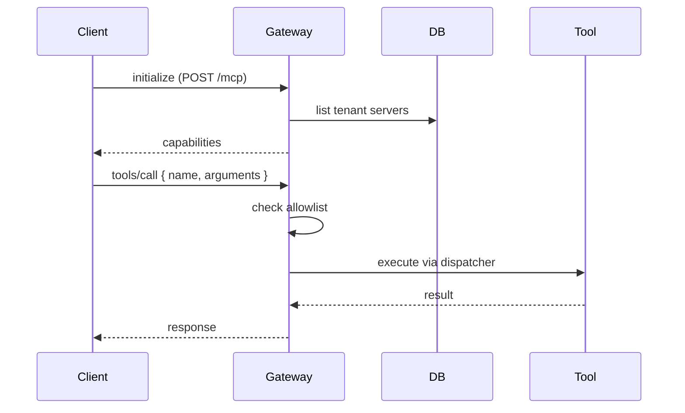

# MCP (Model Context Protocol) API

مجموعة مسارات MCP: إدارة خوادم MCP (HTTP/SSE/WebSocket/Stdio)، القوالب الجاهزة (presets)، OAuth، الاختبار، توليد الأدوات بالذكاء الاصطناعي، السجلات، و gateway العميل عبر Streamable HTTP.

```mermaid
flowchart LR
  subgraph Tenant Control
    ui[UI] -->|install| presets[/mcp/presets]
    ui -->|register| servers[/mcp/servers]
    ui -->|edit| srvId[/mcp/servers/:id]
    ui -->|ping| ping[/mcp/servers/:id/test]
    ui -->|aggregate health| health[/mcp/health]
    ui -->|call history| calls[/mcp/calls]
    ui -->|AI tool build| gen[/mcp/generate-tool]
  end
  subgraph OAuth Flow
    ui -->|initiate| oinit[/mcp/oauth/initiate]
    Provider[OAuth Provider] -->|redirect| ocb[/mcp/oauth/callback]
  end
  subgraph Outbound Gateway
    client[Claude Desktop / Cursor / REST] -->|Streamable HTTP| gw[/api/mcp/...path]
    gw --> Tools[Tenant MCP Tools]
    Tools -->|allowlist| apikey[API key mcpTools]
  end
```

## المصادقة والصلاحيات

- جميع مسارات `/api/v1/mcp/*` (ما عدا `/oauth/callback`) تتطلب `mcp:manage`.
- `/api/mcp/[...path]` يقبل Bearer API key أو Session Cookie.
- `/api/v1/mcp/oauth/callback` عام (popup).

---

## `/api/v1/mcp/servers`

### `GET`

```json
{ "servers": [...], "stdioEnabled": <bool> }
```

`stdioEnabled` يحدد ما إذا كان النقل المحلي `stdio` مدعوماً (مفعّل فقط في النشر الذاتي، مرفوض على Vercel المُدار).

### `POST` (actions)

| `action`                                      | الوصف                                                                             |
| --------------------------------------------- | --------------------------------------------------------------------------------- |
| `add` (افتراضي عند وجود `name`+`endpointUrl`) | ينشئ خادماً. افتراضياً يحدد الأدوات حسب الاسم (slack/github/web/postgres/custom). |
| `edit` + `server`                             | يحدّث بيانات خادم موجود.                                                          |
| `ping` + `serverId`                           | يفحص الاتصال الحقيقي عبر `probeEndpoint` أو `listRemoteTools` لـ stdio.           |
| `delete` + `serverId`                         | يحذف خادماً.                                                                      |
| بدون action + `{serverId,toolName}`           | تبديل تفعيل أداة.                                                                 |

- للأمان: الحقول السرية في `config.env` تُشفّر بـ AES-256-GCM (`encryptToken`).
- Placeholders (تحوي `••`) تعني "احتفظ بالقيمة الحالية".
- نقل `stdio` يتطلب `isStdioTransportAllowed()` (يرفض على Vercel).
- كل عملية تُسجَّل في `audit_logs`.

## `/api/v1/mcp/servers/[id]`

- `GET` — تفاصيل خادم.
- `PATCH` — تعديل `status`, `enabledTools`, `name`, `url`, `config`.
- `DELETE` — حذف + سجل audit.

## `/api/v1/mcp/servers/[id]/test`

إجراء اختبارات متعددة:

1. `mcpClientPool.probeServer` (ping خفيف + كاش).
2. `listRemoteTools` لـ `https?://` حقيقي → MCP handshake + tools/list (حتى 20 اسم).
3. `mcpClientPool.executeToolCall(serverId, toolName, args, ctx)` عند تمرير `body.toolName`.

يُرجع `{ probe, protocolCheck, testCallResult, testedAt }`.

## `/api/v1/mcp/presets`

### `GET`

كتالوج الـ presets الجاهزة (`unstructured-transform`, `knowledge-core`, `web-search`, `youtube-intelligence`, `slack`, `github`, `postgres-analytics`) مع `ready: true/false` و `installed: bool` و `toolsRegistered`.

### `POST`

```json
{ "presetId": "web-search" }
```

يثبّت الخادم. 409 `ALREADY_INSTALLMENT` إن كان مثبتاً.

## `/api/v1/mcp/health`

يكشف عن حالة كل خادم (`healthy`/`degraded`/`unhealthy`) مع `latencyMs` المُقاس فعلياً.

## `/api/v1/mcp/calls`

سجل استدعاءات أدوات MCP للمستأجر (`tool_calls`).

## `/api/v1/mcp/generate-tool`

`action: 'generate'` — يأخذ وصفاً نصياً، يستخدم Gemini (عبر `generateObject`/zod) لتوليد `toolName`, `description`, `properties`, `required`, `sampleResponse`. يخزّن المخطط في `server.customToolSchemas[toolName]`.

```json
{ "action": "generate", "prompt": "أداة لجلب حالة طلب من نظام ERP" }
```

`action: 'save'` — يحفظ مخططاً مولّداً على خادم موجود.

## `/api/v1/mcp/oauth/*`

### `POST /oauth/initiate`

- يفرض `mcp:manage`.
- يبني `authorizationUrl` مع `state`, `PKCE`, `resourceIndicator` (RFC 8707)، و `expectedIssuer` (RFC 9207).
- `redirectUri` يُشتق من `APP_URL` (تجنب host-header injection). fallback محلي لـ dev.

```json
{
  "serverId": "...",
  "authUrl": "https://slack.com/oauth/v2/authorize",
  "clientId": "...",
  "scopes": ["chat:write", "channels:read"],
  "resourceIndicator": "https://api.slack.com",
  "expectedIssuer": "slack.com",
  "tokenEndpoint": "https://slack.com/api/oauth.v2.access",
  "clientSecret": "..."
}
```

### `GET /oauth/callback`

- يُستدعى من نافذة popup. ينهي تدفق OAuth ثم يُغلق النافذة مع `postMessage({source:'omnirag-mcp-oauth', success})`.
- يُعيد صفحة HTML مع `Cache-Control: no-store`.

## `/api/mcp/[...path]` (Streamable HTTP)

- تنفيذ Streamable HTTP من `@modelcontextprotocol/sdk` (Claude Desktop / Cursor / REST MCP clients).
- مصادقة مزدوجة: Bearer API key أو session cookie (عبر `withAuthAndRateLimit`).
- يقبل `GET`, `POST`, `DELETE` (المتطلب للنقل بدون state).
- `maxDuration = 300`.
- مفاتيح API تحمل whitelist عبر `authCtx.apiKeyMcpTools` (null = كل أدوات المستأجر).
- الـ transport stateless → يتوسع أفقياً بسلاسة على serverless.



## تشفير الاعتمادات

- الأسرار (OAuth tokens, stdio env) تُشفّر بـ AES-256-GCM عبر `MCP_OAUTH_ENCRYPTION_KEY` (راجع [protections](../06-security/protections.md)).
- التشفير يكون على مستوى الـ DB record، ويفكّ عند القراءة عبر `decryptToken`.

## رموز الأخطاء الشائعة

| الكود               | المعنى                                |
| ------------------- | ------------------------------------- |
| `404_NOT_FOUND`     | خادم غير موجود.                       |
| `ALREADY_INSTALLED` | الـ preset مثبت مسبقاً.               |
| 400 (stdio)         | `stdio غير مدعوم على Vercel المُدار`. |

## انظر أيضاً

- [mcp integration](../08-integrations/mcp.md) — الكتالوج الكامل + تشفير + web_live_search.
- [auth](../06-security/authentication.md) — تدفق الجلسة + Bearer.
- [protections](../06-security/protections.md) — AES-256-GCM وSSRF guards.
