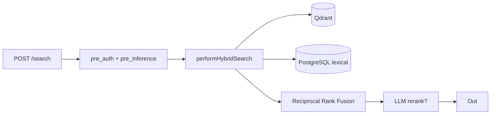
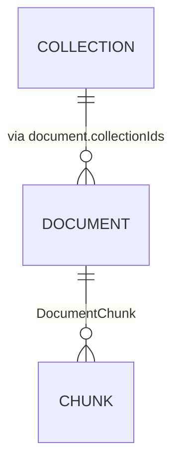

# Search & Collections API

مجموعة المسارات `/api/v1/search` و `/api/v1/collections`: البحث الهجين (متجهي + معجمي + RRF + إعادة ترتيب)، وإدارة المجموعات (تجميع منطقي للمستندات يُستخدم لتقييد النطاق في الاسترجاع).

## المصادقة والحدود

- `/api/v1/search`: يتطلب `chat:use`، حد افتراضي 30 طلب/دقيقة.
- `/api/v1/collections` (GET): `collections:read`.
- `/api/v1/collections` (POST): `collections:write` + `guardQuota('maxCollections')`.

---

## `POST /api/v1/search`

واجهة البحث المبنية على `performHybridSearch` في `src/lib/rag/engine.ts`. تمر بمرحلتين قبل الاشتعال:

- `HookHarness.run('pre_auth')` — إن رفض يرجع 403.
- `HookHarness.run('pre_inference')` — يفحص prompt-injection على الاستعلام.

### الجسم (Zod)

| الحقل            | النوع    | القيود             | الوصف                                        |
| ---------------- | -------- | ------------------ | -------------------------------------------- |
| `query`          | string   | 1..4000            | نص الاستعلام.                                |
| `language`       | enum     | `ar \| en \| auto` | اختياري — يؤثر في الكاش الاحتياطي.           |
| `collectionIds`  | string[] | <=50               | تقييد النطاق على هذه المجموعات.              |
| `topK`           | number   | 1..400             | **معلومة over-fetch** فقط — لا يحدّ نهائياً. |
| `scoreThreshold` | number   | 0.01..1            | أرضية التشابه الدلالي.                       |
| `semanticWeight` | number   | 0..1               | وزن الذراع الدلالي في RRF.                   |
| `lexicalWeight`  | number   | 0..1               | وزن الذراع المعجمي.                          |
| `rerank`         | boolean  | —                  | يفعّل إعادة ترتيب LLM (Cross-Encoder).       |
| `useHyde`        | boolean  | —                  | يفعّل توسيع HyDE للاستعلام الدلالي فقط.      |

### الاستجابة

```json
{
  "chunks": [
    {
      "id": "chunk-doc-...",
      "documentId": "doc-...",
      "documentTitle": "...",
      "content": "...",
      "pageNumber": 7,
      "language": "ar",
      "score": 0.0149,
      "semanticScore": 0.62,
      "lexicalScore": 0.31,
      "semanticRank": 3,
      "lexicalRank": 5
    }
  ],
  "totalCount": 24,
  "latencyMs": 412,
  "hydePrompt": "...",
  "distribution": { "semanticMatches": 18, "lexicalMatches": 22, "fusionCount": 24 }
}
```

- 400 `VALIDATION_ERROR` على مدخلات غير صالحة.
- 403 من `pre_auth`، 400 من `pre_inference`.
- أخطاء داخلية: 500 عام.

### أنماط البحث

- **Aggregative queries**: عند اكتشاف عبارات مثل "الدروس/الفصول/الوحدات"، أو علامات مثل "بالتفصيل الممل"، يفتح المحرك البحث متعدد-العروض (Multi-Query) ويدمج النتائج عبر RRF على العروض.
- **Named-document anchoring**: إذا تطابق اسم مستند مع الاستعلام بنسبة ≥ 0.2، يُحمَّل كامل محتوى المستند ويضاف للسياق بترتيب الكتاب.
- **Stale vectors**: عند اختلاف نموذج التضمين النشط عن المخزّن، يخفض المحرك وزن الذراع الدلالي إلى 0 ويطلق self-heal في الخلفية.

راجع التفاصيل في [retrieval](../03-rag-engine/retrieval.md).

---

## `GET /api/v1/collections`

قائمة المجموعات للمستأجر (مُرتبة حسب `createdAt`).

```json
{ "collections": [{ "id": "col-...", "name": "...", "description": "...", "documentCount": 0, "createdAt": "..." }] }
```

## `POST /api/v1/collections`

```json
{ "name": "موارد بشرية", "description": "..." }
```

الاستجابة (201):

```json
{ "collection": { "id": "col-...", "name": "...", "description": "...", "documentCount": 0, "createdAt": "..." } }
```

- يرفض الأسماء المكررة (409 `DUPLICATE_NAME`).
- `name` 1..200 حرفاً، `description` حتى 2000 حرف.

## مخططات مرجعية





## انظر أيضاً

- [retrieval](../03-rag-engine/retrieval.md) — كيف يدمج RRF وكيف يعمل HyDE وnamed-document.
- [auth](auth.md) — تفاصيل `withAuthAndRateLimit` والصلاحيات.
- [schema](../05-database/schema.md) — جداول المجموعات والمقاطع.
