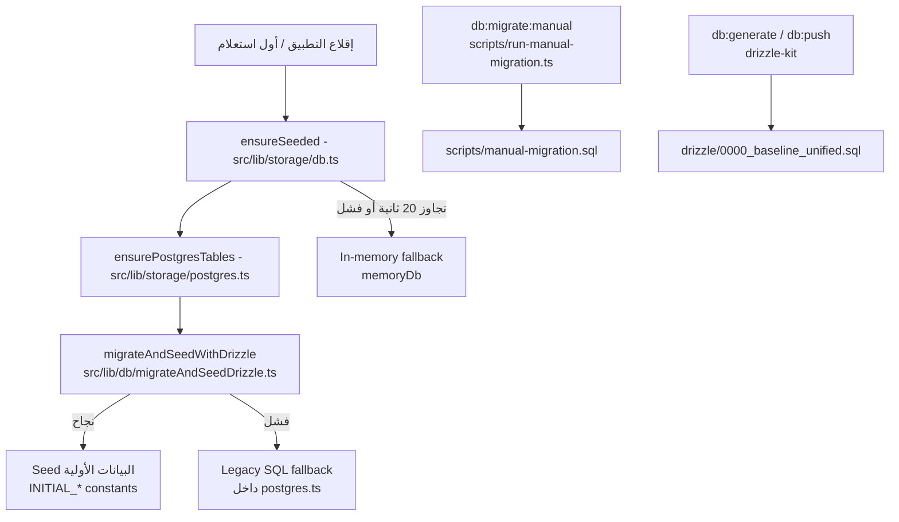

# نظام التهجير وإدارة المخطط (Migrations & Schema Management)

> يوثّق هذا الملف كيف تُنشأ قاعدة البيانات وتُهجَّر وتُبذَر في OmniRAG v0.12.5 — كل شيء مستخرج من الكود الفعلي.

## مصدر الحقيقة (Single Source of Truth)

`src/db/schema.ts` هو المخطط المعتمد الوحيد: 25 جدولاً معرفة بـ Drizzle ORM (`pgTable`). كما يوثّق رأس الملف قراءتين هندسيتين:

- **اتفاقية الطوابع الزمنية**: كل الأعمدة الزمنية `varchar(100)` تحمل ISO-8601 UTC — لا تُحوَّل إلى `timestamptz` جزئياً أبداً.
- **قاعدة الاشتقاق**: كلٌّ من `src/lib/db/migrateAndSeedDrizzle.ts` (مُهجّر الإقلاع) و`scripts/manual-migration.sql` (السكريبت اليدوي) **مشتقان من `schema.ts`**؛ عند تعديل جدول هناك يجب إعادة توليد الـ baseline وإبقاء السكريبت اليدوي متزامناً.

العميل الفعلي يُبنى في `src/db/index.ts`: دالة `getDrizzle()` تلفّ `drizzle-orm/node-postgres` حول الـ pool القادم من `getPostgresPool()` (في `src/lib/storage/postgres.ts`) مع كامل الـ schema.

## طبقات إنشاء المخطط



### 1. التهيئة التلقائية عند الإقلاع — `migrateAndSeedWithDrizzle()`

الملف: `src/lib/db/migrateAndSeedDrizzle.ts`، ويُستدعى من `ensurePostgresTables()` في `src/lib/storage/postgres.ts` (الذي تستدعيه `ensureSeeded()` في `src/lib/storage/db.ts` عند أول عمليات قاعدة البيانات).

**المسار السريع (fast path):** قبل أي شيء، SELECT واحد مفهرس على `schema_meta` يتحقق من `key = 'schema_revision'` و`value = SCHEMA_REVISION` (حالياً `'2026-08-29-perf-indexes'`). إذا تطابقت القيمة، يُتخطى كل الـ DDL — وهذا حاسم على serverless حيث كان كل cold start يعيد معاملة DDL كاملة (~47 عبارة) فقط للتحقق من الموجود.

**جولة DDL داخل معاملة واحدة:**

- الـ statements تُجمع في مصفوفة عبر دالة `ddl()` ثم تُنفَّذ على دفعات من **12 عبارة لكل round-trip** (`DDL_BATCH_SIZE = 12`)؛ node-postgres لا يعمل pipelining للاستعلامات المتسلسلة، وكل statement منتظر يدفع round-trip كامل (~180ms إلى Neon) — التسلسل الخام كان يقيس 10+ ثوانٍ على cold start ويُخرج النسخة من ميزانية `ensureSeeded()` (ما يؤدي إلى 401/403 أو الهبوط إلى الـ in-memory fallback).
- العبارات مدمجة بفواصل منقوطة في رسالة واحدة؛ Postgres ينفذها بالتتابع داخل نفس المعاملة، ويجهضها كاملة عند أول خطأ.
- تُختم `SCHEMA_REVISION` في `schema_meta` **داخل المعاملة** (قبل `COMMIT`) — فشل أي دفعة يتراجع عن الختم أيضاً فيُعادت المحاولة في الإقلاع التالي.
- بعد الـ DDL: عبارات `ALTER TABLE ... ADD COLUMN IF NOT EXISTS` للترقيات التراكمية (أعمدة أُضيفت لاحقاً مثل `documents.source_type` و`api_keys.rate_limit_per_minute` و`mcp_tools` و`users.tenant_id` بـ `DEFAULT ''` للصفوف القديمة).

**البذر (Seeding):** بعد نجاح المعاملة تُزرع البيانات الأولية من `src/lib/storage/constants.ts` (`INITIAL_COLLECTIONS`, `INITIAL_DOCUMENTS`, `INITIAL_CHUNKS`, `INITIAL_MCP_SERVERS`, `INITIAL_SOURCES`, `INITIAL_AUDIT_LOGS`) عبر Drizzle بجُمل `INSERT ... onConflictDoNothing()` — idempotent وتُنفَّذ **بالتوازي** (`Promise.all`) لأنها تستهدف جداول مستقلة، وكل insert متسلسل كان يكلف ~2.5s من ميزانية cold start.

### 2. المسارات البديلة عند الفشل

- **Legacy SQL fallback**: إذا فشل مسار Drizzle، تحاول `ensurePostgresTables()` إنشاء الجداول بـ SQL يدوي متطابق (في `postgres.ts`).
- **In-memory fallback**: إذا تجاوزت التهيئة مهلة 20 ثانية أو فشلت، تُفعّل `dbInstance.enableMemoryFallback()` (`MemoryDatabase` في `src/lib/storage/db.ts`) — بلا durability، والجلسات تضيع (401). يوجد **قاطع دائرة (circuit breaker)**: 3 أخطاء Postgres خلال نافذة 60 ثانية تفتح الدائرة مؤقتاً، ثم تُعاد المحاولة تلقائياً بعد فترة تهدئة بدل الهبوط الدائم.

### 3. الـ Baseline الموحد — `drizzle/0000_baseline_unified.sql`

ملف squash واحد ولّده `drizzle-kit generate` ويغطي الجداول الـ 25 + كل الفهارس في شكل SQL خالص (مع فواصل `--> statement-breakpoint`). لاحِظ فيه:

- قيد `users_email_unique` و`usage_counters_tenant_id_period_pk` تظهر كقيود مسماة.
- فهرس `resource_shares_link_token_idx` UNIQUE الجزئي بـ `WHERE link_token IS NOT NULL`.
- ملف الـ snapshot في `drizzle/meta/0000_snapshot.json` و`drizzle/meta/_journal.json` هما حالة drizzle-kit الداخلية.

### 4. السكريبت اليدوي — `scripts/manual-migration.sql`

بديل يدوي كامل (445 سطراً) للاستخدام عبر `psql` أو Neon console أو `docker exec` — لقاعدة جديدة تماماً أو قاعدة من نسخة سابقة. **كل عباراته idempotent** (`IF NOT EXISTS` / `IF EXISTS` / DO blocks) وينفّذها داخل `BEGIN`/`COMMIT`. مقسّم لثمانية أقسام: Core RAG، Auth & Tenancy، Platform (Phase 0/6)، Teams & Sharing (Phase 5)، Ops، Legacy Column Backfill، Indexes، وLegacy Index Cleanup (إزالة فهارس مكررة من نشر أقدم).

**ما لا يشمله عمداً:**

1. مخطط `pgboss` — ينشئه pg-boss تلقائياً عند أول تشغيل.
2. بيانات Seed — التطبيق يزرعها عند الإقلاع.
3. مجموعات Qdrant — التطبيق ينشئها عند أول رفع مستند.

## أوامر npm المتاحة

الأوامر معرّفة في `package.json` وكلها تمرر `--config=src/db/drizzle.config.ts`:

| الأمر                       | ما يفعله                                                                                                                                  |
| --------------------------- | ----------------------------------------------------------------------------------------------------------------------------------------- |
| `npm run db:generate`       | `drizzle-kit generate` — يقارن `schema.ts` بالـ snapshot في `drizzle/meta/` ويولّد ملف SQL تهجير جديد                                     |
| `npm run db:push`           | `drizzle-kit push` — يطبّق الفروقات مباشرة على قاعدة `DATABASE_URL` (تطوير فقط)                                                           |
| `npm run db:check`          | `drizzle-kit check` — يكشف التعارضات في ملفات التهجير المولّدة                                                                            |
| `npm run db:migrate:manual` | `tsx scripts/run-manual-migration.ts` — ينفّذ `scripts/manual-migration.sql` عبر `pg.Client` مباشرة (مفيد على Windows حيث لا يوجد `psql`) |

`run-manual-migration.ts` يقرأ `DATABASE_URL` (أو `POSTGRES_URL`)، ينفّذ ملف SQL كاملاً، ثم يتحقق من وجود الجداول الـ 25 المتوقعة في `information_schema.tables` ويطبع `25/25 tables present` أو يفشل مع قائمة الناقص.

## إعدادات `drizzle.config.ts`

```ts
schema: './src/db/schema.ts',
out: './drizzle',
dialect: 'postgresql',
tablesFilter: ['!vector_chunks', '!vector_chunks_*', '!pgboss.*', '!pgboss_*'],
```

## استثناءات جداول pgboss و`vector_chunks*`

هذه **استثناء مقصود وموثق** في تعليق `drizzle.config.ts`:

- **مخطط `pgboss`** — ينشئه pg-boss على إقلاع التطبيق (طوابير المهام الخلفية).
- **`vector_chunks` و`vector_chunks_d<dim>`** — يوفرها محول pgvector (`src/lib/storage/vectors/adapters/pgvector.ts`) وقت التشغيل، جدول لكل بُعد embedding (`vector_chunks` للبُعد الافتراضي 3072، وإلا `vector_chunks_d<dim>`).

كلاهما يعيش خارج `src/db/schema.ts` عن قصد، **حتى لا تراها `db:generate` أو `db:push` فتحاول إسقاطها (drop)**. لهذا السبب نفسه لا تعدّل `tablesFilter` إلا بفهم كامل لما تضيفه.

## إرشادات التعديل الآمن على المخطط

1. **عدّل `src/db/schema.ts` أولاً ودائماً** — لا تعدّل SQL التهجير مباشرة دون مصدر.
2. **أعد توليد الـ baseline**: `npm run db:generate` ثم راجع `drizzle/0000_baseline_unified.sql` والـ snapshot الناتج.
3. **زامن `scripts/manual-migration.sql`**: أضف `CREATE TABLE IF NOT EXISTS` / `ADD COLUMN IF NOT EXISTS` / فهرساً في القسم المناسب — القاعدة: كل عبارة idempotent.
4. **ارفع `SCHEMA_REVISION`** في `migrateAndSeedDrizzle.ts` عند أي تغيير في الـ DDL (صيغة التاريخ-الوصف، مثل `'2026-08-29-perf-indexes'`) — قواعد منشورة سابقاً ستتخطى الجولة الجديدة دون هذا.
5. **أضف أعمدة الترقية كـ `ALTER TABLE ... ADD COLUMN IF NOT EXISTS`** في قسم الـ backfill — `CREATE TABLE IF NOT EXISTS` لا يضيف عموداً لجدول موجود مسبقاً (هذا سبب وجود قسم Legacy Column Backfill أصلاً).
6. **احترم اتفاقية الطوابع الزمنية**: أي عمود زمني جديد يبقى `varchar(100)` ISO-8601؛ لا خلط `timestamptz` جزئي.
7. **الفهارس التعبيرية يجب أن تكون مطابقة بايت-ببايت** لما ينفذه الكود: فهارس GIN على `to_tsvector('<dict>'::regconfig, content)` تفقد فائدتها لو غيّر الاستعلام صيغة التعبير.
8. **لا تسحب `pgboss` أو `vector_chunks*` إلى المخطط** — أبقِ `tablesFilter` كما هو.
9. **اختبر مساري التهيئة**: قاعدة فارغة (إنشاء كامل) وقاعدة موجودة من نسخة سابقة (backfill فقط) — كلاهما مسارات مدعومة رسمياً، إضافة إلى re-run آمن للسكريبت اليدوي.

## انظر أيضاً

- [مرجع المخطط](schema.md) — تفصيل الجداول الـ 25 وأعمدتها وفهارسها.
- [طبقات التخزين](storage-adapters.md) — جداول `vector_chunks*` الديناميكية وكيفية اختيار محول التخزين.
- [محرك RAG](../03-rag-engine/pipeline.md) — البحث المعجمي والدلالي الذي تخدمه فهارس GIN وpgvector.
- [README للمشروع](../../README.md) — نظرة عامة على المنصة.
