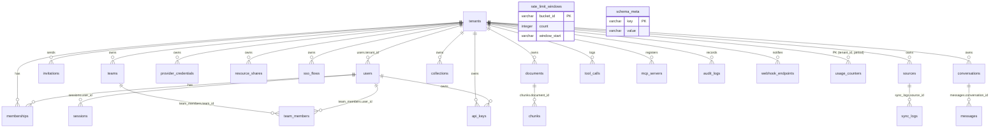

# مرجع مخطط قاعدة البيانات (Database Schema)

> المصدر: `src/db/schema.ts` — الملف الوحيد المعتمد (Single Source of Truth) لتعريف المخطط.
> الإصدار الموثّق: v0.12.5 — **25 جدولاً** في مخطط `public`، إضافة إلى جداول ديناميكية خارج الملف (انظر [التهجيرات](migrations.md)).

## ملاحظات معمارية عامة

### تخزين الطوابع الزمنية (Timestamp Convention)

كل الأعمدة الزمنية (`created_at`, `expires_at`, `timestamp`, ...) هي `varchar(100)` تحمل سلاسل **ISO-8601 UTC** تُنتج حصرياً عبر `new Date().toISOString()` (تنتهي دائماً بـ `Z` وبعرض ثابت). لهذا التنسيق الموحّد، الترتيب المعجمي (lexicographic) يطابق الترتيب الزمني، فتبقى مقارنات SQL النصية ومقارنات `new Date(x)` في JavaScript صحيحة. هذه **قراءة هندسية موثقة في رأس `src/db/schema.ts`**: لا تحوّل الأعمدة إلى `timestamptz` جزئياً — إمّا ترحيل الأعمدة العشرين كلها معاً أو ترك العقد كما هو.

### العزل متعدد المستأجرين (Multi-tenancy)

كل جدول أعمال يحمل عمود `tenant_id varchar(100) NOT NULL`، وكل استعلام في التطبيق يُفلتر بهذا العمود. لا توجد Foreign Keys فعلية بين الجداول (علاقات منطقية عبر الـ IDs فقط)، والعزل يُفرض على مستوى طبقة التطبيق + فهارس `tenant_id`. استثناء الجداول غير المتأثرة: `usage_counters` يحقق العزل عبر المفتاح المركّب، و`rate_limit_windows` / `schema_meta` جداول نظامية بلا نطاق مستأجر.

### اتفاقيات الأعمدة

| النمط             | القاعدة                                                      | مثال                                   |
| ----------------- | ------------------------------------------------------------ | -------------------------------------- |
| المعرّفات (IDs)   | `varchar(100)` Primary Key، تُولَّد في التطبيق (UUID/بادئات) | `documents.id`                         |
| الحقول المرنة     | `jsonb` بقيم افتراضية `'[]'::jsonb` أو `'{}'::jsonb`         | `metadata`, `collection_ids`, `scopes` |
| التعدادات (Enums) | `varchar` بأطوال صغيرة والقيم تُتحقق في طبقة التطبيق         | `status`, `role`, `permission`         |
| النصوص الحرة      | `text`                                                       | `title`, `content`, `description`      |

---

## المجموعة 1: المستأجرون والمصادقة والفرق

### `tenants`

جدول هوية المستأجرين (كان قبلها مجرد اتفاقية نصية على `tenantId`). يملك دورة حياة المستأجر وخطة الاشتراك.

| العمود       | النوع                                      | ملاحظات                                                    |
| ------------ | ------------------------------------------ | ---------------------------------------------------------- |
| `id`         | `varchar(100)` PK                          |                                                            |
| `name`       | `varchar(200)` NOT NULL                    | اسم المستأجر                                               |
| `plan`       | `varchar(50)` NOT NULL DEFAULT `'starter'` | خطة الاشتراك (تُحدَّث عبر Phase 7)                         |
| `created_at` | `varchar(100)` NOT NULL                    | ISO-8601                                                   |
| `settings`   | `jsonb`                                    | إعدادات المستأجر (تُعدّل جزئياً من `updateTenantSettings`) |

### `users`

حسابات المستخدمين — مصادقة Postgres خالصة تستبدل Firebase Auth.

| العمود          | النوع                              | ملاحظات                        |
| --------------- | ---------------------------------- | ------------------------------ |
| `id`            | `varchar(100)` PK                  |                                |
| `email`         | `varchar(255)` NOT NULL **UNIQUE** | قيد `users_email_unique`       |
| `password_hash` | `text` NOT NULL                    | hash فقط — لا كلمات مرور صريحة |
| `tenant_id`     | `varchar(100)` NOT NULL            | المستأجر الافتراضي للمستخدم    |
| `created_at`    | `varchar(100)` NOT NULL            |                                |

### `sessions`

جلسات الدخول برموز (tokens) معتمة — **ليست JWT**.

| العمود       | النوع                   | ملاحظات                                                |
| ------------ | ----------------------- | ------------------------------------------------------ |
| `token`      | `varchar(100)` PK       | الرمز نفسه هو المفتاح                                  |
| `user_id`    | `varchar(100)` NOT NULL |                                                        |
| `tenant_id`  | `varchar(100)` NOT NULL | المستأجر النشط في الجلسة                               |
| `expires_at` | `varchar(100)` NOT NULL | تُنظّف الجلسات المنتهية بمقارنة نصية `expires_at < $1` |
| `created_at` | `varchar(100)` NOT NULL |                                                        |

### `memberships`

ربط المستخدم ↔ المستأجر + الدور (Phase 5). المستخدم الواحد قد ينتمي لعدة مستأجرين، و`tenantId` في الجلسة يحدد النشط. القيم الممكنة لـ `role`: `owner` \| `admin` \| `editor` \| `viewer` (انظر `src/lib/auth/permissions.ts`)، و`status`: `active` وغيرها.

| العمود       | النوع                                     | ملاحظات |
| ------------ | ----------------------------------------- | ------- |
| `id`         | `varchar(100)` PK                         |         |
| `user_id`    | `varchar(100)` NOT NULL                   |         |
| `tenant_id`  | `varchar(100)` NOT NULL                   |         |
| `role`       | `varchar(20)` NOT NULL DEFAULT `'viewer'` |         |
| `status`     | `varchar(20)` NOT NULL DEFAULT `'active'` |         |
| `invited_by` | `varchar(100)`                            |         |
| `created_at` | `varchar(100)` NOT NULL                   |         |

**الفهارس:** `memberships_user_tenant_idx` UNIQUE على `(user_id, tenant_id)` — يُستدعى حل العضوية (`resolveRole`) في **كل** طلب مصادَق، لذلك الفهرسان في الاتجاهين ضروريان؛ و`memberships_tenant_id_idx` على `tenant_id`.

### `invitations`

دعوات بالبريد + رمز لمرة واحدة + انتهاء صلاحية (Phase 5). `status` ∈ `pending` \| `accepted` \| `revoked` \| `expired`. الرمز `token` يُولَّد بـ CSPRNG وهو أحادي الاستخدام؛ قبوله يحوّل الدعوة إلى `membership`.

| العمود       | النوع                             |
| ------------ | --------------------------------- |
| `id`         | `varchar(100)` PK                 |
| `tenant_id`  | `varchar(100)` NOT NULL           |
| `email`      | `varchar(255)` NOT NULL           |
| `role`       | `varchar(20)` DEFAULT `'viewer'`  |
| `token`      | `varchar(100)` NOT NULL           |
| `invited_by` | `varchar(100)` NOT NULL           |
| `expires_at` | `varchar(100)` NOT NULL           |
| `status`     | `varchar(20)` DEFAULT `'pending'` |
| `created_at` | `varchar(100)` NOT NULL           |

**الفهارس:** `invitations_token_idx` UNIQUE على `token`، و`invitations_tenant_id_idx`.

### `teams`

فرق العمل داخل المستأجر (Phase 5): `id` PK، `tenant_id`، `name varchar(200)`، `description text`، `created_at`. فهرس: `teams_tenant_id_idx`.

### `team_members`

عضوية المستخدمين في الفرق (Phase 5): `id` PK، `team_id`، `user_id`، `added_by`، `created_at`.
**الفهارس:** `team_members_team_user_idx` UNIQUE على `(team_id, user_id)` يمنع التكرار، و`team_members_user_id_idx`.

### `resource_shares`

مشاركة الموارد (Phase 5): تمنح مستخدماً أو فريقاً صلاحية `read`/`edit` على مورد محدد (`collection`, `conversation`, `document`) مستقلة عن دوره على مستوى المستأجر. عند ضبط `link_token` تتكوّن رابطة مشاركة عامة للقراءة فقط عبر `/api/v1/share`.

| العمود          | النوع                          | ملاحظات                   |
| --------------- | ------------------------------ | ------------------------- |
| `id`            | `varchar(100)` PK              |                           |
| `tenant_id`     | `varchar(100)` NOT NULL        |                           |
| `resource_type` | `varchar(50)` NOT NULL         | نوع المورد                |
| `resource_id`   | `varchar(100)` NOT NULL        |                           |
| `grantee_type`  | `varchar(20)` NOT NULL         | `user` أو `team`          |
| `grantee_id`    | `varchar(100)` NOT NULL        |                           |
| `permission`    | `varchar(20)` DEFAULT `'read'` |                           |
| `link_token`    | `varchar(100)`                 | NULL ما لم تكن رابطة عامة |
| `shared_by`     | `varchar(100)` NOT NULL        |                           |
| `expires_at`    | `varchar(100)`                 |                           |
| `created_at`    | `varchar(100)` NOT NULL        |                           |

**الفهارس:** `resource_shares_grant_idx` UNIQUE على `(resource_type, resource_id, grantee_type, grantee_id)`؛ `resource_shares_tenant_id_idx`؛ و`resource_shares_link_token_idx` UNIQUE **جزئي** (`WHERE link_token IS NOT NULL`).

### `sso_flows`

حالات تدفق OIDC قصيرة العمر (Phase 5): صف واحد لكل authorization code + PKCE في الطريق؛ يُستهلك عند الـ callback ويُنظّف بالانتهاء.

| العمود          | النوع                   |
| --------------- | ----------------------- |
| `state`         | `varchar(100)` PK       |
| `tenant_id`     | `varchar(100)` NOT NULL |
| `code_verifier` | `varchar(200)` NOT NULL |
| `redirect_uri`  | `text` NOT NULL         |
| `expires_at`    | `varchar(100)` NOT NULL |
| `created_at`    | `varchar(100)` NOT NULL |

### `api_keys`

مفاتيح API للوصول البرمجي (REST + MCP الصادر — Phase 0). **يُخزَّن SHA-256 hash للمفتاح الكامل فقط**؛ النص الصريح يُعرض مرة واحدة عند الإنشاء، والتحقق يهشّ مفتاح Bearer المقدَّم ويطابق `key_hash`.

| العمود                  | النوع                   | ملاحظات                                                       |
| ----------------------- | ----------------------- | ------------------------------------------------------------- |
| `id`                    | `varchar(100)` PK       |                                                               |
| `tenant_id`             | `varchar(100)` NOT NULL |                                                               |
| `user_id`               | `varchar(100)` NOT NULL | المالك                                                        |
| `name`                  | `varchar(200)` NOT NULL |                                                               |
| `prefix`                | `varchar(30)` NOT NULL  | بادئة للعرض في الواجهة                                        |
| `key_hash`              | `varchar(100)` NOT NULL | SHA-256                                                       |
| `scopes`                | `jsonb` DEFAULT `[]`    | نطاقات الصلاحيات                                              |
| `rate_limit_per_minute` | `integer`               | Phase 6 — سقف المعدل لكل مفتاح (NULL = الافتراضي)             |
| `mcp_tools`             | `jsonb`                 | Phase 6 — قائمة أدوات MCP المسموحة (NULL = كل أدوات المستأجر) |
| `expires_at`            | `varchar(100)`          |                                                               |
| `last_used_at`          | `varchar(100)`          |                                                               |
| `revoked_at`            | `varchar(100)`          |                                                               |
| `created_at`            | `varchar(100)` NOT NULL |                                                               |

**الفهارس:** `api_keys_key_hash_idx` — بدونها كان كل طلب API سيجري seq-scan على الجدول؛ و`api_keys_tenant_id_idx`.

### `provider_credentials`

مفاتيح مزودي الذكاء الاصطناعي لكل مستأجر، **مشفّرة**: قيم `credentials` هي AES-256-GCM ciphertext (صيغة `encryptToken`).

| العمود                      | النوع                             | ملاحظات                    |
| --------------------------- | --------------------------------- | -------------------------- |
| `id`                        | `varchar(100)` PK                 |                            |
| `tenant_id`                 | `varchar(100)` NOT NULL           |                            |
| `provider_id`               | `varchar(100)` NOT NULL           |                            |
| `credentials`               | `jsonb` DEFAULT `{}`              | ciphertext                 |
| `base_url`                  | `text`                            | تجاوز URL المزود الافتراضي |
| `enabled`                   | `boolean` NOT NULL DEFAULT `true` |                            |
| `created_at` / `updated_at` | `varchar(100)` NOT NULL           |                            |

**فهرس:** `provider_credentials_tenant_provider_idx` UNIQUE على `(tenant_id, provider_id)` — يفرض صف اعتماد واحد لكل مزود لكل مستأجر (دلالات upsert في `credentialsService`).

---

## المجموعة 2: المستندات وRAG

### `documents`

الجدول المركزي للمستندات المبتلعة (ingested).

| العمود           | النوع                          | ملاحظات                                   |
| ---------------- | ------------------------------ | ----------------------------------------- |
| `id`             | `varchar(100)` PK              |                                           |
| `tenant_id`      | `varchar(100)` NOT NULL        | مفهرس                                     |
| `title`          | `text` NOT NULL                |                                           |
| `content`        | `text` NOT NULL                | النص الكامل                               |
| `source_type`    | `varchar(50)` DEFAULT `'file'` | أُضيف لاحقاً (backfill)                   |
| `language`       | `varchar(10)` NOT NULL         | `ar` / `en`                               |
| `status`         | `varchar(50)` NOT NULL         | حالة دورة الحياة                          |
| `chunk_count`    | `integer` DEFAULT `0`          |                                           |
| `created_at`     | `varchar(100)` NOT NULL        |                                           |
| `metadata`       | `jsonb`                        |                                           |
| `collection_ids` | `jsonb`                        | ربط منطقي بـ `collections` (أُضيف لاحقاً) |

**فهرس:** `documents_tenant_id_idx` — كل استعلامات المستندات تُفلتر بـ `tenant_id`، وبدونه تكون seq-scans كاملة.

### `chunks`

أجزاء النص المستخرجة لكل مستند — جوهر البحث المعجمي (FTS).

| العمود           | النوع                        | ملاحظات                              |
| ---------------- | ---------------------------- | ------------------------------------ |
| `id`             | `varchar(100)` PK            |                                      |
| `tenant_id`      | `varchar(100)` NOT NULL      |                                      |
| `document_id`    | `varchar(100)` NOT NULL      |                                      |
| `document_title` | `text` NOT NULL DEFAULT `''` | نسخة مكررة لتجنب join (أُضيف لاحقاً) |
| `content`        | `text` NOT NULL              |                                      |
| `chunk_index`    | `integer` NOT NULL           | ترتيب الجزء في المستند               |
| `page_number`    | `integer` DEFAULT `1`        |                                      |
| `language`       | `varchar(10)` NOT NULL       |                                      |
| `metadata`       | `jsonb`                      |                                      |

**الفهارس — الأهم في المخطط:**

| الفهرس                       | التعريف                                                  | السبب                                                         |
| ---------------------------- | -------------------------------------------------------- | ------------------------------------------------------------- |
| `chunks_tenant_id_idx`       | btree `(tenant_id)`                                      | العزل الأساسي                                                 |
| `chunks_document_id_idx`     | btree `(document_id)`                                    | مسارات الحذف/إعادة الفهرسةByVersion كانت تمسح المستأجر كاملاً |
| `chunks_tenant_document_idx` | btree `(tenant_id, document_id)`                         | المركّب الساخن: كل استعلامات الأجزاء تُفلتر بالبُعدين         |
| `chunks_fts_english_gin`     | **GIN** على `to_tsvector('english'::regconfig, content)` | البحث المعجمي الإنجليزي                                       |
| `chunks_fts_arabic_gin`      | **GIN** على `to_tsvector('arabic'::regconfig, content)`  | البحث المعجمي العربي                                          |

فهارس GIN **تعبيرية (expression indexes)**: البحث المعجمي ينفّذ `to_tsvector($1, content) @@ to_tsquery($1, $2)` حيث `$1` ∈ `{arabic, english}`، والتعبير في الفهرس مطابق بايت-ببايت حتى يستطيع الـ planner استخدامه.

### `collections`

مجموعات منطقية تُنظّم المستندات: `id` PK، `tenant_id`، `name text`، `description text`، `document_count integer DEFAULT 0`، `created_at`. الربط بالمستندات عبر `documents.collection_ids` (JSONB) وليس بجدول وسيط.

### `sources`

مصادر الربط الخارجية (connectors) ومزامنتها: `id` PK، `tenant_id`، `name text`، `type varchar(50)`، `status varchar(50)`، `config jsonb DEFAULT {}`، `sync_schedule varchar(100)`، `last_sync_at`، `document_count integer`، `last_error text`، `created_at`، `collection_ids jsonb DEFAULT []`.

### `sync_logs`

سجل نتائج مزامنة المصادر: `id` PK، `tenant_id`، `source_id`، `source_name text`، `status varchar(50)`، `items_processed integer`، `duration_ms integer`، `message text`، `timestamp varchar(100)`.

---

## المجموعة 3: المحادثات والرسائل

### `conversations`

| العمود                      | النوع                   | ملاحظات                  |
| --------------------------- | ----------------------- | ------------------------ |
| `id`                        | `varchar(100)` PK       |                          |
| `tenant_id`                 | `varchar(100)` NOT NULL |                          |
| `title`                     | `text` NOT NULL         |                          |
| `mode`                      | `varchar(50)` NOT NULL  | وضع المحادثة             |
| `model`                     | `varchar(100)` NOT NULL | النموذج المختار          |
| `collection_ids`            | `jsonb` DEFAULT `[]`    | المجموعات المفعّلة (RAG) |
| `enabled_mcp_servers`       | `jsonb` DEFAULT `[]`    | خوادم MCP المفعّلة       |
| `created_at` / `updated_at` | `varchar(100)` NOT NULL |                          |

### `messages`

| العمود             | النوع                     | ملاحظات                    |
| ------------------ | ------------------------- | -------------------------- |
| `id`               | `varchar(100)` PK         |                            |
| `tenant_id`        | `varchar(100)` NOT NULL   |                            |
| `conversation_id`  | `varchar(100)` NOT NULL   |                            |
| `role`             | `varchar(50)` NOT NULL    | `user` / `assistant` / ... |
| `content`          | `text` NOT NULL           |                            |
| `citations`        | `jsonb` DEFAULT `[]`      | مصادر الاقتباس من RAG      |
| `model_used`       | `varchar(100)`            |                            |
| `tokens_used`      | `jsonb` DEFAULT `{}`      | تفصيل استهلاك الـ tokens   |
| `feedback`         | `varchar(50)`             | تقييم المستخدم             |
| `tool_calls`       | `jsonb` DEFAULT `[]`      | نداءات الأدوات في الرسالة  |
| `has_pii_redacted` | `boolean` DEFAULT `false` | هل خُفّي PII               |
| `created_at`       | `varchar(100)` NOT NULL   |                            |

**فهرس:** `messages_tenant_conversation_idx` على `(tenant_id, conversation_id)` — لترتيب سجل المحادثة (قائمة المحادثات، آخر الرسائل).

### `tool_calls`

سجل تدقيق مستقل لنداءات الأدوات (MCP/skills):

| العمود             | النوع                     | ملاحظات                               |
| ------------------ | ------------------------- | ------------------------------------- |
| `id`               | `varchar(100)` PK         |                                       |
| `tenant_id`        | `varchar(100)` NOT NULL   |                                       |
| `conversation_id`  | `varchar(100)`            | nullable — قد يكون النداء خارج محادثة |
| `scoped_tool_name` | `text` NOT NULL           | اسم الأداة بعد تحديد النطاق           |
| `input_params`     | `jsonb` DEFAULT `{}`      |                                       |
| `output_result`    | `jsonb` DEFAULT `{}`      |                                       |
| `latency_ms`       | `integer` DEFAULT `0`     |                                       |
| `status`           | `varchar(50)` NOT NULL    |                                       |
| `has_side_effect`  | `boolean` DEFAULT `false` | هل للأداة أثر جانبي                   |
| `user_confirmed`   | `boolean` DEFAULT `false` | هل أكّد المستخدم التنفيذ              |
| `timestamp`        | `varchar(100)` NOT NULL   |                                       |

---

## المجموعة 4: خوادم MCP

### `mcp_servers`

سجل خوادم Model Context Protocol لكل مستأجر، مع إعدادات الحماية والنقل:

| العمود                       | النوع                       | ملاحظات                    |
| ---------------------------- | --------------------------- | -------------------------- |
| `id`                         | `varchar(100)` PK           |                            |
| `tenant_id`                  | `varchar(100)` NOT NULL     |                            |
| `name` / `description`       | `text`                      |                            |
| `endpoint_url`               | `text` NOT NULL             |                            |
| `protocol_version`           | `varchar(50)` NOT NULL      |                            |
| `sandbox_tier`               | `varchar(50)` NOT NULL      | مستوى الحماية (sandbox)    |
| `enabled_tools`              | `jsonb` DEFAULT `[]`        |                            |
| `require_confirmation_tools` | `jsonb` DEFAULT `[]`        | أدوات تتطلب تأكيد المستخدم |
| `status`                     | `varchar(50)` NOT NULL      |                            |
| `latency_ms`                 | `integer` DEFAULT `0`       | آخر قياس زمن استجابة       |
| `last_checked`               | `varchar(100)` NOT NULL     |                            |
| `headers`                    | `jsonb` DEFAULT `{}`        | ترويسات HTTP للاتصال       |
| `category`                   | `varchar(100)`              |                            |
| `url`                        | `text`                      | رابط العرض/الوثائق         |
| `auth_type`                  | `varchar(50)`               | `none` وغيرها              |
| `transport_type`             | `varchar(50)`               | `http` وغيرها              |
| `config`                     | `jsonb` DEFAULT `{}`        |                            |
| `custom_tool_schemas`        | `jsonb` DEFAULT `{}`        |                            |
| `created_at`                 | `varchar(100)` DEFAULT `''` |                            |

---

## المجموعة 5: التشغيل والرقابة (Ops)

### `audit_logs`

سجل تدقيق شامل للأفعال الحساسة: `id` PK، `tenant_id`، `actor_id` (من فعلها)، `action text`، `resource_type varchar(100)`، `resource_id`، `status varchar(50)`، `details text`، `timestamp`.

### `rate_limit_windows`

حدود المعدل الدائمة (durable rate limiting). الـ limiter في الذاكرة هو per-process؛ على serverless يصبح الحد الفعلي N× عدد النسخ وكل cold start يمسح العدّادات (خطر brute-force وإساءة روابط المشاركة). يُنفَّذ upsert ذرّي واحد لكل طلب عبر CASE في عبارة واحدة داخل `src/lib/security/durableRateLimiter.ts`.

| العمود         | النوع                          |
| -------------- | ------------------------------ |
| `bucket_id`    | `varchar(300)` PK              |
| `count`        | `integer` NOT NULL DEFAULT `1` |
| `window_start` | `varchar(100)` NOT NULL        |

**فهرس:** `rate_limit_windows_window_start_idx` — لتنظيف النوافذ المنتهية.

### `usage_counters`

محاسبة شهورية لاستهلاك الـ tokens لكل مستأجر (Phase 4). ميزانيات الخطط تُفرض ضد هذا العدّاد — upsert ذرّي واحد لكل completion بلا أقفال. `period` بصيغة `'YYYY-MM'`؛ الصف يُحذف/يعاد كتابته عند بداية شهر جديد.

| العمود                 | النوع                                               |
| ---------------------- | --------------------------------------------------- |
| `tenant_id` + `period` | **Composite PK** — صف عدّاد واحد لكل مستأجر لكل شهر |
| `tokens_used`          | `bigint` NOT NULL DEFAULT `0` (mode: `number`)      |
| `updated_at`           | `varchar(100)` NOT NULL                             |

### `schema_meta`

علامة مسار سريع للإقلاع البارد (cold-start fast-path). تُختم `migrateAndSeedWithDrizzle()` قيمة `schema_revision` بعد نجاح جولة DDL الكاملة وتتحقق منها قبل كل إقلاع لاحق — SELECT واحد مفهرس بدل معاملة DDL متعددة الجولات. بنية: `key varchar(100)` PK، `value varchar(200)` NOT NULL.

### `webhook_endpoints`

نقاط Webhooks الصادرة (Phase 6): `id` PK، `tenant_id`، `name varchar(200)`، `url text`، `secret text` (**AES-256-GCM ciphertext** لمفتاح توقيع HMAC — يُفك فقط على مسار الإرسال ولا يُسلسَّل أبداً)، `events jsonb DEFAULT []`، `enabled boolean DEFAULT true`، `last_delivery_at`، `last_delivery_status varchar(20)`، `created_at`، `updated_at`. فهرس: `webhook_endpoints_tenant_id_idx`.

---

## مخطط ERD مبسط

العلاقات منطقية (بلا Foreign Keys فعلية) — الأسهم تمثل الربط عبر الأعمدة.

## الجداول خارج `src/db/schema.ts`

ثلاث عائلات جداول تنشأ وقت التشغيل خارج المخطط المعتمد عمداً، ويستثنيها `drizzle-kit` عبر `tablesFilter` (تفصيل في [migrations.md](migrations.md)):

1. **مخطط `pgboss`** — ينشئه pg-boss تلقائياً عند إقلاع التطبيق (طوابير المهام).
2. **`vector_chunks` / `vector_chunks_d<dim>`** — جداول pgvector الديناميكية حسب بُعد الـ embedding، تنشئها `src/lib/storage/vectors/adapters/pgvector.ts` (انظر [storage-adapters.md](storage-adapters.md)).
3. **مجموعة Qdrant `omnirag_chunks`** — تنشأ عند أول رفع مستند، وليست في Postgres أصلاً.

## انظر أيضاً

- [نظام التهجير](migrations.md) — كيف يُنشأ هذا المخطط ويُحدَّث بأمان.
- [طبقات التخزين](storage-adapters.md) — مخازن الكائنات والمتجهات خارج Postgres العلائقية.
- [محرك RAG](../03-rag-engine/pipeline.md) — كيف تُستهلك جداول `chunks` والبحث المعجمي/الدلالي في خط المعالجة.
- [README للمشروع](../../README.md) — نظرة عامة على المنصة.
