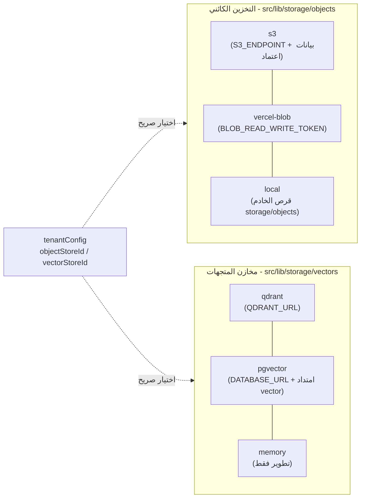
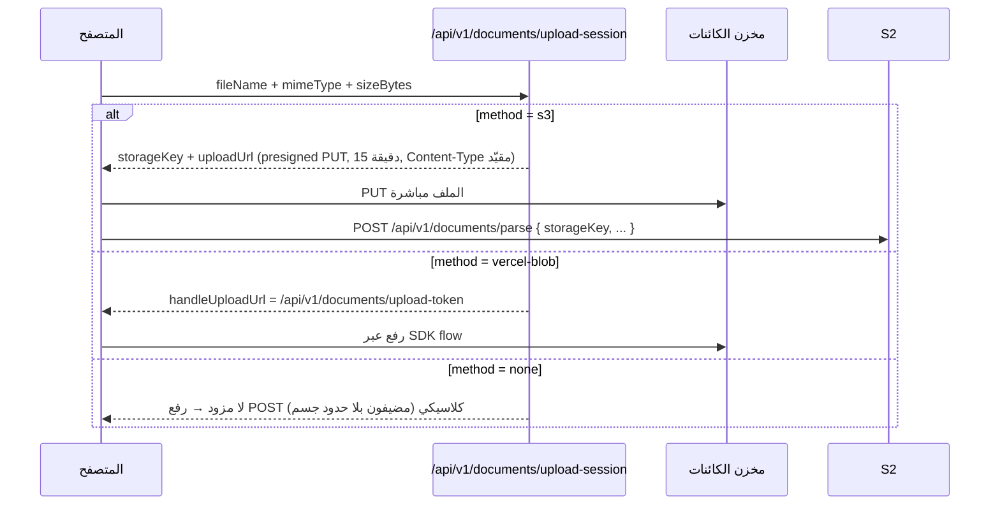
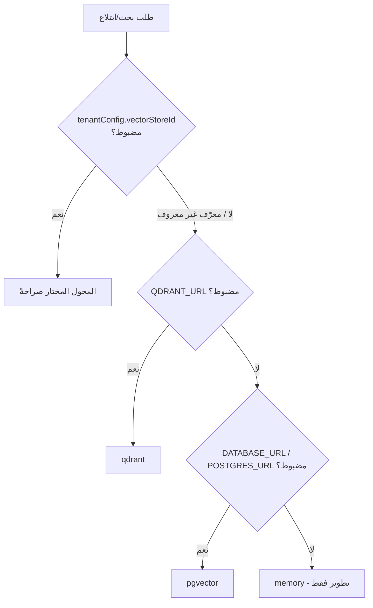

# طبقات التخزين (Storage Adapters)

> يوثّق هذا الملف طبقات التخزين الثلاث في OmniRAG v0.12.5: التخزين الكائني للملفات، مخازن المتجهات، وكاش OCR. كل شيء مستخرج من الكود الفعلي في `src/lib/storage/`.

## نظرة معمارية

تتبع طبقتا الكائنات والمتجهات نمطاً موحداً: **adapters + registry** — كل backend ينفّذ واجهة (`IObjectStore` أو `IVectorStore`)، والـ registry يحلّ اختيار المستأجر (صريحاً من `tenantConfig` أو سلسلة الافتراضيات)، مع كاش اختيار لكل مستأجر مدته 60 ثانية (حد أقصى 256 مدخلاً) وتُبطل عند حفظ إعدادات التخزين.

---

## (أ) التخزين الكائني للملفات — `src/lib/storage/objects/`

مكان حفظ الملفات الأصلية والمصنوعات المولّدة (تقارير، صور، ملفات Office). المفاتيح (keys) مسارات معتمة بنطاق مستأجر: `uploads/{tenantId}/{uuid}-{name}` — تُبنى عبر `buildTenantObjectKey()` في `src/lib/uploads/directUpload.ts` (اسم الملف يُنظّف ويُقص إلى 120 حرفاً ويُسبق بـ UUID). المتاجر يجب أن تعامل المفاتيح كمعتمة ولا تسمح بتجاوز الجذر (path traversal).

### المحولات الثلاثة

| المحول                  | المعرّف       | متى يُستخدم                         | المتطلب                                                                   | ملاحظات                                                                                                                         |
| ----------------------- | ------------- | ----------------------------------- | ------------------------------------------------------------------------- | ------------------------------------------------------------------------------------------------------------------------------- |
| `s3ObjectStore`         | `s3`          | أي نشر بغض النظر عن المضيف          | `S3_ENDPOINT` + `S3_BUCKET` + `S3_ACCESS_KEY_ID` + `S3_SECRET_ACCESS_KEY` | أي مخزن متوافق مع S3 (AWS، Cloudflare R2، MinIO، Supabase، Tigris) — توقيع SigV4 بلا AWS SDK (خالص `node:crypto`)               |
| `vercelBlobObjectStore` | `vercel-blob` | نشر Vercel                          | `BLOB_READ_WRITE_TOKEN`                                                   | SDK `@vercel/blob` يُحمَّل lazily فلا تدفع غير-Vercel تكلفته. الكائنات `access: 'public'` — العزل عبر عدم قابلية تخمين المفاتيح |
| `localFsObjectStore`    | `local`       | النشر الذاتي عبر Docker (الافتراضي) | قرص دائم                                                                  | يكتب تحت `{cwd}/storage/objects/{key}`؛ يبلّغ عن نفسه **غير مهيأ على Vercel** (نظام ملفات فاني)                                 |

### ترتيب الحل (Resolution Order)

`getObjectStore()` / `getObjectStoreSelection()` في `src/lib/storage/objects/registry.ts`:

1. **اختيار صريح**: `tenantConfig.objectStoreId` إذا كان معرّفاً وصالحاً (وإلا تحذير والعودة للافتراضي).
2. **S3 المتوافق** إذا كان مهيأً.
3. **Vercel Blob** إذا وُجد `BLOB_READ_WRITE_TOKEN`.
4. **الملف المحلي** (افتراضي النشر الذاتي).

أي فشل في قراءة إعدادات المستأجر يتراجع بهدوء إلى افتراضي النشر (لا يُلقى استثناء في مسار الطلب).

### الرفع المباشر من المتصفح (Direct Upload) للملفات الكبيرة

الملف: `src/lib/uploads/directUpload.ts`. **المشكلة**: منصات الاستضافة تقيّد حجم جسم الطلب على الدوال الـ serverless (Vercel: 4.5MB → `FUNCTION_PAYLOAD_TOO_LARGE`)؛ ملف PDF بحجم 14MB لن يصل أبداً عبر POST عادي.

**الحل**: يتفاوض المتصفح مع الخادم **قبل** إرسال أي بايتات، ثم يرفع الملف مباشرة إلى التخزين ويسلّم الخادم مرجعاً صغيراً:

| النقطة                | القيمة                                                                                                          |
| --------------------- | --------------------------------------------------------------------------------------------------------------- |
| عتبة القرار في العميل | `DIRECT_UPLOAD_THRESHOLD = 3.5 * 1024 * 1024` (3.5MB) — في `src/components/sources/DocumentIngestionStudio.tsx` |
| الحد الأقصى           | `DIRECT_UPLOAD_MAX_BYTES = 50MB` (ي mirrors سقف مسار parse)                                                     |
| نقطة التفاوض          | `POST /api/v1/documents/upload-session`                                                                         |
| صلاحية presigned PUT  | 15 دقيقة (`PUT_EXPIRY_SECONDS`)                                                                                 |
| قائمة الامتدادات      | `UPLOAD_ALLOWED_EXTENSIONS` — قائمة سماح (~40 امتداداً: مستندات، كود، صور، صوت، فيديو)                          |

**تدفق الرفع:**

**نموذج الأمان**: المفاتيح بنطاق `uploads/{tenantId}/…`؛ الـ presigned URLs تُصدر فقط لسابقة المستأجر نفسه؛ PUTs تُقيَّد بـ Content-Type محدد وتنتهي بدقائق؛ مسار parse يعيد التحقق من سابقة المستأجر وحجم البايتات قبل أي معالجة (`isTenantObjectKey` يرفض `..` والمفاتيح المطلقة). توقيع SigV4 بـ `UNSIGNED-PAYLOAD` مطبّق يدوياً — يعمل مع أي مخزن S3 متوافق وعلى أي مضيف.

### قراءة الملفات — `GET /api/v1/files/[...key]`

الملف: `src/app/api/v1/files/[...key]/route.ts`.

- المصادقة إلزامية (جلسة كوكي أو Bearer API key) عبر `withAuthAndRateLimit` (limit: 120 طلب/دقيقة) + `guardPermission(authCtx, 'documents:read')`.
- يجب أن ينتمي المفتاح للمستأجر المصادَق: `isArtifactKeyForTenant` (مصنوعات `generated/`) أو `isTenantObjectKey` (رفعات `uploads/`) — **لا يمكن قراءة كائنات مستأجر آخر حتى بمفتاح مخمَّن**.
- يقرأ من مخزن المستأجر المُحلّول (`getObjectStoreForTenant`) ويعيد الملف مع `Content-Type` مستنتج من الامتداد؛ الصور (png/jpg/jpeg/webp/gif/svg) تُعرض `inline` والبقية `attachment` باسم ملف منزوع الـ UUID. الترويسة `Cache-Control: private, max-age=3600`.

---

## (ب) مخازن المتجهات — `src/lib/storage/vectors/`

الواجهة `IVectorStore` (في `src/lib/storage/vectors/types.ts`) تحدد: `isConfigured()`, `ensureCollection(dimension, metric?)`, `upsertPoints(points)`, `search(params)`, `deleteByDocument()`, `deletePoint()`, `updateDocumentPayload()`.

### المحولات الثلاثة

| المحول              | المعرّف    | متى يُختار                                                                                      | المتطلب                                         | الميزة الأساسية                                                                   |
| ------------------- | ---------- | ----------------------------------------------------------------------------------------------- | ----------------------------------------------- | --------------------------------------------------------------------------------- |
| `qdrantVectorStore` | `qdrant`   | الافتراضي المؤسسي عند توفر `QDRANT_URL` (الافتراضي التاريخي)                                    | `QDRANT_URL` (+ `QDRANT_API_KEY` اختيارياً)     | قاعدة متجهات مستقلة عالية الأداء، فلترة payload أصلية، فهارس payload، upsert دفعي |
| `pgvectorStore`     | `pgvector` | بحث متجهي داخل Postgres القائم — الأفراد والمنشآت الصغيرة؛ النشر ذات حركة ANN عالية يفضل Qdrant | `DATABASE_URL`/`POSTGRES_URL` + امتداد `vector` | بلا بنية إضافية؛ يشفّف الانهيار بصدق (honest degradation)                         |
| `memoryVectorStore` | `memory`   | التطوير والاختبارات فقط — **ليس للإنتاج**                                                       | متوفر دائماً                                    | cosine similarity عنوة (brute-force) على `Map`؛ المتجهات تموت بانتهاء العملية     |

### ترتيب الحل — `src/lib/storage/vectors/registry.ts`

1. `tenantConfig.vectorStoreId` إذا اختار المستأجر صراحةً.
2. **Qdrant** إذا كان `QDRANT_URL` مضبوطاً (الافتراضي التاريخي).
3. **pgvector** إذا كان Postgres مضبوطاً (يعيد استخدام البنية القائمة).
4. **In-memory** (تطوير فقط).

ملاحظة سلوكية مهمة من التعليقات: الـ memory backend **write-only** ما لم يختره المستأجر صراحةً — النشر بلا أي تهيئة يتخطى البحث الدلالي كما كان قبل التجريد. أي فشل في قراءة إعدادات المستأجر يتراجع لافتراضي النشر بلا استثناء.

### Qdrant — `src/lib/storage/qdrant.ts` + `vectors/adapters/qdrant.ts`

- مجموعة واحدة ثابتة: `COLLECTION_NAME = 'omnirag_chunks'`، متجهات **3072 بُعداً** بمسافة **Cosine** (المنصة توحّد كل الـ embeddings إلى 3072 عبر `embedding.ts` — `normalizeToPlatformDim`).
- تُنشأ عند أول استخدام (`ensureQdrantCollection`) مع **فهارس payload** على `tenantId` و`documentId` و`collectionIds` (keyword).
- معرّفات النقاط حتمية مشتقة بـ SHA-1 لمنع تداخل متجهات المستأجرين وإسقاء الحذف.
- كل عمليات البحث/الحذف تُفلتر إلزامياً بـ `tenantId` (+ فلتر `collectionIds` اختياري).

### pgvector — `vectors/adapters/pgvector.ts`

- **جداول ديناميكية حسب البُعد**: pgvector يثبّت البُعد على مستوى العمود، لكل بُعد جدول خاص: `vector_chunks` للبُعد الافتراضي **3072**، وإلا `vector_chunks_d<dim>`. عملياً جدول واحد يُستخدم لأن المنصة توحّد الأبعاد.
- `ensureTable()` ينفّذ `CREATE EXTENSION IF NOT EXISTS vector` ثم `CREATE TABLE IF NOT EXISTS` (أعمدة: `id TEXT PK`, `tenant_id`, `document_id`, `document_title`, `content`, `chunk_index`, `page_number`, `language`, `collection_ids JSONB`, `metadata JSONB`, `embedding vector(dim)`, `created_at`) + فهارس btree على `tenant_id` و`document_id`.
- **الشفافية في الانهيار**: إن تعذّر إنشاء الامتداد/الجدول (غير مثبت أو صلاحيات ناقصة) يعلّم المحول نفسه غير متاح — الـ upserts تعيد `false` والبحث يعيد `[]` تماماً كأعطال Qdrant، فتبقى دلالات الفشل موحّدة للمستدعين.
- البحث: `1 - (embedding <=> $1::vector) AS score` بترتيب `<=>` (مسافة cosine) مع فلتر `tenant_id` وفلتر `collection_ids ?|` اختياري، وسقف `limit` عند 1200.
- upsert دفعي متعدد الصفوف في round-trip واحد بـ `ON CONFLICT (id) DO UPDATE`؛ الحذف/تحديث الـ payload يمسح كل الجداول الموفرة (البُعد غير معروف وقت الحذف).
- **خارج drizzle-kit عن قصد** — انظر [migrations.md](migrations.md) لتفصيل استثناء `tablesFilter`.

### In-Memory — `vectors/adapters/memory.ts`

- نقاط في `Map<string, {id, vector, payload}>` مع cosine similarity محسوبة يدوياً وفرز تنازلي وفلتر `scoreThreshold` وفلتر `collectionIds`.
- عزل المستأجرين مطبّق (`payload.tenantId !== params.tenantId` → تخطٍّ).
- `resetMemoryVectorStore()` بوابة هروب للاختبارات.

### كيف يُختار المحول فعلياً

`getVectorStoreSelection(tenantId)` (60 ثانية كاش لكل مستأجر):

---

## (ج) كاش OCR لـ Mistral — `src/lib/cache/mistralOcrCache.ts`

طبقة كاش **من طرف العميل (client-side)** لنتائج OCR المعالجة، هدفها منع نداءات API المكررة وتوفير الـ tokens على المستندات الكبيرة. لا يعيش في Postgres — تخزين متصفحي بالكامل:

| الطبقة                   | التفاصيل                                                                                                                                                                                       |
| ------------------------ | ---------------------------------------------------------------------------------------------------------------------------------------------------------------------------------------------- |
| الذاكرة (`MEMORY_CACHE`) | `Map` داخلي — يُفحص أولاً ويزيد عدّاد `hits`                                                                                                                                                   |
| `localStorage`           | مفتاح واحد `omnirag_mistral_ocr_cache_v1` — حد أقصى **50 مستنداً** (الأقدم cachedAt يُحذف عند الامتلاء)، مع حدث مخصص `omnirag-ocr-cache-updated` لتحديث واجهة KnowledgeBase حياً               |
| IndexedDB                | قاعدة `omnirag_ocr_db_v1` مخزن `ocr_entries` — للمستندات الكبيرة التي تتجاوز حدود localStorage (واجهات `getIndexedDBEntry` / `saveIndexedDBEntry` / `deleteIndexedDBEntry` / `clearIndexedDB`) |

**بنية المدخل** (`OcrCacheEntry`): `cacheKey` (SHA-256 لمحتوى الملف عبر `generateFileHash` — Web Crypto أولاً، ثم Node crypto، ثم FNV-1a احتياطي)، `fileName`, `fileSize`, `mimeType`, `engineUsed`, `extractedText`, `totalPages`, `chunksProcessed`, `cachedAt`, `hits`, `pages[]`، و`savedTokensEstimate` (تقدير = طول النص ÷ 4).

**الإحصاءات** عبر `getOcrCacheStats()`: عدد المدخلات، إجمالي hits، البايتات والـ tokens الموفَّرة، إجمالي الصفحات، وحجم الكاش بالكيلوبايت. الإدارة: `deleteOcrCacheEntry` و`clearAllOcrCache` يمسحان من الذاكرة وlocalStorage معاً.

---

## انظر أيضاً

- [مرجع المخطط](schema.md) — جداول Postgres العلائقية التي تكمل طبقات التخزين هذه.
- [نظام التهجير](migrations.md) — استثناء جداول `vector_chunks*` ومخطط `pgboss` من drizzle-kit.
- [محرك RAG](../03-rag-engine/pipeline.md) — كيف يُستهلك البحث الدلالي والمعجمي من هذه المخازن أثناء الاسترجاع.
- [README للمشروع](../../README.md) — نظرة عامة على المنصة.
