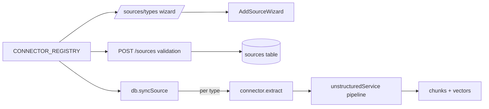

# Knowledge Connectors

مجموعة الموصلات (`src/lib/connectors/**`) تمكّن المستأجرين من استيعاب المحتوى من مصادر خارجية: صفحات ويب، ملفات عامة، RSS/Atom، GitHub، YouTube، قواعد بيانات SQL، Google Drive، Notion، Confluence، Slack، Email، REST API عام. كل موصل هو `ConnectorDescriptor` واحد يحمل (أ) بيانات واجهة المعالج (`fields`، `nameAr/En`، `category`، `iconName`)، (ب) تحقق zod (`configSchema`)، (ج) منطق استخراج حقيقي (`extract`) أو متخصص في وحدة أخرى.



## حالة كل موصل

| Type         | الفئة     | الحالة | extraction          | ملاحظات                                                                                     |
| ------------ | --------- | ------ | ------------------- | ------------------------------------------------------------------------------------------- |
| `file`       | files     | مفعّل  | (متخصص)             | يُعالج في `web-file connector` + مسار الرفع، له pipeline مفصّل (PDF/PPTX/DOCX/audio/video). |
| `url`        | web       | مفعّل  | `liveConnectors.ts` | `safeFetchText` + `htmlToText`، حرس SSRF.                                                   |
| `rss`        | web       | مفعّل  | `liveConnectors.ts` | RSS 2.0 + Atom، `parseRssOrAtomFeed` (max 30).                                              |
| `web_file`   | files     | مفعّل  | `liveConnectors.ts` | تنزيل ملف عام → `processFileBuffer` (Mistral/Unstructured/auto).                            |
| `github`     | code      | مفعّل  | `liveConnectors.ts` | `api.github.com/repos/{owner}/{repo}` + README raw.                                         |
| `youtube`    | media     | مفعّل  | (متخصص)             | سُلَّم transcript عبر `processYoutubeTranscript`.                                           |
| `database`   | databases | قريباً | schema/placeholder  | يتطلب DB driver؛ تسجيل الواجهة فقط.                                                         |
| `gdrive`     | cloud     | قريباً | schema/placeholder  | يتطلب Service Account JWT.                                                                  |
| `notion`     | apps      | قريباً | schema/placeholder  | يتطلب integration token.                                                                    |
| `confluence` | apps      | قريباً | schema/placeholder  | يتطلب PAT.                                                                                  |
| `slack`      | workplace | قريباً | schema/placeholder  | مفعّل في واجهة MCP (preset).                                                                |
| `email`      | workplace | قريباً | schema/placeholder  | imapflow + nodemailer.                                                                      |
| `api`        | api       | قريباً | schema/placeholder  | HTTP request مرن.                                                                           |

> **قاعدة الشرف (honesty contract)**: الموصلون `liveSync=true` فقط (`url, rss, github, web_file, youtube, file`) يستخرجون محتوى حقيقياً الآن؛ البقية يفشلون بصراحة في `syncSource` بدلاً من فهرسة placeholders.

## العقد الموحد

```ts
interface ConnectorDescriptor {
  type: SourceType;
  nameAr: string;
  nameEn: string;
  descriptionAr: string;
  descriptionEn: string;
  category: 'files' | 'web' | 'workplace' | 'cloud' | 'databases';
  iconName: string;
  defaultSchedule: string;
  supportsSchedule: boolean;
  fields: ConnectorFieldDescriptor[];
  configSchema: z.ZodType<Record<string, unknown>>;
  testConnection?: (config) => Promise<ConnectorTestResult>;
  extract?: (config) => Promise<ConnectorExtraction>;
}
```

- `validateConnectorConfig(type, config)` (في `registry.ts`):
  - يطبّق `applyFieldDefaults` (يملأ defaults للحقول الاختيارية).
  - يفحص بـ zod → `{ ok: true, config }` أو `{ ok: false, errors }`.
  - مفاتيح غير معروفة تمر كما هي (توافق retro-compat).

## الحرس SSRF

كل المنفذات الحية تستخدم `src/lib/mcp/net.ts`:

- `assertPublicHttpUrl(url)` — scheme allow-list + IP literal pattern + DNS resolution (يُرفض كل عنوان خاص/loopback/link-local/ULA).
- `safeFetchText(url, { timeoutMs, maxBytes })` — `safeFetchBinary` للملفات.
- `htmlToText(html)` — تنظيف HTML.
- `safeFetchBinary` يقبل `timeoutMs`, `maxBytes`, `contentTypeAllowList?`.

## الموصلات الحية (تنفّذ في `liveConnectors.ts`)

```ts
parseRssOrAtomFeed(xmlBody, maxEntries=30): FeedEntry[]
fetchUrlConnector(config)   // → { title, content, sourceUrl, itemsProcessed }
fetchRssConnector(config)
fetchGithubConnector(config)
fetchWebFileConnector(config)
```

### `url`

```json
{ "url": "https://example.com/article" }
```

- يجلب الصفحة، يستخرج العنوان من `<title>`، يحول HTML إلى نص.
- يتعامل مع 4xx/5xx عبر استثناء قابل للقراءة.

### `rss`

```json
{ "feedUrl": "https://example.com/feed.xml", "maxEntries": 20 }
```

- 30 مدخل كحد أعلى افتراضي.
- يحول `<content:encoded>`/`<description>`/`<summary>`/`<content>` (HTML) إلى نص.

### `github`

```json
{ "repoUrl": "https://github.com/acme/repo", "branch": "main", "patToken": "" }
```

- يجلب metadata عبر `api.github.com/repos/...`.
- يستبدل HEAD refs بالـ branch.
- يُحمّل README من raw (`raw.githubusercontent.com/.../{branch}/README.md`).
- PAT اختياري للمستودعات الخاصة أو رفع حد المعدل.

### `web_file`

```json
{ "fileUrl": "https://example.com/report.pdf", "engine": "auto|mistral|unstructured|local", "fileName": "" }
```

- `safeFetchBinary` → `processFileBuffer(bytes, fileName, mime, { preferredEngine })`.
- يستخدم نفس محركات استوديو الرفع.

## إدارة دورة حياة المصادر

### إنشاء

`POST /api/v1/sources`:

1. `validateConnectorConfig(type, config)` → 400 `CONNECTOR_CONFIG_INVALID` عند الفشل.
2. `encryptSourceConfig(normalizedConfig)` → تخزين آمن للحقول المعلّمة `secret:true`.
3. `db.addSource(source)` (status=`healthy`, `configEncrypted: true`).
4. `after(() => db.syncSource(id, tenantId))` → المزامنة الأولية في الخلفية.

### تعديل

`PUT /api/v1/sources/:id`:

- يستخدم `mergeAndEncryptSourceConfig` لدمج الحقول الجديدة مع القديمة (placeholders `••` → "احتفظ").

### حذف

`DELETE /api/v1/sources/:id?purgeDocs=true`:

- يحذف المصدر والوثائق المرتبطة (افتراضياً)، سجلات المزامنة تبقى.

## الأمان المرتبط

- جميع طلبات الإدارة تمر عبر `withAuthAndRateLimit` + `guardPermission(authCtx, 'sources:write' | 'sources:delete')`.
- حقول `secret: true` في `fields` تُشفّر قبل التخزين ولا تُسرّب في أي استجابة GET (تُطبَّق `redactSourceConfig`).
- المزامنة اللاحقة تستخدم `decryptToken` لإجراء المصادقة على المصدر البعيد.
- نقل `stdio` للأدوات (مختلف عن الموصلات) مرفوض على Vercel (راجع [mcp integration](mcp.md)).

## اختبارات

- `src/__tests__/connectorRegistry.test.ts` — `validateConnectorConfig` لـ URL/RSS/GitHub.
- `src/__tests__/liveConnectors.test.ts` — تنفيذ حقيقي على feeds/repos عامة.
- `src/__tests__/webFileConnector.test.ts` — تنزيل + استخراج لملف عام.
- `src/__tests__/webFetchStudio.test.ts` — SSRF guard.

## انظر أيضاً

- [sources API](../04-api/sources.md) — CRUD + sync + types.
- [extraction engines](extraction-engines.md) — المحركات وراء file/url/...
- [mcp integration](mcp.md) — تكاملات الوقت الحقيقي (Slack/GitHub/Web search) عبر MCP.
- [retrieval](../03-rag-engine/retrieval.md) — كيف تُستخدم المقاطع المستوعبة في البحث.
