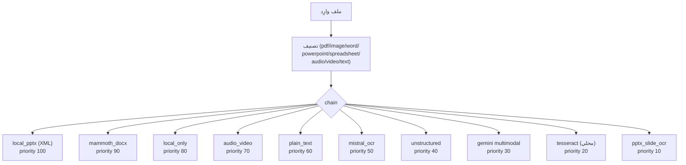

# محركات استخلاص المحتوى

طبقة الاستخلاص (`src/lib/services/extraction/`) تستقبل ملفاً ثنائياً وتنتج نصاً منظَّماً. التصميم يفصل بين:

- **الأنواع (Types)** في `types.ts`: تعريف `ExtractionContext` و`IExtractionEngine`.
- **المحركات (Engines)** في `engines.ts`: كل محرّك يغلّف أداة استخراج قائمة (Mistral، Unstructured، Tesseract…).
- **السجل (Registry)** في `registry.ts`: يرتّب المحركات حسب الأولوية ويُشغّل السلسلة.
- **قوالب المسار (Pipeline Templates)** في `pipelineTemplates.ts`: ثلاث وصفات (fast / balanced / accurate) للمستأجرين.

## سلسلة الاستخلاص

السلسلة تُشغَّل في `runExtractionChain` (السجل): لكل محرك `canHandle(ctx)` ثم `extract(ctx)`؛ إن أعاد `null` يُسلِّم للمحرك التالي، وإلا يطالب بالملف (terminal). لا يُسمح لأي محرّك باختلاق نص.

| المحرك           | الفئة              | سحابي؟ | يحلّ                                          |
| ---------------- | ------------------ | ------ | --------------------------------------------- |
| `local_pptx`     | PowerPoint         | لا     | PPTX نصّي سريع (`pptxParser.ts`)              |
| `mammoth_docx`   | Word               | لا     | DOCX بدون mojibake للعربية                    |
| `local_only`     | pdf/image/text     | لا     | وضع “محلي فقط” — terminal                     |
| `audio_video`    | audio/video        | نعم    | Groq Whisper → Voxtral → Gemini               |
| `plain_text`     | text               | لا     | UTF-8 مباشر                                   |
| `mistral_ocr`    | pdf/image          | نعم    | Mistral Document AI OCR                       |
| `unstructured`   | pdf/word/pptx/xlsx | نعم    | Unstructured Partition (hi_res/fast/ocr_only) |
| `gemini`         | الكل               | نعم    | Multimodal fallback حسب الفئة                 |
| `tesseract`      | image              | لا     | OCR محلي WASM                                 |
| `pptx_slide_ocr` | PowerPoint         | لا     | استخلاص صور الشرائح + Tesseract               |

> **تنبيه على الترتيب:** التقييم حسب `priority` تنازلياً وليس حسب ترتيب الكتابة في الملف. الأرقام أعلاه حقيقية من `engines.ts`.

## Mistral Document AI

`src/lib/services/unstructuredService.ts` يصدّر `mistralOcr`، يُستدعى من المحرك `mistral_ocr`. يقبل PDF/صور ويعيد Markdown يحافظ على التخطيط والجداول والمعادلات. يُستخدم أيضاً عبر أداة MCP `mistral_document_ai_parse` بشكل مباشر.

- المفتاح: `MISTRAL_API_KEY` (متغيّر بيئة أو مخزن `provider_credentials`).
- غياب المفتاح → `simulated: true` صريح في الأداة، أو `null` من المحرك (تنتقل السلسلة).

## Tesseract.js (محلي)

`src/lib/services/localOcr.ts` يستضيف محرّك WASM مع نموذجين `ara+eng`:

- الملفات `ara.traineddata` و`eng.traineddata` متضمَّنان في الجذر.
- **Singleton worker** يُحمَّل مرة واحدة (boot مكلف) ومُخزَّن في `workerPromise`.
- **استخلاص صور PDF:** `extractImagesFromPdf` يستخدم `pdf-lib` لسحب `Image XObject`s (DCTDecode/FlateDecode)، يتخطى الأقنعة والـ CMYK، يبني PNG داخل الذاكرة، ثم يُمرّر لكل صورة إلى Tesseract.
- **PDF نصّي بلا صور:** يُعاد `''`، يسقط على المحرك التالي.
- **حدّ أقصى:** `maxImages = 200` افتراضياً.
- **الاستخدام:** OCR احتياطي لملفات الصور الـ standalone وفي شرائح PPTX المصدَّرة كأشكال.

## `pdf-parse`

`pdf-parse` (v2.4.5) يُستخدم في `src/lib/pdf/pdfChunker.ts` لمحاولة استخراج النص الأصلي من PDF قبل اللجوء إلى OCR. يُستخدم داخل مسار `processPdfWithBatchedPipeline` مع `preferredEngine: 'local'` لمحرك `local_only`. PDFs بلا طبقة نصية (ممسوحة ضوئياً) تُسلَّم لـ Tesseract المحلي.

## Unstructured (الجيلان القديم والجديد)

- **التكامل:** `unstructuredPartition` في `unstructuredService.ts` يستدعي نقطة النهاية الرسمية لـ Unstructured.io.
- **الاستراتيجيات:** `hi_res` (افتراضي)، `fast`، `ocr_only`.
- **المفتاح:** `UNSTRUCTURED_API_KEY`.
- **المحرك `unstructured`:** يعمل على PDF/Word/PPTX/XLSX، ويعود `null` عند الفشل ليسلّم لـ Gemini.
- **الجيل القديم (legacy):** الإصدارات السابقة استدعت واجهة `general/v0/general`؛ `unstructuredService.ts` الحالي يعتمد واجهة `/partition` الموحَّدة. أي ترقية لازمها تحديث `partition` handlers.

## خط أنابيب القوالب (Pipeline Templates)

`src/lib/services/extraction/pipelineTemplates.ts` يوفّر ثلاث وصفات يختارها المستأجر مرة واحدة:

| المعرّف              | الاسم  | المحرك المفضّل | حجم القطعة | التداخل |
| -------------------- | ------ | -------------- | ---------- | ------- |
| `fast`               | سريع   | `mistral`      | 800        | 40      |
| `balanced` (افتراضي) | متوازن | `auto`         | 500        | 50      |
| `accurate`           | دقيق   | `unstructured` | 300        | 60      |

الدالة `resolveTenantPipeline(tenantId)` تجلب القالب الفعّال وتطبّق القيم ما لم يمرّر المتّصل overrides. **التدهور صادق:** إن كان المحرك المفضّل بلا مفتاح، تنزل السلسلة للمحرك التالي بدلاً من فشل الرفع.

## كاش OCR

`src/lib/cache/mistralOcrCache.ts` كاش من طبقتين لتقليل تكرار طلبات Mistral:

| الطبقة                          | السعة                  | المفتاح              |
| ------------------------------- | ---------------------- | -------------------- |
| `MEMORY_CACHE` (Map)            | غير محدود (in-process) | SHA-256 لمحتوى الملف |
| `localStorage` (متصفح)          | 50 إدخال max           | نفس الـ hash         |
| IndexedDB (`omnirag_ocr_db_v1`) | للمستندات الكبيرة      | نفس الـ hash         |

`generateFileHash` يستخدم `crypto.subtle.digest('SHA-256')` ويستعمل بديل FNV-1a إن تعذّر. الحقول المحفوظة تشمل `engineUsed`, `totalPages`, `chunksProcessed`, `savedTokensEstimate`. الأحداث `omnirag-ocr-cache-updated` تُبَثّ في الـ UI ليُحدِّث المكون فوراً.

> ملاحظة: طبقة الكاش مربوطة بواجهة Mistral UI. داخل `dispatchFile` لا يُستخدم الكاش — كل استدعاء Mistral في السلسلة مباشر؛ الكاش لتجنّب إعادة الطلب في نفس جلسة المتصفح.

## سياسة الصدق في الاستخلاص

كل محرّك في السلسلة يلتزم:

1. **عدم الاختلاق:** `null` أو `success:false` عند الفشل، لا نص مُفبرك.
2. **ختم المحرك:** كل نتيجة تحمل `engineUsed` بنص بشري (مثلاً `Local Tesseract OCR (offline ⚡)`، `Mistral Document AI OCR`) ليعرف المستخدم ما اشتغل فعلاً.
3. **التدهور المنظَّم:** من المحلي → السحابي → multimodal fallback → Tesseract → فشل صريح.

## انظر أيضاً

- [MCP](mcp.md) — أدوات `unstructured_parse_document`, `mistral_document_ai_parse`, `knowledge_ingest_document`.
- [الموصلات](connectors.md) — للموصلات التي تجلب محتوى يحتاج نفس المسار.
- [قاعدة البيانات](../05-database/schema.md) — لمكان تخزين النصوص والقصاصات.
