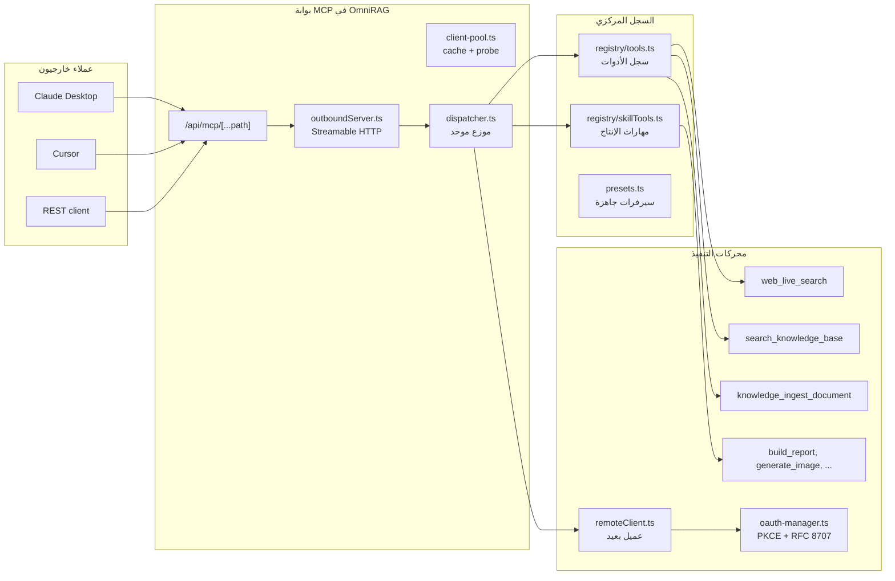

# Model Context Protocol (MCP)

تتعامل OmniRAG مع بروتوكول Model Context Protocol (MCP) كمحرّك موحّد للأدوات والتفاعل مع العملاء الخارجيين (Claude Desktop، Cursor، وغيرها). يوفّر النظام:

1. **سيرفر MCP صادر** يستضيف أدوات المستأجر لاستقبال طلبات JSON-RPC من عملاء MCP عبر `Streamable HTTP` (`/api/mcp/[...path]`).
2. **سيرفر MCP داخلي** (سجل أدوات + موزّع موحّد) ينفّذ الأدوات على المنصة نفسها.
3. **عميل MCP بعيد** يتصل بسيرفرات خارجية حقيقية عبر `@ai-sdk/mcp` مع مصافحة `initialize` كاملة.
4. **أداة `web_live_search`** للبحث الحي في الويب عبر مزوّدين خارجيين.
5. **إدارة كاملة لـ OAuth 2.0 + PKCE** لتوثيق السيرفرات الخارجية.
6. **تشفير AES-256-GCM** لكل الاعتمادات المخزّنة في `provider_credentials` و`mcp_servers.config`.

## نظرة معمارية



## طبقات البروتوكول

| الطبقة                   | الملف                                                                  | المسؤولية                                                                                                      |
| ------------------------ | ---------------------------------------------------------------------- | -------------------------------------------------------------------------------------------------------------- |
| بروتوكول JSON-RPC البسيط | `src/lib/mcp/server-factory.ts`                                        | يتعامل مع `initialize`, `ping`, `tools/list`, `tools/call`, `resources/list`, `resources/read`, `prompts/list` |
| بوابة Streamable HTTP    | `src/lib/mcp/outboundServer.ts` + `src/app/api/mcp/[...path]/route.ts` | بناء سيرفر stateless متوافق مع `@modelcontextprotocol/sdk`                                                     |
| موزّع الأدوات الموحّد    | `src/lib/mcp/dispatcher.ts`                                            | نقطة التنفيذ الوحيدة — فولت آوت، حدود زمن، ختم `simulated`، حفظ سجل `tool_calls`                               |
| تجمع العملاء             | `src/lib/mcp/client-pool.ts`                                           | TTL cache (60 ثانية)، فحوصات ping، توجيه إلى السيرفر المالك                                                    |
| العميل البعيد            | `src/lib/mcp/remoteClient.ts`                                          | يستخدم `@ai-sdk/mcp` لمصافحة حقيقية، ينشئ جلسة ويُغلقها دائماً                                                 |
| حرس الشبكة               | `src/lib/mcp/net.ts`                                                   | SSRF guard: فحص scheme + literal patterns + DNS pinning + إعادة فحص كل redirect حتى 5 hops                     |

## السجل المركزي للأدوات

السجل المركزي في `src/lib/mcp/registry/tools.ts` يدمج كل أدوات الإنتاج من `SKILL_TOOLS` ليصبح المصدر الوحيد للحقيقة الذي يستخدمه:

- حلقة الوكلاء (agentic chat loop) عبر `aiSdkTools.ts` (تولّد `tool()` لـ Vercel AI SDK v7).
- البوابة الصادرة عبر `outboundServer.ts`.
- موزّع الأدوات عبر `dispatcher.ts`.

### الفئات

| الفئة       | أمثلة                                                                                                                                                            |
| ----------- | ---------------------------------------------------------------------------------------------------------------------------------------------------------------- |
| `slack`     | `slack_send_message`, `slack_read_channel`, `slack_post_alert`                                                                                                   |
| `github`    | `github_search_code`, `github_create_issue`, `github_read_repo`                                                                                                  |
| `search`    | `web_live_search`, `fetch_url_content`                                                                                                                           |
| `postgres`  | `external_postgres_query`, `get_table_schema`                                                                                                                    |
| `knowledge` | `search_knowledge_base`, `query_collection`, `knowledge_ingest_document`, `unstructured_parse_document`, `mistral_document_ai_parse`, `youtube_fetch_transcript` |
| `actions`   | `custom_action_execute`, `read_server_resource`                                                                                                                  |
| `skills`    | `create_chart`, `generate_image`, `create_office_document`, `build_report`, `create_tutorial_guide`, `send_email`                                                |

كل أداة تحمل حقول `{ hasSideEffect, requireConfirmation, simulated, timeoutMs, parameters }`. الحقل `simulated` يكشف للمستهلك ما إذا كانت النتيجة سحابة فعلية أو محاكاة شفافة.

### ختم الصدق (simulation honesty)

`applySimulationStamp` في `dispatcher.ts` يضمن أن كل نتيجة تحمل `simulated` صراحةً:

- أدوات السجل: الافتراضي `simulated: true` ما لم يُعلن خلاف ذلك.
- الاستدعاءات البعيدة (`defaultSimulated=false`): تنجح فعلاً، ختم الواقع.

## إدارة السيرفرات

### الإضافة والاختبار

| الإجراء      | المسار                                                  |
| ------------ | ------------------------------------------------------- |
| إضافة سيرفر  | `POST /api/v1/mcp/servers`                              |
| اختبار اتصال | `POST /api/v1/mcp/servers/test` (ينفّذ `probeEndpoint`) |
| فحص دوري     | `MCPClientPool.probeServer` (TTL 60 ثانية)              |

السيرفرات المعرّفة تحمل حقول `transportType ∈ {http, sse, stdio, websocket}`، `authType ∈ {none, oauth2, api_key}`، و`sandboxTier ∈ {T0_READ_ONLY, T1_LIMITED, T2_ELEVATED}`.

### سيرفرات جاهزة (Presets)

`src/lib/mcp/presets.ts` يوفّر كتالوجاً من سبعة سيرفرات معروفة بنقرة واحدة:

| المعرّف                  | الاسم                  | الفئة         | Sandbox      |
| ------------------------ | ---------------------- | ------------- | ------------ |
| `unstructured-transform` | Unstructured Transform | documents     | T2_ELEVATED  |
| `knowledge-core`         | نواة المعرفة OmniRAG   | knowledge     | T1_LIMITED   |
| `web-search`             | البحث الحي في الويب    | search        | T0_READ_ONLY |
| `youtube-intelligence`   | ذكاء يوتيوب            | knowledge     | T0_READ_ONLY |
| `slack`                  | Slack Communications   | communication | T2_ELEVATED  |
| `github`                 | GitHub Enterprise      | development   | T2_ELEVATED  |
| `postgres-analytics`     | PostgreSQL Analytics   | database      | T1_LIMITED   |

### OAuth 2.0 + PKCE

`src/lib/mcp/auth/oauth-manager.ts` يدير تدفق OAuth مع:

- **PKCE S256** (RFC 7636) — verifier عشوائي 64 بايت، challenge SHA-256 base64url.
- **Resource Indicator** (RFC 8707) — إرسال `resource=` لمزوّدين يدعمون التحديد الدقيق.
- **Issuer Validation** (RFC 9207) — مقارنة صارمة للأصل (origin) لا substring؛ يمنع التصيّد مثل `https://slack.com.evil`.
- **خادم الحالة المستمر** — تُحفظ التدفقات في `mcp_servers.config.oauthPendingFlows` بمهلة 15 دقيقة، ما يجعل التدفق يصمد عبر عمليات serverless.
- **مفتاح خارجي** — `state` الخارجي يحمل `<tenantId>:<pkceState>` ليسترد الـ callback المستأجر الصحيح بدون تعداد.
- **تبادل رمز حقيقي** — إن وُجد `tokenEndpoint` و`clientId`، يُنفّذ `POST` HTTP RFC 6749 §4.1.3 مع `code_verifier`.
- **محاكاة شفّافة** — عند غياب البيانات، يُولَّد `mcp-sim-token-<uuid>` موسوم صراحة، ولا يُسجَّل في `audit_logs` كحدث حقيقي.

### تشفير الاعتمادات

`src/lib/mcp/auth/encryption.ts` يستخدم AES-256-GCM:

- صيغة الإخراج: `iv:authTag:ciphertext` (hex).
- مفتاح الإنتاج مشتق من `MCP_OAUTH_ENCRYPTION_KEY` عبر `scryptSync` بـ salt ثابتة.
- **الإنتاج يرفض مفتاح التطوير العام** — `throw` بدلاً من التشفير بمفتاح مكشوف في الكود.
- `decryptToken` يتحقّق من `authTag` ويرمي عند العبث.

## أداة `web_live_search`

`web_live_search` في `src/lib/mcp/registry/tools.ts` تستخدم `resolveSearchProvider()` لتحديد المزوّد حسب أولوية:

```ts
if (getEnv('TAVILY_API_KEY')) return tavilySearch;
if (getEnv('SERPER_API_KEY')) return serperSearch;
if (getEnv('BRAVE_API_KEY')) return braveSearch;
return null; // بحث صريح المرتجع: simulated
```

| المزوّد | المتغير          | نقطة النهاية                                     |
| ------- | ---------------- | ------------------------------------------------ |
| Tavily  | `TAVILY_API_KEY` | `https://api.tavily.com/search`                  |
| Serper  | `SERPER_API_KEY` | `https://google.serper.dev/search`               |
| Brave   | `BRAVE_API_KEY`  | `https://api.search.brave.com/res/v1/web/search` |

بدون أي مفتاح، يُعاد `{ success:false, simulated:true, reason:"..." }` صريح بدلاً من نتائج مفبركة. جلب محتوى الصفحات يتم عبر `fetch_url_content` التي تستخدم `safeFetchText` (SSRF-guarded).

## البوابة `/api/mcp/[...path]`

`src/app/api/mcp/[...path]/route.ts` يستجيب لكل من `POST` و`GET` و`DELETE`:

- يغلّف `handleOutboundMcpRequest` من `outboundServer.ts` عبر `withAuthAndRateLimit`.
- يبني `Server` بـ `name='OmniRAG-MCP-Gateway'` و`version='3.0.0'`.
- يستخدم `WebStandardStreamableHTTPServerTransport` بـ `sessionIdGenerator: undefined` (stateless) و`enableJsonResponse: true` (متوافق مع بيئات serverless).
- يدعم whitelist لكل API key عبر `authCtx.apiKeyMcpTools`؛ كل من `tools/list` و`tools/call` يخضع للتقييد.
- قبل الاتصال بـ transport، يستدعي `hydrateToolRuntimeEnv` لتمرير مفاتيح البيئة لكل طلب (Gemini, Unstructured, Mistral, Tavily, Serper, Brave, Qdrant, DB).

## نقطة الدخول الموحّدة

كل استدعاء أداة — من chat loop، البوابة، أو الـ pool — يمر عبر `executeMcpToolCall` في `dispatcher.ts`:

```ts
executeMcpToolCall(toolName, args, { tenantId, userId, conversationId })
  → إذا الأداة في السجل → def.execute(args, ctx) + simulation stamp
  → إذا غير معروفة → dispatchToRemoteServer (SSRF-guarded) عبر @ai-sdk/mcp
  → في كل الأحوال → حفظ tool_call + audit_log عند الفشل
```

كل نتيجة تحمل `source ∈ {'registry','remote-server'}` و`simulated` و`latencyMs` و`isError`.

## جدول نقاط نهاية API المتعلقة بـ MCP

| المسار                               | الوصف                                     |
| ------------------------------------ | ----------------------------------------- |
| `POST/GET/DELETE /api/mcp/[...path]` | البوابة الصادرة لـ Streamable HTTP        |
| `POST /api/v1/mcp/servers`           | إضافة/تحديث سيرفر                         |
| `POST /api/v1/mcp/servers/test`      | اختبار اتصال                              |
| `GET /api/v1/mcp/servers/{id}/tools` | قائمة أدوات السيرفر                       |
| `POST /api/v1/mcp/calls`             | استدعاء مباشر (محمي بـ auth + rate limit) |
| `GET /api/v1/mcp/calls`              | سجل الاستدعاءات (audit)                   |

## انظر أيضاً

- [الموصلات الخارجية](connectors.md) — للموصلات الخاصة بكل مزوّد (Gmail، IMAP، إلخ).
- [المهارات الإنتاجية](skills.md) — لتفاصيل `SKILL_TOOLS` المدمجة في السجل.
- [محركات الاستخلاص](extraction-engines.md) — لمحركات OCR و parsing التي تستهلكها أدوات `knowledge_*`.
- [الأمان](../06-security/protections.md) — لحرس SSRF وحدود المعدل.
- [مرجع API](../04-api/overview.md) — لقائمة REST الكاملة.
