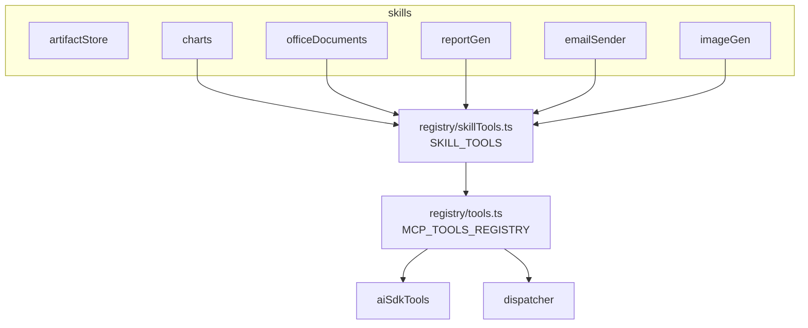

# مهارات الإنتاج (Skills)

> **ملاحظة معمارية:** الكود في `src/lib/skills/` **لا يُسجَّل كمجلد “skills”** في طبقة MCP. بدلاً من ذلك، ملف `src/lib/mcp/registry/skillTools.ts` يُضمّ كل دوال المهارات في `MCP_TOOLS_REGISTRY`، فتظهر وكأنها أدوات MCP عادية، ويستفيد من نفس الـ agentic loop وحارس الموافقة البشرية وحارس التدقيق. لا يوجد مجلد `src/lib/skills/` كمجلد منطقي مستقل في البروتوكول.

تنفّذ OmniRAG ست مهارات إنتاج حقيقية، كل واحدة منها ملف مستقل في `src/lib/skills/`:

| الملف                | المهارة                                  | أداة MCP المكافئة                       |
| -------------------- | ---------------------------------------- | --------------------------------------- |
| `artifactStore.ts`   | تخزين المرفقات المولّدة في مخزن الكائنات | (داخلي — يُستخدم من بقية المهارات)      |
| `charts.ts`          | مخططات ECharts تفاعلية                   | `create_chart`                          |
| `officeDocuments.ts` | بناء DOCX/XLSX/PPTX/PDF/MD               | `create_office_document`                |
| `reportGen.ts`       | تقارير وأدلة تعليمية                     | `build_report`, `create_tutorial_guide` |
| `emailSender.ts`     | إرسال بريد حقيقي                         | `send_email`                            |
| `imageGen.ts`        | توليد صور AI                             | `generate_image`                        |



## كيف تُستدعى المهارات

كل مهارة متاحة كأداة MCP:

1. **عبر حلقة الوكلاء (chat agentic loop):** `buildTenantMcpTools` في `src/lib/mcp/aiSdkTools.ts` يولّد AI SDK `tool()` من السجل.
2. **عبر gateway الصادر:** `outboundServer.ts` يسرد الأدوات نفسها ويستدعيها عبر `executeMcpToolCall`.
3. **عبر call مباشر:** `POST /api/v1/mcp/calls`.

## `create_chart`

- **الموقع:** `src/lib/skills/charts.ts`
- **المحرّك:** [ECharts](https://echarts.apache.org/) (lazy-loaded في الواجهة).
- **الأنواع المدعومة:** `line`, `bar`, `pie`, `scatter`, `area`, `horizontal_bar`.
- **التحقق:** `normalizeChartSpec` يرفض المدخلات السيئة ويقص إلى حدود آمنة (`MAX_LABELS=200`, `MAX_SERIES=10`).
- **الأمان:** `toEChartsOption` يصدر **مفاتيح مسموحة فقط** بدون callbacks أو raw JS.
- **العرض في الواجهة:** المخطط يُسلسل في كتلة ماركداون ```chart fence، تُحلَّل في الواجهة وتُعاد صياغتها إلى `setOption()`. مصدر حقيقة واحد للتصيير.

````ts
// مخرج الأداة
{
  success: true, simulated: false,
  chartType: 'bar',
  markdownFence: '```chart\n{"title":"...","chartType":"bar",...}\n```',
  renderInstruction: 'اعرض المخطط...'
}
````

## `create_office_document`

- **الموقع:** `src/lib/skills/officeDocuments.ts`
- **الصيغ:** `docx`, `xlsx`, `pptx`, `pdf`, `md`.
- **محركات التحميل الكسول:**

| الصيغة  | المكتبة                                         |
| ------- | ----------------------------------------------- |
| `.docx` | `docx` (Paragraph, HeadingLevel, Table, …)      |
| `.xlsx` | `exceljs` (Workbook + auto-width)               |
| `.pptx` | `pptxgenjs` (مع `rtlMode: true` للنصوص العربية) |
| `.pdf`  | `jspdf`                                         |
| `.md`   | ناتج نصّي مباشر                                 |

- **قاعدة الصدق للنصوص العربية:** `jspdf` لا يدعم تشكيل الحروف العربية، لذا `buildPdf` يرفع `throw` بنصائح عربية إن احتوى المحتوى على أحرف عربية. التوجيه: استخدم `docx` للعربية.
- **التخزين:** كل ملف يُحفَظ في مخزن كائنات المستأجر تحت `generated/{tenantId}/{uuid}-{safeName}` ويُخدَم عبر `/api/v1/files/{key}`.
- **تحقق Markdown:** `parseMarkdownBlocks` يحلّ العناوين (`#`, `##`, `###`)، القوائم النقطية، والقوائم المرقّمة؛ `parseMarkdownTable` يستخرج أول جدول Markdown لتغذية XLSX.

## `build_report` و `create_tutorial_guide`

- **الموقع:** `src/lib/skills/reportGen.ts`
- **النوع:** `ReportKind ∈ {'report','tutorial'}`.
- **التدفق:** `generateTextResilient` (سلسلة AI SDK المرنة) ينتج Markdown منظّماً → `buildOfficeDocument` يحوّله إلى `md/docx/pdf` → `storeSkillArtifact` يخزّنه.
- **المتطلبات:** `topic` (مطلوب)، `outline` (اختياري مفصول بفواصل)، `context` (اختياري، يُحشر في الموجِّه)، `format` (md/docx/pdf)، `language` (ar/en).
- **عند فشل كل النماذج:** يُعاد `{ success:false, simulated:false, error:'تعذر توليد المحتوى…' }` صريح، لا محتوى مفبرك.
- **عند فشل التحميل فقط:** يُعاد `markdown` ناجح + `error` للملف، حتى لا يضيع العمل.

## `generate_image`

- **الموقع:** `src/lib/skills/imageGen.ts`
- **المزودون:** أول مزوود له قدرة `image` ومُهيأ في سجل المزودين (افتراضياً `google/imagen-4.0-generate-001` أو `openai/dall-e-3`).
- **البارامترات:** `prompt` (مطلوب)، `modelRef` (مثل `openai/dall-e-3`)، `size` (`WxH`)، `aspectRatio` (`W:H`).
- **الحفظ:** الصورة ثنائية البايتات تُحفَظ في مخزن الكائنات ثم يُعاد `artifact.url` صالح عبر `/api/v1/files/{key}`.
- **التدهور الشفّاف:** عند غياب أي مزوود، يُعاد `availableProviders` مع تعليمات إعداد صريحة بدلاً من توليد زائف.

## `send_email`

- **الموقع:** `src/lib/skills/emailSender.ts`
- **المزودون بالترتيب:** Resend (`RESEND_API_KEY`) ثم SMTP (`SMTP_HOST` + الإعدادات).
- **الحماية:** يتطلّب موافقة بشرية (`requireConfirmation: true`) قبل التنفيذ.
- **الحدود:** `MAX_RECIPIENTS=10`, `MAX_BODY_CHARS=50000`.
- **التحقق:** `EMAIL_PATTERN` لازم لكل من `to`/`cc`.
- **بدون مزوود:** يُعاد `{ success:false, simulated:false, error:'...' }` صريح. **لا** يرسل بريداً تجريبياً مفبركاً.

## تخزين المرفقات

`src/lib/skills/artifactStore.ts` يبني مفتاحاً `generated/{tenantId}/{uuid}-{name}` مع تعقيم الاسم وفحص المسار (`isArtifactKeyForTenant`) لرفض أي محاولة وصول من مستأجر آخر. يُستخدم من جميع المهارات ويُخدّم عبر `/api/v1/files/{key}`.

## الجدول المرجعي للمهارات

| اسم الأداة               | لها أثر جانبي؟ | تتطلب موافقة؟ | المهلة (ms) | المحرك الفعلي                            |
| ------------------------ | -------------- | ------------- | ----------- | ---------------------------------------- |
| `create_chart`           | لا             | لا            | 15,000      | ECharts (render)                         |
| `generate_image`         | لا             | لا            | 120,000     | AI SDK `generateImage`                   |
| `create_office_document` | لا             | لا            | 60,000      | docx / exceljs / pptxgenjs / jspdf       |
| `build_report`           | لا             | لا            | 180,000     | `generateTextResilient` + Office builder |
| `create_tutorial_guide`  | لا             | لا            | 180,000     | نفس بنية `build_report`                  |
| `send_email`             | نعم            | نعم           | 30,000      | Resend / SMTP                            |

## انظر أيضاً

- [MCP](mcp.md) — السياق الكامل لسجل الأدوات وآليات البوابة.
- [الموصلات الخارجية](connectors.md) — للموصلات الخاصة بكل مزوّد بيانات.
- [الأمان](../06-security/protections.md) — لقواعد حقن المخرجات وتعقيم SVG.
