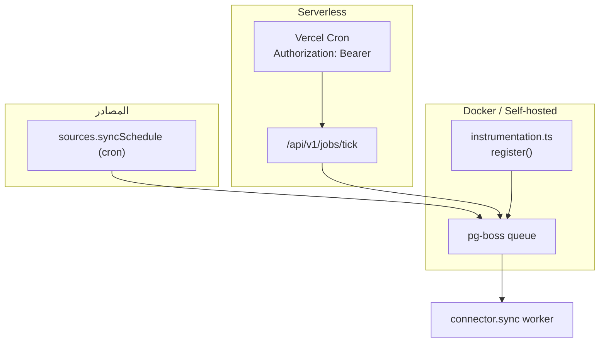

# المهام الخلفية (Background Jobs)

تعتمد OmniRAG على [pg-boss](https://github.com/timgit/pg-boss) (Postgres-backed) كمحرّك قائمة انتظار. لا توجد خدمة Redis أو عامل خارجي — كل شيء قائم على الجداول داخل قاعدة بيانات Postgres الحالية.

## مسارات التشغيل



## طوابير المسجلة

في `src/lib/jobs/queue.ts`:

```ts
export const CONNECTOR_SYNC_QUEUE = 'connector.sync';
export const DOCUMENT_REINDEX_QUEUE = 'document.reindex';
```

`getJobQueue()` يُعيد نسخة `PgBoss` مشتركة، يبدأها عند أول نداء:

- `cronWorkerIntervalSeconds: 15` لجدولة منتهية الصلاحية تُطلَق فوراً على السيرفرلس.
- `clockMonitorIntervalSeconds: 15`.
- `createQueue(...)` صريحة لـ pg-boss v12 (لا يُنشئ تلقائياً).
- يفشل بأمان → يعيد `null` عند انعدام `DATABASE_URL/POSTGRES_URL`.

## العامل المستمر (Docker)

`src/instrumentation.ts` هو خطّاف Next.js يعمل مرة عند إقلاع Node.js:

```ts
if (process.env.NEXT_RUNTIME !== 'nodejs') return;
if (process.env.VERCEL) return;
if (process.env.ENABLE_JOB_WORKER === 'false') return;
```

- يستدعي `startConnectorSyncWorker` و`reconcileConnectorSchedules`.
- يعيد الجدولة كل 5 دقائق عبر `setInterval` (`unref()` لإبقاء حلقة Node حية).
- **لا يعمل على Vercel** — مسار السيرفرلس مختلف.

## المسار السيرفرلس `/api/v1/jobs/tick`

`src/app/api/v1/jobs/tick/route.ts`:

- `dynamic = 'force-dynamic'`، `maxDuration = 60`.
- يفحص `Authorization: Bearer <secret>` مقابل `CRON_SECRET` أو `JOBS_TICK_SECRET`.
- **بدون سر في الإنتاج → 401.** التطوير المحلي يسمح بدون سر.
- يبدأ `pg-boss`، يستدعي `reconcileConnectorSchedules`، ثم يبدأ العامل.
- يحتجز الطلب لمدة `JOBS_TICK_HOLD_MS` (افتراضي 45 ثانية، سقف 55 ثانية) ليُعطي pg-boss وقتاً لإطلاق الـ cron وتنفيذ المهام.

### مثال `vercel.json` (Cron)

```json
{ "crons": [{ "path": "/api/v1/jobs/tick", "schedule": "* * * * *" }] }
```

## العامل `connector.sync`

`src/lib/jobs/connectorSync.ts`:

| الدالة                                     | المسؤولية                                                                                                                 |
| ------------------------------------------ | ------------------------------------------------------------------------------------------------------------------------- |
| `enqueueConnectorSync(sourceId, tenantId)` | يضع مهمة فورية بمفتاح singleton (`sync-${sourceId}`، 300 ثانية) لمنع عواصف التزامن                                        |
| `startConnectorSyncWorker()`               | يسجّل `boss.work(CONNECTOR_SYNC_QUEUE, ...)` — idempotent                                                                 |
| `reconcileConnectorSchedules()`            | يمشي كل المصادر ذات `syncSchedule` صحيح، ينشئ `boss.schedule(...)`، ويلغي الجدولة للمصادر المحذوفة/المحوَّلة إلى `manual` |
| `isCronSchedule(expr)`                     | يفحص بسيطاً (5 حقول أو `@hourly`)؛ pg-boss هو من يحلّل الصيغة الحقيقية                                                    |

### قيد النموذج (Model-Config Constraint)

العامل يدور خارج سياق HTTP، فلا يصله `x-ai-model-config` أو الـ cookie. لذلك `runWithModelConfig({ ...DEFAULT_AI_MODELS }, async () => db.syncSource(...))` يُلزم نموذجاً افتراضياً صريحاً، حتى لا يحلّ `getAiModel()` نموذجاً عشوائياً. المزامنة التفاعلية (sync route) تستخدم اختيار المستخدم.

### شكل البيانات

```ts
export interface ConnectorSyncJobData {
  sourceId: string;
  tenantId: string;
}
```

## مصفوفة المهام

| الطابور            | المنتج                 | المستهلك                   | التحفيز                                         |
| ------------------ | ---------------------- | -------------------------- | ----------------------------------------------- |
| `connector.sync`   | `enqueueConnectorSync` | `startConnectorSyncWorker` | cron من `sources.syncSchedule`، أو استدعاء يدوي |
| `document.reindex` | مُحجوز (placeholder)   | (لا يوجد worker بعد)       | سيُستخدم لإعادة الفهرسة                         |

## استراتيجيات الإقلاع البارد

- **تطوير بدون Postgres:** كل دالة تعيد `null/false` بأمان؛ التطبيق يعمل بدون مهام.
- **إخفاقات pg-boss:** كل خطأ يُسجَّل في console ولا يكسر الـ request.

## تشخيص

- `/api/v1/diagnostics` يفحص `postgres` ويؤكد اتصال الطابور ضمنياً.
- سجلّ الخادم: ابحث عن `[JobQueue]` و`[ConnectorSync]` لتتبع دورة حياة pg-boss.

## انظر أيضاً

- [محركات الاستخلاص](../08-integrations/extraction-engines.md) — لما يدخل مسار المزامنة.
- [الموصلات](../08-integrations/connectors.md) — لمصدر `sources.syncSchedule` نفسه.
- [التشخيص وحل المشاكل](troubleshooting.md) — عند فشل pg-boss في الإقلاع.
